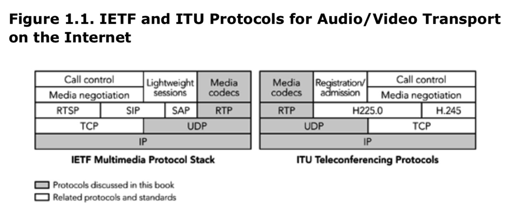
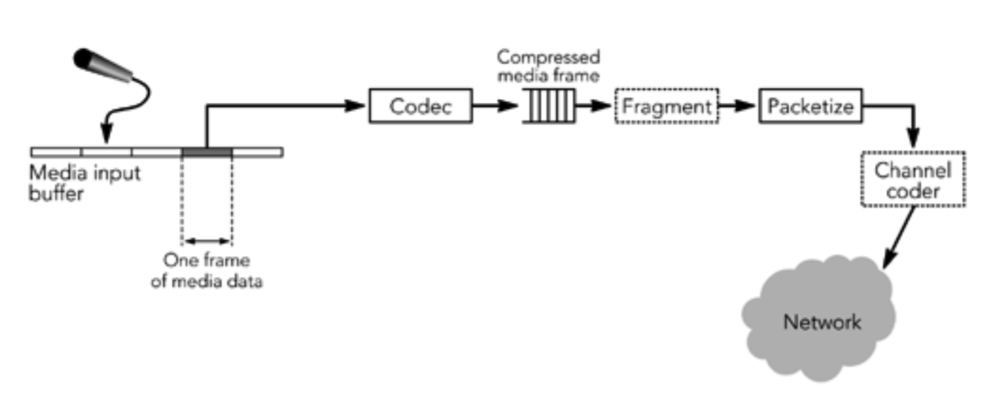
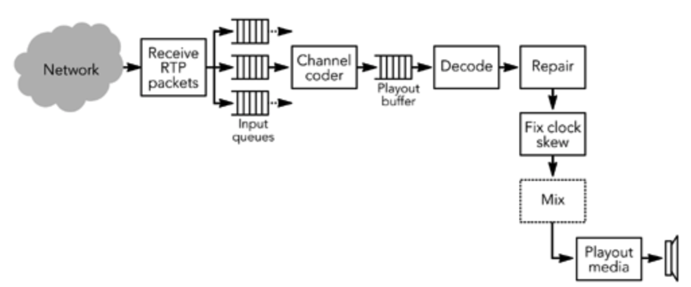

## 第一章 RTP介绍

### 本章目录
*  音视频网络简史
*  RTP简况
*  相关标准
*  RTP实现的概述

互联网正在发生改变：静态内容正让位于流媒体视频，文本正在被音乐和语音所取代，交互式音频和视频正变得司空见惯。这些变化需要新的应用程序，这给应用程序设计人员带来了全新且独特的挑战。

本书描述了如何构建这些新的应用程序:VOIP、电话、电话会议、流媒体视频和网络广播。探讨了在IP网络上可靠地传输音频和视频所固有的挑战，并解释了 如何在网络问题面前确保高质量，以及如何确保系统安全。本书的重点是开放标准，特别是那些由互联网工程任务组(IETF)和国际电信联盟(ITU)设计的标准，而不是私有解决方案。

本章首先介绍实时传输协议(RTP)，简要回顾了音频/视频网络的历史，以及RTP与其他标准的关系。

#### 1.1 音视频网络的简介

使用分组网络(如互联网)传输语音和视频的想法并不新鲜。分组网络上的语音实验可以追溯到20世纪70年代早期。关于这个主题的第一个RFC—[网络语音协议](https://datatracker.ietf.org/doc/html/rfc741)-从1977年起。视频虽然出现的较晚，但也经历了十多年的音频/视频会议和互联网流媒体历程。

**早期的分组语音和视频实验**

NVP的最初开发人员是通过ARPANET(因特网的前身)传输分组语音的研究人员。ARPANET提供了一种可靠的流服务(类似于TCP/IP)，但这种服务延引入了太多的延迟，因此开发人员开发了一种“不受控制的包服务“，类似于RTP使用的现代UDP/IP数据报。NVP被直接放在这个”不受控制的包服务“上。后来，实验扩展到ARPANET之外，与包无线网络（the Packet Radio Network）和大西洋卫星网络(SATNET)交互操作，在这些网络上运行NVP。

由于早期网络的低带宽，所有早期的实验都局限于一两个语音通道。20世纪80年代，3Mbps宽带卫星网络的建立不仅使更多的语音通道成为可能，而且还促进了分组视频的发展。一种被称为面向连接的互联网络协议的流协议(ST)的开发，用来访问单跳，保留带宽,组播的卫星网络服务。NVP的第二个版本(NVP-II)和与之配套的分组视频协议都通过ST，这为支持分组交换视频会议服务提供了样板。

1989-1990年，卫星网络被地面宽带网络和一个叫做 DARTnet 的研究网络所取代，而 ST 发展成为 ST-ii。分组视频会议系统投入计划生产，以支持网络研究人员和其他人员在地理上分布的会议，同时在多达五个地点。

ST 和 ST-ii 在网络间层与 IP 并行运行，但在政府和研究网络上只实现了有限的部署。作为替代方案，使用 IP 的初始会议部署从 DARTnet 开始，使得使用 NVP-II 的多方会议能够通过多播 UDP/IP 传输。在1992年3月召开的 IETF 会议上，音频通过组播“隧道”(tunnel)从 DARTnet 扩展到三大洲的20个站点。在同一次会议上，开始了 RTP 的发展。

**互联网上的音视频**

在这些早期实验之后，互联网社区对视频会议的兴趣在20世纪90年代初就开始了。大约在这个时候，工作站和 PC 的处理能力和多媒体功能已经足以同时捕获、压缩和播放音频和视频流。与此同时，IP 组播的发展允许将实时数据传输给任意数量的连接到互联网的接收端。

视频会议和多媒体流媒体是显而易见的且执行良好的多播应用。研究小组着手开发工具，比如劳伦斯伯克利实验室研发的vic和vat，马萨诸塞大学研发的nevot, Xerox PARC研发的INRIA视频会议系统和nv，以及伦敦大学学院研发的rat。这些工具遵循了一种新的会议方法，基于无连接协议、端到端参数和应用程序级框架。会议被最低限度地管理，没有准入或最低控制，而且传输层单薄且适应性强。多播既用于广域数据传输，也用作同一机器上应用程序之间的进程间通信机制(用于在音频和视频工具之间交换同步信息)。由此产生的协作环境由轻度耦合的应用程序和高度分布式的参与者组成。

多播会议(Mbone)工具产生了重大影响:它们使人们广泛认识到通过IP网络交付实时媒体所固有的问题、可伸缩解决方案的需求以及错误和拥塞控制。它们还直接影响了几个关键协议和标准的开发。

RTP是在1992-1996年期间由IETF开发的，以NVP-II和原始vat工具中使用的协议为基础。多播会议工具采用RTP作为唯一的数据传输和控制协议;因此，RTP不仅包括媒体发布工具，还支持会员管理、唇音同步和接收质量报告。

除了用于传输实时媒体的RTP之外，还必须开发其他协议来协调和控制媒体流。会话通知协议(SAP)是为了通知多播数据流的存在而开发的。会话的通知本身就是多播的，任何具有多播能力的主机都可以接收SAP通知并了解会议和传输的内容。在通知中，会话描述协议(SDP)描述了发送端和接收端在多播会话中使用的传输地址、压缩和分组方案。多播部署的缺乏和万维网的兴起在很大程度上取代了分布式多播目录的概念，但SDP在今天仍被广泛使用。

最后，Mbone会议社区主导了**会话发起协议(SIP)**的开发。SIP的目的是作为一种轻量级的方法来查找参与者，并使用一组特定的参与者启动多播会话。在早期的版本中，SIP几乎不包括呼叫控制和协商支持，因为这些方面没有用于Mbone会议环境。它已经成为一个更全面的协议，包括广泛的协商和控制功能。

**ITU Standards**

与早期分组语音工作并行的是**综合业务数字网(ISDN)**的发展，这是普通老式电话系统的数字版本，以及一套相关的视频会议标准。这些标准基于ITU的建议H.320，使用电路交换链路，因此与我们对分组音频和视频的讨论没有直接关系。然而，他们开创了许多今天使用的压缩算法(例如H.261视频)。

因特网的发展和商业世界中局域网设备的广泛部署促使国际电联扩展了H.320系列协议。具体说来，他们试图使协议适合于“提供无保证服务质量的局域网”，IP是一个符合描述的经典协议族。这也引起了H.323的系列建议书的诞生。

H.323于1997年首次出版，此后几经修改。它提供了一个由媒体传输、呼叫信令和会议控制组成的框架。信令和控制功能在ITU建议书H.225.0和H.245中定义。最初，信令协议主要集中在使用H.320与ISDN会议的互操作上，结果导致繁琐的会话设置过程，该标准的后续版本简化了这一过程。关于媒体传输，电信联盟工作组采纳了RTP。然而，H.323只使用了RTP的媒体传输功能，很少使用控制和报告元素。

H.323在市场上取得了一定的成功，有几个硬件和软件产品是为支持H.323技术套件而构建的。开发体验导致了对其复杂性的抱怨，特别是H.323版本的复杂设置过程和对信令使用的二进制消息格式。其中一些问题在后来的H.323版本中得到了解决，但在此期间，人们对替代方案的兴趣有所增加。

其中一个我们已经提到过的替代方案是SIP。最初的SIP规范是IETF在1999年发布的，它是一个学术研究项目的成果，几乎没有商业利益。此后，在很多领域，它都被视为H.323的替代品，并被应用于更多样化的应用，比如短信系统和ip电话。此外，它正在考虑用于第三代移动电话系统，并已获得相当多的行业支持。

国际电信联盟最近提出了建议H.332，它结合了紧密耦合的H.323会议和轻量级多播会议。该结果对于在线研讨会等场景非常有用，在在线研讨会中，会议的H.323部分允许一组发言者之间的密切交互，而被动的观众则通过多播观看。

**音视频流**

在多播会议和H.323发展的同时，万维网革命也发生了，它为因特网带来了精美的内容和公众的普遍接受。网络带宽和终端系统容量方面的进步使流媒体音频和视频与网页一起成为可能，RealAudio和QuickTime等系统在这方面处于领先地位。这类系统的市场不断增长，促使人们希望为流媒体内容设计一种标准的控制机制。结果是实时流协议(RTSP)，它能提供流媒体演示的启动和类似于录像机的控制;RTSP于1998年标准化。RTSP建立在现有的标准之上:它在操作上非常类似于HTTP，并且它可以使用SDP进行会话描述，使用RTP进行媒体传输。

#### 1.2 RTP简况
IP 网络中音频/视频传输的关键标准是实时传输协议(RTP)及其相关配置文件和有效负载格式。RTP旨在通过IP网络提供对实时媒体传输有用的服务，如音频和视频。这些服务包括定时恢复、丢包检测和恢复、负载和源标识、接收质量反馈、媒体同步和会员管理。RTP最初设计用于多播会议，使用轻量级会话模型。从那时起，它已被证明对一系列其他应用有用:H.323视频会议、网络广播和电视分发;有线电话和移动电话都是如此。该协议已被证明可以从点对点使用扩展到具有数千用户的多播会话，从低带宽蜂窝电话应用程序扩展到以千兆比特速率传输未压缩的高清晰度电视(HDTV)信号。

RTP是由IETF的音频/视频传输工作组开发的，后来被国际电联作为其H.323系列建议的一部分而采用，并被其他各种标准组织采用。RTP的第一个版本是在1996年1月完成的，在完成之前需要对特定用途的RTP进行概要分析;RTP规范定义了一个初始概要，还有几个概要正在开发中。附带几个负载格式规范的配置文件描述了特定媒体格式的传输。RTP的开发正在进行中，在撰写本文时，一个修订已经接近完成。

在第三章会详细介绍RTP，即实时传输协议，本书的大部分内容讨论了使用RTP的系统的设计及其各种扩展。

#### 1.3 相关标准
除了RTP之外，完整的系统通常还需要使用各种其他协议和标准来进行会话通知、启动和控制，媒体压缩和网络传输。

图1.1显示了根据IETF和国际电信联盟会议框架，协商和呼叫控制协议、媒体传输层(由RTP提供)、压缩解压算法(codecs)和底层网络之间的关系。这两套并行的呼叫控制和媒体协商标准使用相同的媒体传输框架。同样，不管会话是如何协商的，也不管底层网络传输是什么，媒体编解码器都是通用的。

这些标准和RTP之间的关系在第3章实时传输协议中有详细的描述。但是，这本书的主要主要聚焦媒体传输，而不是信号和控制。

#### 1.4 RTP实现的概述

如图1.1所示，任何通过IP传输实时音频/视频的系统的核心都是RTP:它提供公共的媒体传输层，独立于信令协议和应用程序。在我们更详细地研究RTP和使用RTP的系统设计之前，有必要了解一下系统中RTP发送端和接收端的职责。

RTP发送端的行为

发送端负责采集和转换用于传输的视听数据，以及生成RTP包。它还可以通过调整传输的媒体流以响应接收端的反馈来参与错误恢复和拥塞控制。发送过程的关系如图1.2所示。

未压缩的媒体数据(音频或视频)被采集到缓冲区中，产生压缩帧。帧可以根据使用的压缩算法以多种方式进行编码，编码后的帧可能同时依赖于之前和之后的数据。

压缩帧被装入RTP包中，准备发送。如果帧很大，它们可能被分成几个RTP包;如果它们很小，可以将几个帧绑定到一个RTP包中。根据配套的错误恢复方案，可以使用信道编码器来生成错误恢复包或在传输之前重新对包进行排序。

发送RTP包之后，与这些包对应的缓冲媒体数据最后被释放。发送端不能丢弃可能需要用于错误恢复或编码的数据。这个要求可能意味着发送端在发送了相应的数据包之后，必须将数据缓存一段时间，这个时间取决于所使用的编解码器和错误恢复方案。

发送端负责生成它所生成的媒体流的定期状态报告，包括唇音同步所需的媒体流。它还从其他参与者那里收到接收质量反馈，并可能利用这些信息来调整其传输。

RTP接收端的行为

接收端负责从网络中收集RTP数据包，恢复丢失的数据，纠正时序，解压媒体，并将结果显示给用户。还需要发送接收质量反馈，允许发送端调整到接收端的传输，并维护会话中参与者的数据库。接收过程可能的方框图如图1.3所示;然而具体实现有时根据需要以不同的顺序执行操作。

接收过程的第一步是收集来自网络的数据包，验证它们的正确性，并将它们插入到特定发送端的输入队列中。从输入队列中收集数据包，并将其传递给可选的信道编码例行程序以恢复丢失的数据。在通道编码器之后，数据包被插入到指定源的播放缓冲区中。播放缓冲区按时间戳排序，将数据包插入缓冲区的过程纠正了传输期间引起的排序错乱。数据包一直保留在播放缓冲区中，直到接收到完整的帧为止，另外还对它们进行额外的缓冲，以消除由网络引起的包间计时的任何变化。计算要添加的延迟量是RTP实现设计中最关键的方面之一。每个包都用相应帧所需的播放时间进行标记。

当它们的播放时间到达后，这些包形成完整的帧，任何损坏或丢失的帧都被修复。在进行任何必要的修复之后，帧将被解码(根据使用的编解码器，在修复丢失的帧之前可能需要解码媒体)。在这一点上，发送端和接收端的名义时钟速率可能有明显的差异。这些差异表现为RTP媒体时钟相对于播放时钟的值的偏移。接收器必须补偿这个时钟偏差，以避免在播放中出现间隙。

从这篇简短的概述中可以明显看出，RTP接收端的操作很复杂，它比发送端的操作更加复杂。这种复杂性的增加主要是由于IP网络的不确定性(大部分复杂性来自于补偿丢失的包的需要，以及恢复受抖动影响的流的时序)。

#### 总结
本章介绍了通过IP网络实时传输多媒体的协议和标准，特别是实时传输协议(RTP)。本书的其余部分将详细讨论RTP的特性和使用。其目的是扩展标准文档，解释标准背后的基本原理和可能的实现选择及其权衡。