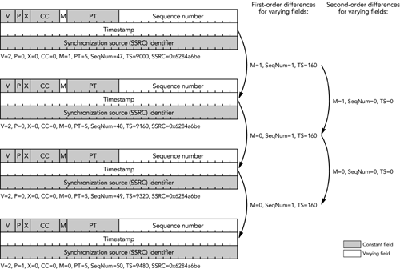
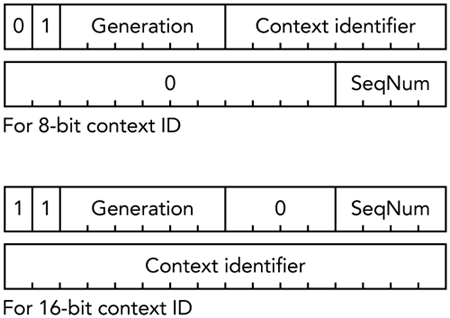
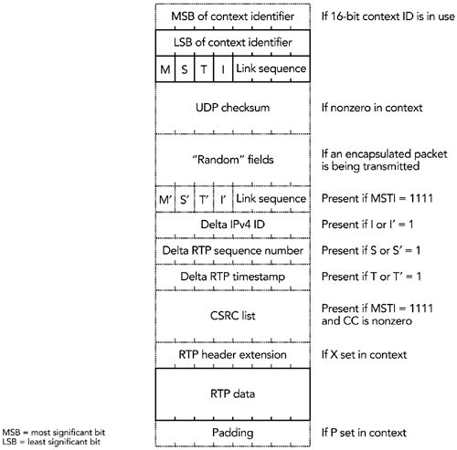
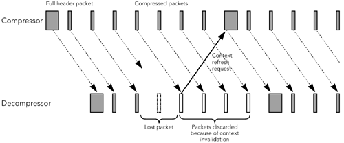
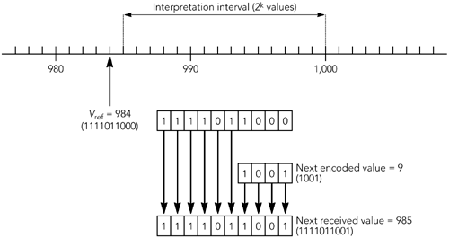

# 第十一章. 包头压缩

- 初步概念
- 压缩 RTP
- 鲁棒性包头压缩
- RTP 应用程序注意事项

包头大小是 RTP 经常被批评的一个方面。有人认为 12 字节的 RTP 头加上 28 字节的 UDP/IPv4 头对于一个只有 14 个字节的音频数据包来说过于冗余，且认为应该使用一个更高效的压缩的头。这在某种程度上是正确的，但是这个论点忽略了在某种情况下使用 RTP 的完整包头是有必要的，并且忽略了单一开放的音视频传输标准对于社区的好处。

包头压缩技术在以上两点中取得了一个平衡：在链路层，可以将整个 40 个字节的 RTP/UDP/IP 头压缩至 2 个字节，这比在 UDP/IP 之上再设计一种专有协议更加高效，而且可以保留单一开放标准的益处。本章介绍了包头压缩技术的原理，并进一步对两种压缩标准进行分析：RTP 压缩（CRTP） 和 鲁棒性包头压缩（ROHC）。

## 初步概念

包头压缩技术的使用在 Internet 社区已有悠久的历史，自 1990 年 TCP/IP 包头压缩的定义，便被用于拨号网络的 PPP 协议广泛实现。而最近，TCP/IP 包头压缩标准已经被修订更新，并且 UDP/IP 和 RTP/UDP/IP 等包头压缩的新标准也已经被开发。

包头压缩的典型应用场景包括通过低速的拨号调制解调器或者无线网络链接到网络的一个主机。主机和第一跳路由对通过它们之间的低速链路的数据包进行压缩，从而在不影响其余网络的情况下来提高该链路的传输效率。在任何情况下，都存在需要更有效使用带宽的瓶颈链路，在其余网络则无需压缩。包头压缩是基于每个链路工作的，是透明的。因此非常适合以下场景：压缩的链路看起来和其他 IP 链路一样，并且应用程序是无法感知到包头压缩的存在的。

这些特性（每个链路的操作及对应用程序透明）意味着包头压缩通常作为操作系统的一部分（通常作为 PPP 实现的一部分）。应用程序通常不需要知道包头压缩的存在，尽管在某些情况下考虑到包头压缩的行为可以显著提高性能。这些情况将在本章后面的标题为“ RTP 应用程序的注意事项”的部分中讨论。

### 模式，鲁棒性和本地实现

压缩依赖于包头中的模式：许多字段是不变的，或者在属于同一个数据包流的连续数据包之间以可预测的方式更改。如果我们可以识别这些模式，则可以将这些字段压缩为“包头以预期的方式更改”的指示，而不是显示发送它们。只有当包头中的字段以不可预期的方式改变时，才需要传输整个包头。

在包头压缩标准的设计过程中一个重要的原则就是鲁棒性。主要体现在两方面：丢包鲁棒性和误识别流的鲁棒性。网络链接（尤其是无线链接）可能会丢失或破坏数据包，所以包头压缩方案必须能够在存在此类损坏的情况下起作用。最重要的要求是压缩比特流的损坏不会在未压缩的数据流中引发不可检测的损坏。如果数据包损坏，后续的数据包要能够被正确解码或丢弃。解码器绝不应该产生损坏的数据包。

第二个鲁棒性问题是 RTP 流无法自我识别。UDP 包头中没有字段能够分辨当前正在传输的是 RTP 流，并且编码器无法明确确定 UDP 数据包的特定序列包含 RTP 流量。编码器需要显式的被告知一个数据流中包括 RTP，或者需要它能够基于对数据包序列的观测来进行有依据的猜测。鲁棒性工程设计要求 如果错误的将其用于非 RTP 流，则压缩不得破坏任何内容。被误导的编码器预期不应压缩其他类型的 UDP 流，但是底线是一定不能破坏它们。

模式识别和鲁棒性原则结合在一起，形成了包头压缩的一般性原则：编码器偶尔发送包含完整头部的数据包，然后进行增量更新，指示哪些头部字段以预期的方式进行更改，哪些头部字段中包含随机的无法被压缩的字段。完整的包头提供了鲁棒性：对增量包的破坏可能会导致解码器混淆并阻止操作，但是当下一个完整的包头到达时将会得到纠正。

最后，本地实现包头压缩非常重要。其目的是开发一种可在单个链路上运行而无需端到端支持的包头压缩方案：如果节省带宽很重要，两个系统可以花费处理器周期来压缩；否则如果处理成本太高，则会发送未压缩的包头。如果两个系统决定压缩单个链接上的包头，它们应该能够以其他系统都不可见的方式做到这一点。因此，包头压缩应该在网络协议栈而非应用 程序中实现。应用程序不需要自己实现包头压缩；应用程序设计人员应该了解包头压缩及其后果，应将其作为链接两端机器的协议栈的一部分来实现。

### 标准

RTP 包头压缩有两种标准。原始的压缩 RTP（CRTP）规范设计用于拨号调制解调器，是 TCP 包头压缩的直接扩展，可用于 RTP/UDP/IP。然而，随着以 IP 电话为载体的第三代蜂窝技术的发展，人们发现 CRTP 在高链路延迟和丢包的环境下表现不佳，因此开发了一种替代协议——健壮报头压缩(ROHC)。

CRTP 仍然是拨号使用的首选协议，因为它在该环境中具有简单性和良好的性能。 ROHC 相对复杂，但在无线环境中的性能要好得多。下面几节将详细讨论每个标准。

## 压缩 RTP（CRTP）

CRTP 的标准在 [RFC 2508 ](https://tools.ietf.org/html/rfc2508)中指定。它是为低速串行链路设计的，比如拨号调制解调器，其误码率很低。CRTP 是 Van Jacobson 的 TCP 包头压缩算法的直接产物，与其具有相似的性能和局限性。

TCP 包头压缩主要收益来自于观察到 TCP/IP 包头中一半的字节在数据包之间是恒定不变的。这些信息在完整的包头数据包中发送一次，然后从之后的数据包中删除。剩余的增益来自对变化的字段进行差分编码以减小其大小，以及通过在通常情况下计算数据包长度的变化来完全消除变化的字段。

RTP 包头压缩使用了很多相同的技术，观察表明，尽管每个数据包中有多个字段更改，但数据包到数据包之间的差异通常是恒定的，因此二阶差分为零。恒定的二阶差分使编码器能够抑制（suppress）不变的字段以及各个包之间可预测变化的字段。

图 11.1 根据 RTP 头部字段展示了该流程。阴影部分的头字段在数据包之间是常量，它们的一阶差分为 0，不需要发送。未着色部分字段是变化的字段；它们的一阶差分非 0。然而，它们的二阶差分通常是常数和 0，这使得变化的字段是可预测的。

**图 11.1. 包头压缩原理**

在图 11.1 中，除了 M 以外的所有字段要么恒定不变，要么其二阶差分为 0。因此，如果已知可预测字段的初始值，只需要发送 M 字段的更改。

### CRTP 的运作：初始化和上下文

压缩 RTP 首先发送一个包含完整包头的初始数据包，从而在编码器和解码器之间建立相同的状态。此状态作为压缩数据流的初始上下文。后续数据包包含被缩减的包头，这些包头指示解码器使用存在的上下文来对其进行预测，或者包含必须用于后续数据包的更新。可以定期发送包含完整包头的数据包，以确保纠正编码器和解码器之间任何的同步丢失。

完整包头数据包包括未经压缩的原始数据包，以及两个附加信息（上下文标识符和序列号），如图 11.2 所示。上下文标识符占 8 或 16bit，唯一标识特定的流。序列号占 4 位，用于检测链路丢包。这些附加信息替换了原始数据包中的 IP 和 UDP 长度字段，而不会丢失数据，因为该长度字段对于链路层帧长度是多余的。完整包头格式在一些压缩方案中很常见，包括 IPv4 和 IPv6、TCP 和 UDP 包头。

**图 11.2 完整包头中的附加信息**

链路层协议向传输层表明这是一个 CRTP(而不是 IP)完整的包头包。此信息允许传输层将数据包路由到 CRTP 解码器，而不是将它们视为通常的 IP 数据包。链路层提供这种指示的方式取决于所使用的链路的类型。在[RFC 2509](https://tools.ietf.org/html/rfc2509)中指定了对 PPP 链路的操作。

上下文标识符由编码器管理，每当它看到它认为可以压缩的新的数据流时，就会生产新上下文。在接收到新的上下文标识符后，解码器将为上下文分配存储空间。否则，它将上下文标识符作为存储上下文状态的状态表的索引。上下文标识符不需要顺序分配。当上下文较少时，应使用哈希表来减少状态所需的存储空间，当上下文较多时，应仅使用具有上下文标识符作为索引的数组。

上下文包含以下状态信息，这些信息将在收到完整的包头包时进行初始化：

- 传送的最后一个数据包的完整 IP，UDP 和 RTP 包头，可能包括 CSRC 列表

- 当接收到一个完整的包头时，将会把 IPv4 的 ID 字段的一阶差分初始化为 1。（当 RTP-over-UDP/IPv6 被压缩时，不需要此信息，因为 IPv6 没有 ID 字段）

- 当接收到一个完整的包头时，RTP 的 timestamp 字段 的一阶差分初始化为 0。

- CRTP 序列号（4bit）的最后一个值，用于检测压缩链路丢包。

有了这些上下文信息，接收端就可以解码收到的每个连续数据包。尽管可能需要使用每个数据包更新存储在上下文中的状态，但不再需要额外的其他状态。

### CRTP 的运作：编码和解码

在发送完整的包头以建立上下文之后，可能会发生向压缩 RTP 数据包的过渡。解码器可以根据存储的上下文以及收到的压缩 RTP 数据包，来预测下一个数据包的包头。压缩的 RTP 数据包可能会更新该上下文，从而允许在不发送完整包头的情况下传达包头中的常见更改。压缩 RTP 数据包的格式如图 11.3 所示。在大多数情况下，仅存在具有实线轮廓的字段，这种情况下可以直接从上下文预测下一个包头。可以根据需要提供其他字段以更新上下文，也可以从上下文推断出它们的存在，或者直接在压缩包头中被示意。

**图 11.3 一个压缩 RTP 数据包**

编码器观察数据流的特点，并且忽略那些恒定不变或以可预测方式变化的字段。压缩算法会对任何可以通过预测得到的 IPv4 ID，RTP 序号，以及 RTP 时间戳字段 起作用。通常，编码器无法知道特定流是否真的是 RTP。它必须在包头中查找模式，如果存在特定模式，则开始压缩。如果该流不是 RTP，则不太可能存在这种特定模式，那它将不会被压缩（当然，如果流不是 RTP，但具有适当的模式，则对其进行压缩）。编码器预期会保持状态以跟踪哪些流是可压缩的，哪些流不是，以此来避免浪费压缩工作。

一旦接收到压缩 RTP 包，解码器就会重建包头。可以通过获取先前存储在上下文中的包头来重建 IPv4 包头，并从链路层包头中推断出校验和的值和总长度字段。如果在压缩 RTP 数据包中设置了 I 或 I` 位，则 IPv4 ID 将增加压缩 RTP 数据包中的 Delta IPv4 ID 字段的值，并更新上下文中存储的 IPv4 ID 的一阶差分。否则 IPv4 ID 会增加上下文中存储的一阶差分。

如果上下文中存在多个 IPv4 包头（例如，IP-in-IP 隧道的原因），将从压缩 RTP 数据包中恢复其 IPv4 ID 字段，并按顺序将它们存储为“随机”字段。如果使用 IPv6，则没有数据包 ID 和校验和字段，因此除负载长度（可从链路层长度推断出来）以外，所有字段都是恒定不变的。

你可以通过获取之前存储在上下文中的包头并从链路层包头中推断长度字段来重新构造 UDP 包头。如果上下文中存储的校验和为零，则假定不使用 UDP 校验和。否则，压缩的 RTP 包将包含校验和的新值。

你可以通过采用先前存储在上下文中的报头来重构 RTP 包头，按如下所述进行修改：

- 如果所有 M，S，T 和 I 都为 1，则数据包包含 CC 字段和 CSRC 列表以及 M‘，S’，T‘，I’。在这种情况下，M，S，T，I 字段用于预测标记位，序列号，时间戳和 IPv4 ID。CC 字段和 CSRC 列表基于压缩的 RTP 包被更新。否则，CC 和 CSRC 列表将基于先前的数据包进行重建。

- M 位被压缩 RTP 包中的 M(或 M’)位所代替。

- 如果压缩 RTP 包中的 S 或 S‘位为 1，则 RTP 序列号将增加由压缩 RTP 包中的 delta RTP sequence 指示的值。否则 RTP 序列号自增 1。

- 如果压缩 RTP 包中设置了 T 或 T’位，则将 RTP 时间戳增加压缩 RTP 数据包中的 delta RTP timestamp 字段指示的值，并更新上下文中存储的时间戳的一阶差分值。否则，RTP 时间戳会根据上下文中存储的一阶差分值递增。

- 如果上下文中设置了 X 位，将从压缩 RTP 中恢复 header extension 字段。

- 如果上下文中设置了 P 位，将从压缩 RTP 中恢复 padding 字段。

上下文以及任何对 IPv4 ID，RTP 时间戳 的一阶差分和链路层序列号的更新将使用新接收到的包头来进行更新。然后，将重构的包头和负载数据传递到 IP 栈，以常规方式进行处理。

通常只有上下文标识符，链路层序列号，M，S，T 和 I 字段存在，通常是 2 个八位组（如果使用 16bit 上下文标识符，则为 3 个八位组）。这比 40 个八位组的未压缩包头好很多。

### 丢包影响

RTP 接收端通过 RTP 序列号的不连续来检测丢包；RTP 时间戳也将跳转。当丢包发生在编码器的上游时，新的 delta 值被发送到解码器来传达这些不连续。虽然压缩效率降低了，但数据包流仍在链路上准确通信。

同样的，如果丢包发生在压缩链路，会通过压缩 RTP 数据包中的链路层序列号来检测到丢包。然后，解码器将会发送一个消息给编码器，指示其应该发送一个完整包头数据包来修复状态。如果存在 UDP 校验和，解码器还可能尝试应用两次存储在上下文中的增量，来验证这样做是否生成了正确的数据包。只有当存在 UDP 校验和时，才可以使用两次算法。否则，解码器将无法知道恢复的数据是否正确。

当丢包发生时，需要请求一个完整的包头数据包来恢复上下文信息，这使得 CRTP 极易受到压缩链路上丢包的影响。特别是，如果链路的往返时间（RTT）较长，在传递上下文恢复请求期间可能会收到许多数据包。造成的影响如图 11.4 所示，结果是丢包倍增，其中单个数据包的丢失会影响到多个包，直到传递完整的包头数据包为止。因此，数据包丢失会严重影响 CRTP 的性能。

**图 11.4 CRTP 面对丢包时的处理**

CRTP 的另一个限制因素是数据包重排序。如果数据包在压缩链路之前进行重排序，则需要编码器发送包含序列号和时间戳更新的数据包以进行补偿。这些数据包相对较大（通常在两到四个八位组之间），对压缩率有显著影响，至少使压缩包头增大了一倍。

基本的 CRTP 是假设压缩链路上没有重新排序的。为了使 CRTP 在面对丢包和重新排序时更健壮，目前正在进行扩展工作。预计这些增强将使 CRTP 适用于在压缩链路上有少量或中等丢包或重新排序的环境。下一节讲述的鲁棒性包头压缩（ROHC）方案是针对更极端的环境设计的。

## 鲁棒性包头压缩（Robust Header Compression）

如之前所述，CRTP 在丢包和往返时间（RTT）较长的链路（例如许多蜂窝无线网络）上不能很好的工作。每个丢失的数据包都会导致后续多个数据包的丢失，因为上下文信息至少在一个链路往返时间不同步。

丢失多个数据包除了会降低媒体流的质量外，还会浪费带宽，因为已经发送的一些数据包被简单的丢弃了，并且必须发送一个完整包头数据包来刷新上下文。鲁棒性包头压缩（ROHC）旨在解决这些问题，提供适用于第三代蜂窝系统的压缩功能。在这些链路上，ROHC 相对于 CRTP 具有显著的性能提升，但代价是实现相对复杂。

观察媒体流包头字段的变化，可以发现这些字段分为三类：

1. 有些字段或者大部分字段都是静态不变的。比如 RTP，SSRC，UDP 端口号和 IP 地址。这些字段在连接建立时发送一次，它们或者从不改变，或者变化不频繁。

2. 有些字段随着数据包的发送以可预测的方式变化，但偶尔会突然变化。比如 RTP 时间戳，序列号，以及 IPv4 ID 字段。在这些字段可预测期间，它们通常有一个恒定的关系。当突然变化时，通常只有一个字段发生了不可预期的变化。

3. 有些字段是不可预测的，基本上是随机的，必须按原样进行通信，不能进行压缩。主要是 UDP 校验和。

ROHC 通过在 RTP 序列号和其他可预测字段之间建立映射函数（mapping functions）进行操作，然后可靠的传输 RTP 序列号和不可预测的包头字段。这些静态函数与在启动或当这些字段更改时传递的静态字段一起构成了压缩上下文的一部分。

ROHC 和 CRTP 的主要差别在它们处理第二类字段（通常以可预测的方式变化的字段）的方式。在 CRTP 中，字段的值是隐式的，并且数据包中包含一个指示，表明它以可预测的方式更改。在 ROHC 中，单个关键字段的值（RTP 序列号）明确包含在所有数据包中，并且使用隐式映射函数推导出其他字段。

### ROHC 的运作：状态和模式

ROHC 具有三种运行状态，具体取决于传输的上下文量：

1. 系统以初始化和刷新状态启动，非常类似于 CRTP 的完整包头模式。 此状态传达了建立上下文的必要信息，使系统能够进入一阶或二阶压缩状态。

2. 一阶压缩状态使系统有效地传播媒体流中的不规范信息(上下文的变化)，同时仍然保持很高的压缩效率。在这种状态下，只传输 RTP 序列号的压缩表示以及上下文标识符和更改字段的简化表示。

3. 当根据 RTP 序列号和存储的上下文可以预测整个包头时，二阶状态是最高的压缩级别。包中只包含 RTP 序列号的压缩表示(可能是隐式的)和上下文标识符，给出的包头可以小到只有一个八位组。

如果存在任何不可预测的字段（如 UDP 校验和），则一阶和二阶压缩方案都会不变的传递这些字段。如预期那样，造成的结果是压缩效率显著降低。为了简单起见，这个描述省略了对它们的进一步提及，尽管它们总会被传递。

编码器开始于初始化和刷新状态，将完整的包头信息发送给解码器。当确认解码器正确的接收到足够的信息来设置上下文之后，它将移动到一阶或二阶状态，发送压缩后的包头。

系统可以以三种模式之一运行：单向，双向乐观（bidirectional optimistic），双向可靠（bidirectional reliable）。根据选择的模式，编码器将根据超时或确认从初始化和刷新状态转换到一阶或二阶压缩状态：

1. 单向模式。有可能没有反馈，编码器会在发送预定数量的数据包之后，转换到一阶或二阶状态。

2. 双向乐观模式。与单向模式一样，编码器在发送了预定数量的数据包之后，或收到确认时将转换为一阶或二阶状态。

3. 双向可靠模式。编码器在收到确认后转换为一阶或二阶状态。

单向或双向反馈模式的选择取决于编码器和解码器之间链路的特性。一些网络链路可能不支持（对其不友好）反馈消息的反向通道，从而迫使运行于单向模式。但是，在大多数情况下，可以使用双向模式之一，从而使接收端可以将其状态传达给发送端。

编码器以单向模式启动。如果链路支持，解码器将根据链路的丢失模式（loss pattern）选择是否发送反馈。如果编码器接收到反馈消息，就会认为解码器期望使用双向模式。解码器根据反向通道的容量和链路的丢包率在乐观和可靠模式之间选择。可靠模块需要发送更多的反馈信息，但容错性更高。

> 保持 ROHC 状态和模式之间的区别是很重要的。状态决定了每个数据包中的信息类型：完整的包头，部分更新或完全压缩。模式确定解码器发送反馈的方式和时间：（1）从不，（2）当有问题发生时，（3）总是

通常，在建立上下文之后，系统会从初始化和刷新状态过渡到二阶状态。然后它将保持二阶状态，直到发生丢包，或由于流特性的变化而需要更新上下文。

发生丢包时，系统的行为取决于当前的工作模式。处于两种双向模式之一时，解码器会发送反馈信息，然后导致编码器进入一阶状态发送更新信息来修复上下文。这个过程对应于在 CRTP 中发送上下文刷新消息，从而导致编码器生成包含完整包头的数据包。处于单向模式时，编码器会定期转换到低阶状态，以刷新解码器中的上下文。

在需要对一个可预测字段的映射进行更改或对一个静态字段进行更新时，编码器也会转换到一阶状态。这个过程对应于在 CRTP 中发送包含更新的 delta 字段或完整包头的压缩包。根据操作模式的不同，一阶状态的更改有可能会导致编码器发送反馈信息，来表明它已经正确接收到新的上下文。

### ROHC 的运作：鲁棒性和压缩效率

在压缩链路可靠的情形下，ROHC 和 CRTP 具有相似的压缩效率，而 ROHC 却更加复杂。因此，拨号调制解调器链路通常不适用 ROHC，因为 CRTP 复杂度较低，并能产生相似的性能。

在压缩链路上有丢包发生时，ROHC 的优势才会体现出来，体现在发送上下文更新信息时的灵活性和对压缩数据的鲁棒性编码。在 CRTP 必须发送完整包头以更新上下文的情况下，ROHC 仅需发送部分更新的上下文信息。当链路有丢包发生时，ROHC 也可以减小上下文更新信息的大小。这些特性使得 ROHC 相比于 CRTP 具有明显的性能提升。

压缩值的鲁棒性和序列号驱动操作的组合也是一个关键因素。如前所述，ROHC 上下文中包含了 RTP 序列号和其他可预测包头字段的映射。二阶压缩包使用基于窗口的最低有效位（W-LSB）编码来传递序列号，其他字段由此得出。W-LSB 编码的大量使用使得 ROHC 在应对丢包时提供了鲁棒性。

标准 LSB 编码传输字段值的 _k_ 个最低有效位，而不是整个字段。在接收到这些 _k_ bits 后，然后给定先前传输的值 _Vref_，解码器推导出该字段的原始值，前提是该值位于称为 _可解释区间（interpretation interval）_ 的范围内。

可解释区间是 _Vref_ 偏移参数 _p_ 后，周围 _2k_ 范围内的值，从 _Vref - p_ 到 _Vref + 2k -1 - p_ 。参数*p* 是基于初始化期间被传输并传送到解码器的字段的特性来选择的，从而构成上下文的一部分。可能的选择包括：

- 如果字段的值期望被增加，则 _p = -1_。

- 如果字段的值期望被增加或保持不变，则 _p = 0_。

- 如果字段的值期望与固定值不同，则 _p = 2(k-1) + 1_。

- 如果字段的值期望经历小的负变化和大的正变化（如使用 B 帧的视频流的 RTP 时间戳），则 _p = 2(k-2) - 1_。

序列号传输示例。假定，最后传输的值 _Vref = 984_ ，_k = 4_（表示 4 个最低有效位作为编码格式传输）。假设 _p = -1_，计算出可解释区间为 985 到 1000，如图 11.5 所示。下一个发送的值是 985（二进制：1111011001）被编码为 9（二进制：1001，985 的 4 个最低有效位）。收到编码后的值后，解码器获取到 _Vref_，然后使用接收到的数据替换其 _k_ 个最低有效位，来恢复原始值。

**图 11.5 LSB 编码示例**

只要需要编码的值在解释区间内，LSB 编码就能很好的工作。在前面的示例中，如果丢失了一个数据包，解码器收到的下一个值是 10（二进制：1010），还原后是 986，这是正确的。如果丢失了超过 _2k_ 个数据包，解码器将无法知道要解码的正确值。

W-LSB 是基于窗口的 LSB 的变体，W-LSB 将可解释区间保持为滑动窗口，当编码器确定解码器收到特定值时，就会向前滑动。滑动窗口可以向前滑动的时机可以通过不同的方式触发：双向可靠（原文应有误）模式下，解码器发送 ack 时；双向乐观模式下，除非解码器发送一个否定的应答，否则窗口将每隔一定时间向前滑动；在单向模式下，窗口每隔一定时间就会向前滑动。

W-LSB 编码的优点是，窗口内少量数据的丢失不会导致解码器失去同步。这种鲁棒性使得 ROHC 解码器在遇到 CRTP 解码器发送故障并需要上下文更新的情况下可以无需请求反馈而继续运行。结果是，ROHC 比 CRTP 更不容易受到丢包倍增效应的影响：链路上一个数据包的丢失只会在 ROHC 解码器输出端引起单个丢失，而 CRTP 解码器必须经常等待一个上下文更新才能继续解码。

### RTP 应用程序注意事项

RTP 包头压缩（无论是 CRTP 还是 ROHC）对应用程序来说都是透明的。当使用包头压缩时，对 RTP 数据包来说，压缩链路会成为一个更高效的管道，除了提高性能之外，应用程序无法知晓正在使用压缩。

然而，应用程序可以使用一些方法来帮助编码器更好的运行。主要方法是保证发送的数据包的规律性：发送的包时间戳增量有规律，且负载类型不变，就会产生压缩良好的 RTP 流，而多样的负载类型或包间间隔会降低压缩效率。数据包间时序变化的常见原因包括音频编解码器的静音抑制，反向预测视频帧以及视频交织（interleaving）：

- 在静音期间抑制信息包的音频编解码器以两种方式影响包头压缩：设置标记位并导致时间戳跳变。这些变化导致 CRTP 发送包含更新的时间戳增量的包；ROHC 发送包含标记位和新时间戳映射的一阶数据包。任何一种方式都会导致压缩包头大小至少增加一个八位组。尽管包头压缩效率降低了，但由于有些数据包未被发送，静音抑制总是会节省带宽。

- 反向预测视频帧（如 MPEG B 帧）的时间戳比前帧的时间戳小。结果导致 CRTP 会发送多个更新，严重降低了压缩效率。对 ROHC 来说，尽管也会降低压缩效率，但并没有那么严重。

- 交织通常是在 RTP 有效负载中实现的，其格式设计为使 RTP 时间戳增量恒定不变。这种情况下，交织不会影响包头压缩，甚至可能是有益的。如 CRTP 在高延迟链路上运行时具有丢包倍增效应，与非交织流相比，交织流的问题较小。但是，在某些情况下，交织会导致具有带有非恒定偏移量的 RTP 时间戳的数据包。因此交织将降低压缩效率，最好避免。

UDP 校验和也会影响压缩效率。启用后，UDP 校验和必须与每个数据包一起传送。这会导致压缩包头额外增加两个八位组，而完全压缩的 RTP/UDP/IP 包头对于 CRTP 来说是两个八位组，对 ROHC 来说是一个八位组，所以影响是显著的。

这意味着，想要提高压缩效率，应用程序应该禁用校验和，但这可能是不合适的。禁用校验和可以提高压缩效率，但是可能会使流容易受到未检测的包损坏的影响（取决于链路层，一些链路包含校验和，从而使 UDP 检验和变的冗余）。应用程序设计人员必须确定提升压缩效率带来的好处是否超过接收到损坏数据包带来的影响。在有线网络中，位错误比较罕见，关闭校验和通常是安全的，而在无线网络上使用的应用程序可能希望启用检验和。

最后一个可能影响包头压缩的因素是 IPv4 ID 字段的生成。一些系统为每个发送的数据包的 IPv4 ID 字段递增 1，使压缩比较高效。其他系统使用 IPv4 值的伪随机序列，从而使得该序列不可预测，从而避免了某些安全问题。不可预测的 IPv4 ID 值的使用大大降低了压缩效率，因为每个数据包中的 IPv4 ID 字段需要两个八位组，而不是对其进行预测。

虽然认识到 IP 层通常不会知道数据包的内容，但还是建议 IP 实现发送 RTP 包时将 IPv4 ID 字段递增 1（可能需要提供一个函数调用来通知系统对特定的 socket，IPv4 ID 字段应该统一递增）。

## 总结

当 RTP 在低速网络上运行时，使用 RTP 包头压缩（无论时 CRTP 还是 ROHC）可以显著提高性能。当有效负载很小时（低速率的音频，数据包长度几十个字节），与 40 个字节的未压缩包头相比，具有 2 个字节的压缩包头的 CRTP 所获得的效率非常显著。ROHC 的使用在某些情况下会获得更好的收益，但会增加额外的复杂性。

包头压缩开始得到广泛使用。ROHC 是第三代蜂窝电话系统的重要组成部分，该系统使用 RTP 作为语音承载通道。CRTP 已在路由器中广泛实现，并开始在终端主机中部署。
