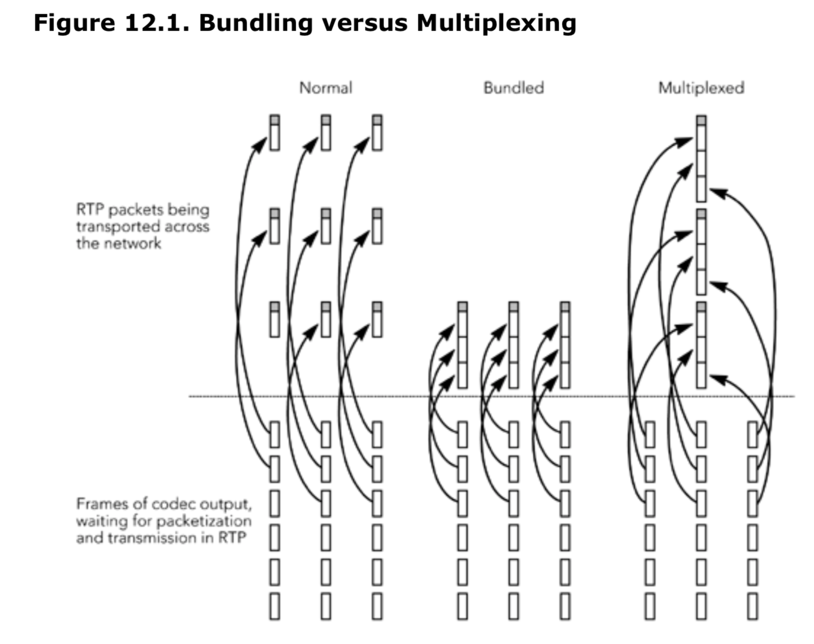
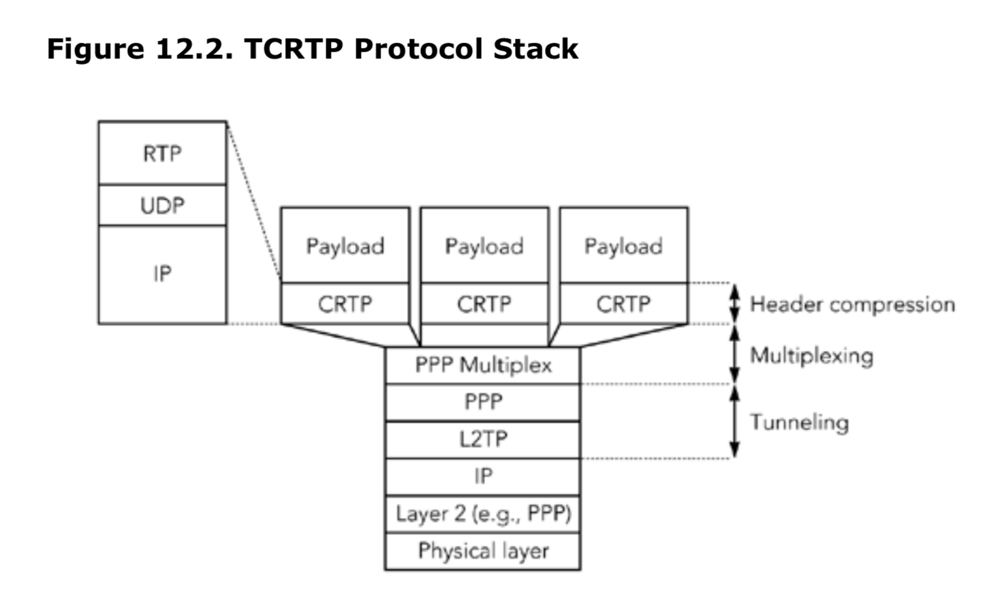
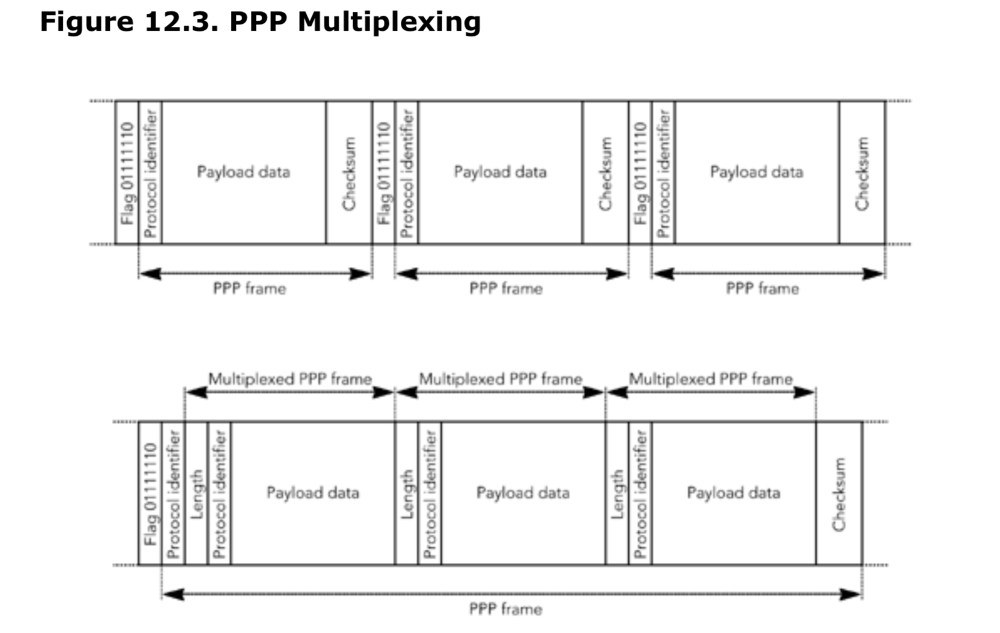
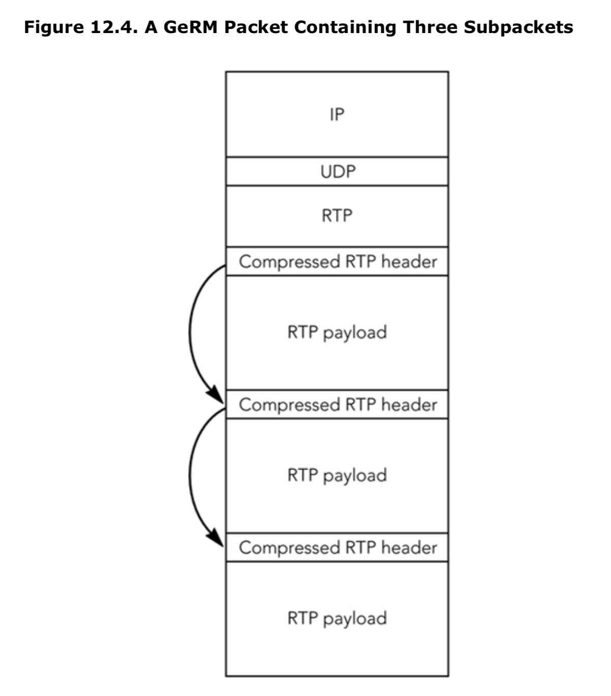
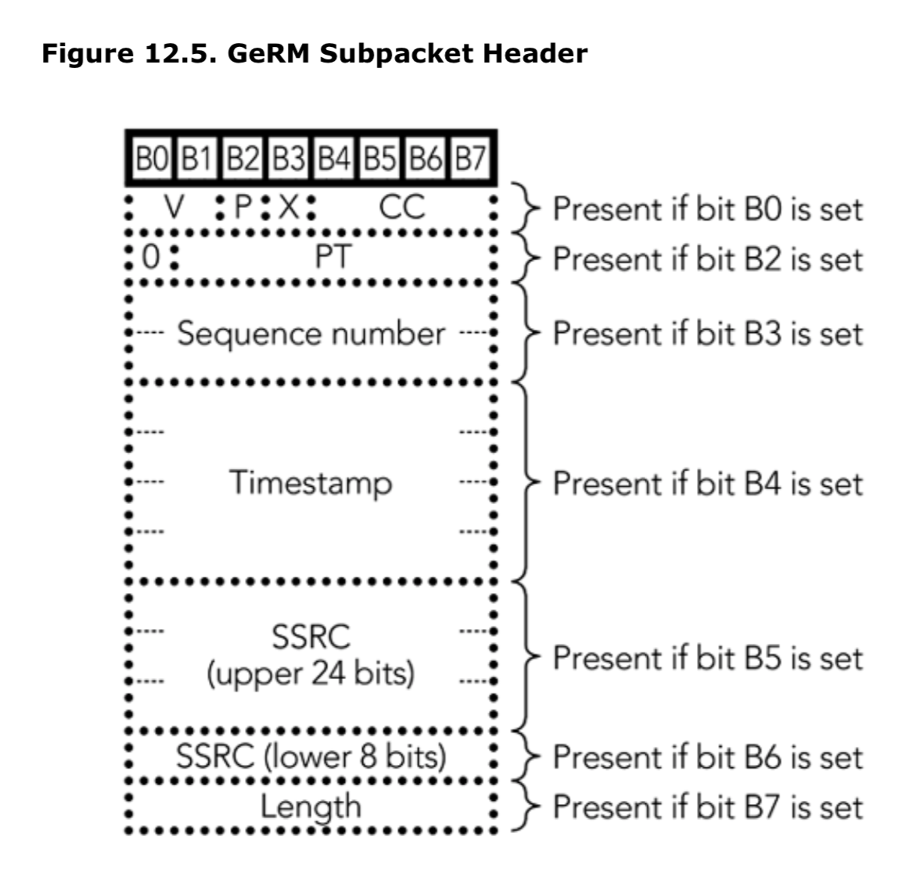

# 第十二章 多路复用和隧道技术

*  多路复用的动机
*  隧道复用压缩RTP
*  多路复用的其他方法

多路复用和隧道传输为包头压缩提供了一种替代方案，通过将多个流捆绑在一个传输连接中来提高RTP的效率。其目的是通过跨多个流来平摊头部的大小，减少每个流的开销。本章讨论了复用的动机，并概述了用于复用RTP流的机制。

## 多路复用的动机

包头压缩在逐跳的基础上减少单个RTP流的包头大小。虽然它提供了非常高效的传输，但是需要网络的协作(因为头压缩是逐跳工作的，而不是端到端的)。由于附加的计算和特定于流的状态，包头压缩增加了路由器上的负载，在必须同时支持数百甚至数千个RTP流的系统中，这两种情况都是不可接受的。

对网络内的计算和状态问题的传统解决方案是将复杂性推到边缘，简化网络的中心，但以边缘的额外复杂性为代价:端到端参数。这个解决方案的应用导表明:如果可能的话，应该减少端到端的包头。你可以通过端到端执行包头压缩来减少包头，从而减少每个包头的大小，或者通过在每个包中放置多个有效负载来减少包头的数量。

虽然应用RTP头端到端压缩是可能的，但遗憾的是，它的好处很少。即使RTP包头被完全删除，UDP/IP包头仍然存在。因此，对于典型的IPv4情况，28字节的开销仍然存在，当音频帧的负载为14字节时，这种大小显然是不可接受的。因此，只有一种可能的端到端解决方案:在每个包中放置多个有效负载，以摊销UDP/IP包头带来的开销。

如图12.1所示，多个有效负载数据帧可以来自单个流，也可以来自多个流。绑定就是将来自单个流的多个有效负载数据帧放入到每个RTP包。如第4章，RTP数据传输协议，所述，绑定是RTP的一个固有部分，不需要特殊的支持。它在减少包头开销方面非常有效，但是它给媒体流增加了额外的延迟，因为在所有绑定的数据出现之前不能发送包。

多路复用是将来自不同流的多个有效负载数据帧放入单个数据包进行传输的过程。多路复用避免了绑定中固有的延迟损失，并且在某些情况下可以显著提高效率。然而,不是没有问题,这可能使它不适合许多情况:

- 多路复用需要许多具有相似特性的流出现在多路复用点上。如果帧的到达时间不一致，多路复用设备将不得不延迟一些帧，等待其他帧的到达。如果帧的大小不可预测，则会出现其他问题，因为多路复用设备事先不知道可以多路复用多少帧。这可能意味着当帧的大小完全不适合多路复用时，将发送部分多路复用包。结果是低效的传输和可变的延迟，两者都不可取。

- 为IP提出的QoS服务质量机制(区分服务和集成服务)在IP流的粒度上进行操作。由于一个复用器在一个IP层流中传输多个流，因此不可能给这些流提供不同的服务质量。这可能会限制多路复用在使用QoS的环境中的有效性，因为它要求所有流具有相同的QoS。另一方面，如果许多流需要相同的增强QoS，则多路复用可能有助于减少QoS方案必须处理的流的数量。

- 类似地，多路复用意味着多路复用中的所有流都具有相同程度的错误恢复能力。这并不一定是适当的，因为某些流可能被认为比其他流更重要，并且可以从额外的保护中受益。

尽管存在这些问题，但在某些情况下，仍然希望复用RTP流。最常见的例子是大量本质上相同的流在两个点之间传输，这种情况经常发生在IP电话被用作取代传统电话线的主干“中继线”时。

RTP不直接支持多路复用。如果需要在RTP中使用多路复用流，则必须使用本章中描述的一个扩展。

##  隧道复用压缩RTP
IETF音频/视频传输工作组收到了许多关于RTP多路复用解决方案的建议。其中许多是由特定应用程序的需求驱动的，尽管它们可能已经解决了这些应用程序的需求，但它们通常无法提供完整的解决方案。在保留RTP语义的为数不多的建议中，有一条是隧道多路复用压缩RTP (TCRTP)，它被作为推荐的“最佳当前实践”解决方案。

**TCRTP的基本概念**

TCRTP规范描述了如何将现有协议组合起来以提供多路复用。它没有定义任何新的机制。RTP包头压缩、第二层隧道协议 (L2TP)和PPP复用的组合提供了TCRTP系统，协议栈如图12.2所示。包头压缩用于减少单个RTP有效负载的包头开销。隧道技术用于通过多跳IP网络传输压缩的包头和有效负载，而不必在每个链接上进行压缩和解码缩。

多路复用是通过在多个RTP有效负载上分摊一个隧道包头，从而来减少隧道包头的开销。

TCRTP的第一阶段是压缩包头，它以平常的方式进行，通过PPP链接协商CRTP或ROHC的使用。不同之处在于PPP链接是一个表示隧道的虚拟接口，而不是一个真实的链接。隧道对包头压缩是不可见的，其存在的唯一表现是其损失和延迟特性。这个概念与RTP实现在虚拟专用网(VPN)链接上运行非常相似，只是目的是提供更高效的传输，而不是更安全的传输。

与单个物理链路相比，隧道通常有更长的往返时间，可能有更高的包丢失率，并可能重新排序包。如第11章包头压缩所讨论的，与这些属性的链接对CRTP包头压缩有不利影响，并可能导致较差的性能。正在开发的CRTP的增强功能将减少这个问题。ROHC不是一个很好的选择，因为它需要按顺序交付，而不能通过隧道来保证。

隧道是通过L2TP创建的，它为IP网络上的PPP会话提供了一个通用的封装。这是一个自然的选择，因为CRTP和ROHC通常都映射到PPP连接上，而L2TP允许透明地协商任何类型的PPP会话。如果PPP层的接口正确实现，CRTP/ROHC实现将不知道PPP链接是一个虚拟通道。

不幸的是，当将隧道包头的开销添加到单个压缩RTP有效负载时，与未压缩的RTP流传输相比，节省的带宽非常少。需要多路复用来分摊许多RTP有效负载上的隧道头开销。因此，TCRTP规范建议使用PPP多路复用。PPP多路复用将连续的PPP帧组合成一个传输帧。它是在PPP连接设置过程中协商的一个选项，并且它支持可变大小和PPP帧类型的多路复用，如图12.3所示。

PPP为点对点的比特流增加了帧，这样它就可以传输上层数据包的序列。至少有四个八位字节的帧被添加到每个上层数据包: 一个标志位表示PPP帧的开始,紧随其后的是一个协议标识符,作为负载数据对上层数据包的映射,和两位的校验码(可能存在其他帧头,这取决于频道设置时的配置)。通过将多个帧复用为一个，PPP开销从每个包4个字节减少到2个字节。

当考虑到隧道开销时，TCRTP需要包括多路复用就变得很明显了。当PPP帧通过L2TP在IP上通过隧道传输时，每帧有36字节的开销(L2TP包头压缩可以将这个数字减少到每帧20字节)。除非帧在隧道化之前进行多路复用，否则这些开销将抵消包头压缩带来的收益。

**实现TCRTP**

TCRTP的优点是对上层协议不可见。生成RTP包的应用程序不能判断这些包是否被多路复用，而且应该可以在不更改现有应用程序的情况下将多路复用添加到现有应用程序中。

多路复用的通用性使TCRTP的使用具有很大的灵活性。例如，TCRTP可以实现为主机上的虚拟网络接口，以多路复用本地生成的数据包，或者在路由器上实现为在两个公共中间点之间流动的多路复用数据包，或者作为独立网关的一部分，从PSTN(公共交换电话网络)到IP，在电话系统中多路复用语音呼叫。

根据不同的场景，可以以多种方式实现TCRTP。一种可能的实现是将TCRTP堆栈作为标准的PPP网络接口呈现给系统的其余部分，该接口允许协商RTP包头压缩。在内部，它将实现PPP多路复用和L2TP隧道，但这种实现对应用程序是透明的。

TCRTP接口的透明性主要取决于操作系统。如果IP协议实现只是松散地耦合到第二层接口，那么应该可以相对容易和透明地添加一个新的接口—TCRTP。如果IP层与第二层接口紧密耦合，就像在嵌入式系统中TCP/IP实现根据特定链接的特性进行调优一样，那么这个过程可能会更加困难。

更严重的问题可能是两层接口和网络堆栈其他部分之间的交互。TCRTP是一个隧道协议，其中压缩RTP/UDP/IP层在多路复用PPP和L2TP之上，然后在UDP/IP之上。如果操作系统不支持隧道接口的概念，这种IP-over-something-over-IP的分层可能会有问题，需要大量的工作。如果系统将隧道接口隐藏在普通网络接口的抽象中，这也很有帮助，否则隧道接口的不同API会增加应用程序与TCRTP不兼容的可能性。

在TCRTP接口中，必须仔细控制多路复用的程度以限制延迟，同时确保在多路复用中包含足够多的包，以将包头开销保持在可接受的范围内。如果复用的包太少，每个包的包头就会变大，复用的好处就会被抵消。我们可以通过延迟发送多路复用包来避免这个问题，直到它们积累了足够的数据使包头开销可接受;但是，由于交互式应用程序需要的端到端总延迟小于150毫秒，所以多路复用不能插入太多的延迟。

非RTP流量可以通过TCRTP隧道发送，但会导致压缩效率显著降低，因此最好将其与RTP流量分离。如果实现协作确保只将RTP包发送到特定的目的地，或者可以使用对包头的更广泛的检查(例如，检查这些包是否是针对特定端口范围的UDP包)，则可以使用目标地址来分离这两种类型的流量。因为RTP不使用固定的端口，所以没有直接的方法来区分RTP流和非RTP流;因此，除非生成这些包的应用程序以某种方式与多路复用进行合作，否则多路复用不能确定只传输RTP包。

**性能**

使用TCRTP节省的带宽取决于几个因素，包括多路复用增益、隧道内的预期丢包率和多路复用RTP和IP包头内字段的变化率。

多路复用减少了由于PPP和L2TP包头而造成的开销，并且随着越来越多的流被多路复用到每个PPP帧中，这种减少会更大。当更多的流被复用在一起时，性能总是会提高，尽管每个流的增量增益随着复用中的流总数的增加而减少。

丢包率和包头字段的变化率会对包头压缩效率产生不利影响。丢包将导致上下文失效，这将导致在刷新上下文时，压缩切换到效率较低的操作模式。如果使用标准的CRTP，问题尤其严重;增强的CRTP执行得更好。头字段中的更改也可能导致压缩转换为效率较低的操作模式，发送一阶增量，而不是完全压缩的二阶增量。对此我们无能为力，只能参考在第11章标题为RTP应用程序注意事项的章节。包头压缩也与TCRTP相关。

TCRTP规范包括一个简单的性能模型，该模型试图预测IP上的语音流(给定增强的CRTP压缩)使用的带宽、数据包大小和持续时间、平均通话长度、可复用的数据包数量，以及由于压缩的RTP和IP包头的变化而导致的开销估计。该模型预测，对于一个G.729流，TCRTP将达到14.4 Kbps的速率，该流包含20毫秒的数据包、三个多路复用的数据包和平均1500毫秒的对话并发长度。这与逐跳CRTP实现的12Kbps和没有包头压缩或多路复用的标准RTP(所有数字都包括由于PPP-in-HDLC[高级数据链路控制]帧造成的第二层开销)的25.4 Kbps形成了鲜明的对比。

当然，性能在很大程度上取决于媒体和网络的特性，但是我们相信，在这个例子中看到的相对性能并不是不现实的。如果有足够的流量进行多路复用，TCRTP的性能将显著优于标准RTP，但略低于逐跳包头压缩。

### 多路复用的其他方法
在IETF内部，多路复用一直是存在一些争议和大量讨论的领域。虽然TCRTP是当前推荐的最佳实践，但还有其他一些建议值得进一步讨论。这包括通用的RTP多路复用(GeRM)，它是TCRTP的少数几个保持RTP语义的备选方案之一，以及几个特定于应用程序的多路复用。

**GeRM**

通用RTP多路复用(GeRm)在1998年8月芝加哥的IETF会议上被提出，但是一直没有发展成一个完整的协议规范。GeRM使用RTP包头压缩的思想，但它不是压缩包之间的包头，而是将压缩应用于单个包内复用的多个有效负载。在每个新的包中，所有的压缩状态都被重新初始化，因此，GeRM可以有效地端到端的工作。

**概念和包格式**

图12.4显示了GeRM的基本操作。一个RTP包被创建，多个RTP包(称为子包)在其中进行多路复用。每个GeRM包都有一个外部RTP包头，其中包含第一个子包的包头字段，但是RTP有效负载类型字段被设置为一个值，表示这是GeRM包。

除了有效负载类型字段和长度之外，第一个子包包头将被完全压缩，因为完整的RTP包头和子包包头只在有效负载类型上不同。然后，根据第二个子包的原始RTP包头与第一个子包的原始RTP包头之间预测的差异对第二个子包包头进行编码。然后，第三个子包包头基于其原始RTP包头与第二个子包的原始RTP包头编码，以此类推。每个子包包头由一个强制的八字节组成，后面跟着几个扩展八字节，如图12.5所示。

强制八位中的位的含义如下:

B0: 0表示原始RTP包头的第一个八位组与前一个子包中的原始RTP包头保持不变(如果此包中没有前一个子包，则为外RTP包头)。也就是说，V CC P不变。1表示原始RTP包头的第一个八位元紧接在GeRM包头之后。

B1:这位包含子数据包RTP包头的标记位。

B2:0表示负载类型保持不变。1表示有效负载类型字段跟在GeRM头和任何可能出现的包头首字节之后。虽然PT是一个7位字段，但它是作为一个8bit字段添加的。这个字段的第0位总是0。

B3:0表示序列号保持不变。1表示16bit序列号字段位于GeRM包头和可能存在的任何包头首字节或PT包头之后。

B4:0表示时间戳保持不变。1表示32bit的时间戳字段位于GeRM包头和可能存在的任何包头首字节、PT或序列号包头之后。

B5:0表示SSRC的最高有效的24位保持不变。1表示SSRC最高有效的24位位于GeRM头和可能存在的任何首八位、PT、序列号或时间戳字段之后。

B6:0表示SSRC的最低有效8bit比前一个SSRC高1位。1表示SSRC的最低有效的8bit位于源包头和可能存在的首八位、PT、序列号、时间戳或MSB SSRC包头字段之后。

B7:0表示以字节为单位的子包长度(忽略子包包头)与前面的子包相同。1表示子包长度(忽略子包包头)遵循所有其他GeRM包头作为一个8bit无符号整数长度字段。一个8bit长度的字段就足够了，因为较大的数据包通过多路复用可以获得的增益很少。

原始RTP包头中存在的CSRC字段，跟随在原始包头。接下来的是RTP有效负载。

## 应用场景
由于GeRM而节省的带宽取决于多路复用包之间的包头的相似性。考虑两个场景:任意的包和协作应用程序生成的包。

如果要对任意的RTP包进行多路复用，则多路复用的增益很小。如果包之间没有相关性，那么所有可选字段都将出现，并且子包包头的长度为14字节。与非多路复用的RTP相比，这里仍然有一个优势，因为一个14字节的RTP/UDP/IP包头比40字节的RTP/UDP/IP包头要小，但是与标准包头压缩相比，节省的带宽相对较小。

如果要进行多路复用的包是通过协作应用程序产生的，则由GeRM节省的带宽可能要大得多。在最简单的情况下，所有要复用的包都具有相同的有效负载类型、长度和CSRC列表;除了第一个子数据包包头外，所有的字节都被删除了3个8bit字节。如果生成包的应用程序相互协作，它们可以合作以确保子包中的序列号和时间戳匹配，从而节省额外的6个字节。如果应用生成具有连续同步源标识符的分组，也允许移除SSRC，则可以实现更多的节省。

当然，实现之间的这种相互协作扩展了合法RTP的范围。特别是，生成非随机SSRC标识符的应用程序可能会在与使用标准RTP的发送端的会话中造成严重问题。这种非随机SSRC的使用在两种情况下是可以接受的:

1.当使用RTP和GeRM在两个网关之间传输媒体数据时。在这种情况下，数据的发送端和接收端意识不到RTP和GeRM被用来传输数据也算是一种幸运。例如，一个系统可以生成ip上的语音数据包，作为两个PSTN交换之间的网关的一部分。

2.当复用设备在被包含进GeRM之前重新映射SSRC时，用多路复用设备重新生成原始的SSRC。在这种情况下，SSRC标识符映射必须在带外发出信号，但这可以作为调用设置过程的一部分。

在最好的情况下，GeRM可以生成每个多路复用数据包带有两个八位字节标头的数据包，与非多路复用RTP相比，这可节省大量带宽。与非多路复用RTP相比，GeRM将始终减少包头开销。

## GeRM的未来

GeRM不是一个标准的协议，目前也没有计划完成它的规范。这样做有几个原因，其中最主要的原因是，如果在网络中应用了GeRM，应用程序在生产RTP包头时协作的要求将限制协议的范围并导致互操作性问题。此外，带宽节省相对较小，除非这种协作发生，这可能使GeRM不那么有吸引力。

作为特定于应用程序的多路复用器，GeRM的概念非常有用，它位于两个网关之间，这两个网关使用相同的编解码器对多个RTP流进行发送和接收，并且愿意为这些流协作生成RTP包头。典型的例子是IP- PSTN网关，其中IP网络充当两个PSTN交换机之间的长途中继电路。GeRM允许这样的系统维护大多数RTP语义，同时提供一个高效的多路复用，但只能在应用层实现。

**特定于应用程序的多路复用**

除了TCRTP和GeRM等通用多路复用协议外，还提出了各种特定于应用的多路复用协议。这些多路复用的绝大多数都是针对IP到PSTN网关的，其中IP网络充当两个PSTN交换之间的长途中继电路。这些网关之间有许多并发的语音连接，可以通过多路复用来提高效率，支持使用低比特率的语音编解码器，并提高可伸缩性。

这种网关通常使用RTP协议特性的一个非常有限的子集。所有要进行多路复用的流通常使用相同的有效负载格式和编解码器，它们可能不采用静音抑制。此外，每个流表示单个会话，因此不需要RTP的混流功能。结果是RTP包头的CC、CSRC、M、P和PT字段是冗余的，序列号和时间戳之间有一个常量关系，可以省略其中一个。删除这些字段后，只剩下序列号/时间戳和同步源(SSRC)标识符。鉴于RTP的使用如此有限，显然有必要在这些场景中使用特定于应用程序的多路复用。

特定于电话的多路复用可以定义为对RTP包的操作，将多个RTP流转换为一个减少包头的单一多路复用。简单地说，这样的多路复用可能只将序列号和同步源(可能减少)的包连接到UDP包中，使用带外信令定义这些减少的头和完整的RTP头之间的映射。根据应用程序的不同，多路复用可以对实际的RTP包进行操作，也可以是将PSTN包直接转换为多路复用包的逻辑操作。这种特定于应用程序的多路复用没有标准的解决方案。

作为一种替代方案，可以为TDM(时分多路复用)有效负载定义一种RTP有效负载格式，这将允许直接传输PSTN语音，而无需首先将其映射到RTP。结果是一种“电路仿真”格式，定义为传输整个电路而不关心其内容。

在这种情况下，RTP头将涉及到电路。SSRC、序列号和时间戳与电路有关，而与在该电路中进行的任何单个会话无关;有效负载类型识别，例如，“T1仿真”;混流功能(CC和CSRC列表)没有使用，标记位和填充也没有使用。图12.6显示了该过程如何工作，每个T1帧形成一个RTP包。

当然，由于RTP开销很大，对T1线路的直接模拟收益很少。但是，在每个RTP包中包含几个连续的T1帧是完全合理的，或者模拟一个更高速率的电路，这两者都可以显著降低RTP开销。

IETF有一个伪线边缘到边缘仿真工作组，该工作组正在开发电路仿真标准，包括PSTN(公共交换电话网)、SONET(同步光网络)和ATM(异步传输模式)电路。这些标准还没有完成，但RTP负载格式的电路仿真是一个建议的解决方案。

用于ip - pstn网关设计的电路仿真方法比特定于应用程序的多路复用解决方案更符合RTP原理。强烈建议将电路仿真作为此特定应用程序的解决方案。

## 总结

多路复用通常是不可取的。它强制所有媒体流使用单一传输，阻止接收端根据需要对其进行优先级排序，并使其难于应用错误纠正。在几乎所有情况下，包头压缩都提供了更合适、更高效的解决方案。

然而，在某些有限的情况下，多路复用可能是有用的，主要是当许多本质上相同的流在两个点之间传输时，这种情况经常发生在ip电话被用作取代传统电话线的主干“中继线”时。