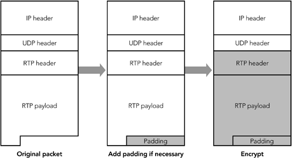
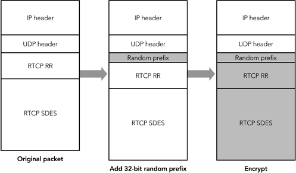
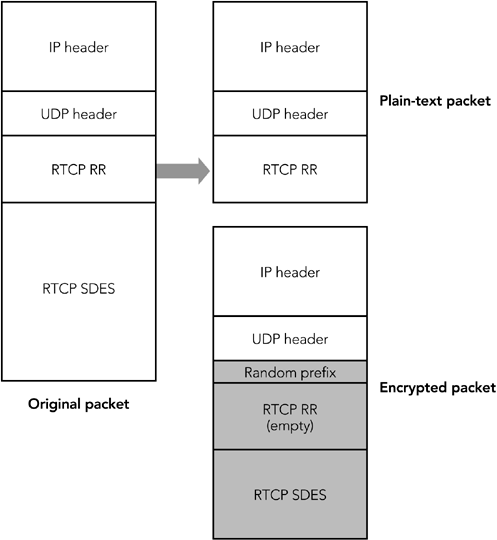
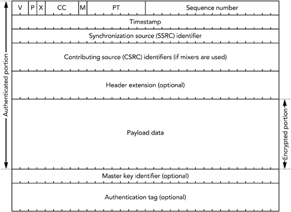
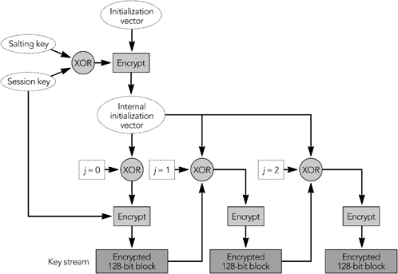
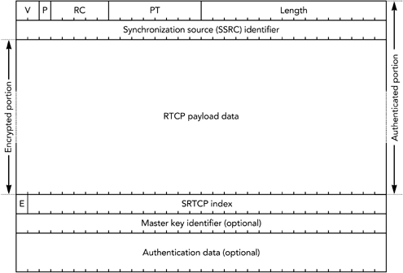
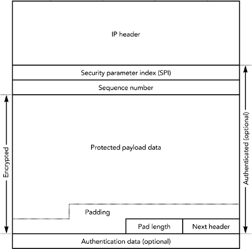
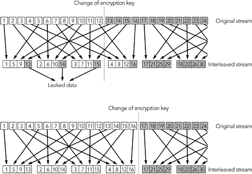
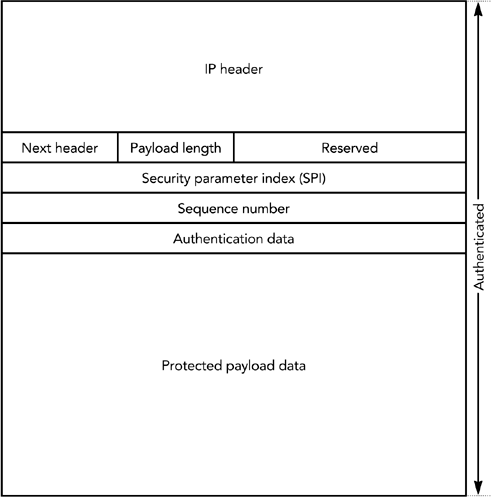

## 第十三章  安全考虑

-  隐私
-  保密
-  认证
-  重播保护
-  拒绝服务
-  混流器和转换器
-  动态内容
-  其他注意事项

到目前为止，我们只考虑了在一个隔离的，安全的环境中怎么实现RTP。然而，在现实世界中，有些人会试图窃听会话，冒充合法用户，以及出于恶意目的侵入系统，因此在现实世界中，一个正确的RTP系统实现应该能防卫此类攻击，为其用户提供稳私、机密性和身份验证服务。本章描述了用于增强用户隐私的RTP特性，并概述了各种潜在的攻击以及如何防范这些攻击。

## 隐私

显而易见的隐私问题是如何防止未经授权的第三方窃听RTP会话。这个问题在下一节（保密）讨论。然而，保密性并不是唯一的隐私问题；用户可能希望限制他们在会话期间向外暴露出的个人信息量，或者他们可能希望对其通信伙伴进行身份保密。

正如第5章RTP控制协议中所述的，源信息（可能包括个人详细信息）被封装在RTCP源描述包中传送和交换。这些信息有多种用途，其中大多数用途是合法的，但有些用途可能会被用户视为不恰当的。远程会议应用程序使用RTCP源描述包来传送参与者的名称和从属关系，或提供其他呼叫者的身份标识信息，这就是一个合法用途的例子。在用户收听在线电台时，通过RTCP源描述包收集个人详细信息，从而使电台及其广告商跟踪其听众，这就是一个不合法的使用例子。

由于这些问题，建议应用程序在首次提示信息可用之前，不要发送源描述包。

必须发送的规范名(CNAME)是一个例外。CNAME包括有参与者的IP地址，但这不应该被视做一个隐私问题，因为这些数据可以从IP包头得到（当使用了NAT设备，CNAME中包括的是一个内部的IP地址）。CNAME还公开了参与者的用户名，这可能是一个更大的隐私问题，但应用程序可以省略或重写用户名以隐藏此信息，前提是通过CNAME关联会话的所有应用程序都一致地执行此操作。

CNAME相当于一个唯一标识符，可以用来跟踪参与者。如果参与者从具有临时IP地址（例如，拨号用户的IP地址是动态分配的）的计算机加入，则可以避免被跟踪。如果系统有一个静态的IP地址，就无法保护该地址不被跟踪，但是CNAME暴露出的IP信息是比IP头中获得的信息要更少（尤其是当CNAME中用户名部分被隐藏时）。

一些接收端可能根本不想别人看到他们的存在。这些接收端不发送RTCP包也是可以接受的，但这样会阻止发送端使用接收质量信息来调整其传输以匹配接收端（并且也可能导致源认定接收端已失败，并停止传输）。此外，一些内容提供商可能需要RTCP报告来衡量其受众的规模。

一个相关的隐私问题涉及到在谈话中保密对方的身份。即使使用了下一节中描述的保密措施，窃听者也可以观察传输中的RTP包，并通过查看IP包头获得一些通信知识（例如你的老板可能会有兴趣知道你的IP语音呼叫的目的IP地址是否是招聘机构所拥有）。这个IP暴露的问题不容易解决，但是如果流量是通过一个可信的第三方网关来路由的，这个网关充当一个中间的IP地址，就可以减轻这个问题（对网关的流量分析可能仍然会揭示通信模式，除非网关设计为能够抵抗这种分析）。

## 保密

RTP的关键安全要求之一是保密性，确保只有预期的接收端才能解码RTP包。RTP内容通过加密来保密，无论是在应用程序级加密整个RTP包，还是仅加密有效负载部分，或是在IP层。

应用程序级的加密，对于RTP来说，有优点也有缺点。它的主要优点是允许包头压缩。如果仅对RTP有效负载进行加密（即应用程序级的加密），则包头压缩将正常工作，这对于某些应用程序（例如，使用RTP的无线电话）是必不可少的。如果RTP包头也被加密，则包头压缩的操作在一定程度上会中断，但仍然可以压缩UDP/IP包头。

应用程序级加密的另一个优点是它易于实现和部署，不需要更改主机操作系统或路由器。不幸的是，这也是一个潜在的缺点，因为它将正确实现的负担扩展到所有应用程序。加密代码是非常重要的，必须注意确保安全性不会因设计不当或实现中的缺陷而受到损害。

>  再次值得一提：加密代码是很重要的，必须注意确保安全，不会因不良的设计或实现中的缺陷而受到影响。我强烈建议读者在使用加密构建系统之前，先详细研究相关标准，并确保使用众所周知的，经过公开分析的加密技术。

应用程序级加密的另一个潜在缺点是，它会使某些包头字段未加密。在某些情况下，缺少加密可能会泄露敏感信息。例如，对负载类型字段的了解可能允许攻击者确定加密负载数据部分的值，这可能是因为每一帧以标准格式的负载头开始。如果选择了合适的加密算法，这不应该是个问题，但它有可能危及本已薄弱的解决方案。

作为替代方案，可以在IP层执行加密，例如，使用IP安全协议。这种方法的优点是对RTP是透明的，并且提供了一套经过充分测试的加密代码，可以信任它们是正确的。IP层加密的缺点是它会中断RTP包头压缩的操作，并且其部署需要对主机操作系统进行大量更改。

###  RTP规范中的保密特性

RTP规范提供了对RTP数据包（包括头）和RTCP包的加密支持。

RTP数据包的所有字节，包括RTP包头和有效负载数据，都是可以加密的。实现可以选择它们支持的加密方案。根据使用的加密算法，可能需要在执行加密之前将填充的八位字节附加到有效负载中。例如，DES加密对64位的块进行操作，因此如果有效负载的长度不是8个字节的倍数，则需要对其进行填充。图13.1说明了该过程。当有填充字节时，RTP头中的P位必须被设置，并且填充字节的最后一个字节，指示有填充多少字节。

###### 图 13.1 RTP数据包的标准加密

当RTCP包被加密时，在第一个包之前插入一个32位随机数，如图13.2所示。这样做是为了防止已知的纯文本攻击。RTCP包中很多的八位字节都具有标准格式; 这些固定八位字节存在的知识使得狡猾的破解者的工作更容易，因为他知道他寻找的东西有部分一定在一个解密的包中。破解者可以使用强力密钥猜测，在解密尝试中使用那些具有标准格式的八位字节值来确定何时停止。

###### 图13.2 RTCP数据包的标准加密

前缀的插入为加密算法提供初始化，从而有效地防止已知的纯文本攻击。数据包不使用前缀，因为固定头字段较少：同步源是随机选择的，序列号和时间戳字段具有随机偏移量。

在某些情况下，希望只加密部分RTCP数据包，而明文发送其他部分。典型的例子是加密SDES项，但不加密RR(接收端报告)。我们可以通过将一个复合RTCP包拆分为两个单独的复合包来实现这一点。第一个包括SR/RR包；第二个包括空RR包（以满足所有复合RTCP包以SR或RR开头的规则）和SDES项。(有关RTCP数据包格式，请参阅第5章，RTP控制协议。) 图13.3说明了这个过程。

###### 图13.3 对控制包进行部分加密的标准方式

> 该规则有一个例外，即所有复合RTCP数据包都必须同时包含SR/RR数据包和SDES数据包：将复合数据包拆分为两个单独的复合数据包进行加密时，SDES数据包仅包含在一个复合数据包中，而不是全部。

以CBC模式工作的DES是默认的加密算法。在设计RTP时，DES提供了适当的安全级别。然而，机器处理能力的提高使其变得很弱，因此建议在可能的情况下选择更强的加密算法。合适的强加密算法有3DES和AES。为了最大限度地提高互操作性，支持加密的所有实现都应该支持DES，尽管它不是强加密算法。

接收端通过包头或有效负载的有效性检查（如第4章RTP数据传输协议和第5章RTP控制协议的分组验证部分中所述的检查）来确认加密的存在和正确密钥的使用。

RTP规范没有定义任何交换加密密钥的机制。然而，密钥交换是任何系统的重要组成部分，必须在会话启动期间执行。SIP和RTSP等协议应以适合RTP的形式提供密钥交换。

##### 使用安全RTP配置文件的机密性

安全RTP（SRTP）配置文件提供了RTP规范中加密机制的替代方案。这一新的配置文件是根据无线电话的需要而设计的，它提供了保密性和身份验证，适用于可能具有较高丢包率的链路，并且需要包头压缩以实现高效操作。SRTP是一项正在进行的工作，在撰写本文时，协议的细节仍在不断发展。规范完成后，读者应参考最终标准，以确保此处描述的细节仍然准确。

SRTP通过仅加密数据包的有效负载部分来提供RTP数据包的机密性，如图13.4所示

###### 图13.4 数据包的SRTP加密

RTP头以及任何头扩展都是在不加密的情况下发送的。假如RTP包中的负载数据区域，有一个负载头，则该负载头将与负载数据一起加密。认证头在“认证”这一节被详细描述，使用了本章后面的安全RTP配置文件。密钥管理协议可以使用可选的主密钥标识符，以便在加密上下文中重新设置和标识特定的主密钥。

使用SRTP时，发送端和接收端需要维护一个加密上下文，包括加密算法、主密钥和转换密钥、一个32位滚动计数器（它记录16位RTP序列号反转的次数）和会话密钥产生的速率。接收端还应记录接收到的最后一个分组的序列号，以及重播列表（当使用认证时）。RTP会话的传输地址与SSRC一起用于确定哪个加密上下文用于加密或解密数据包。

默认的加密算法是计数器模式或f8模式下的AES，计数器模式是强制实现的。未来可能会定义其他算法。

加密过程包括两个步骤：

1.  系统通过一个非基于RTP的密钥交换协议提供一个或多个主密钥。每个会话密钥是一个伪随机函数的采样，在发送了一定数量的数据包后，以主密钥、数据包索引和密钥产生速率作为输入进行重新绘制。根据加密上下文中的密钥产生速率，会话密钥可能会针对发送的每个数据包进行更改。密钥管理协议可以使用主密钥标识符来指示要使用哪个预交换的主密钥，从而允许同步主密钥中的更改。

2.  通过基于包索引和会话密钥生成密钥流，然后利用RTP包的有效负载部分计算该密钥流的逐位异或（XOR），以对包进行加密。

在这两个步骤中，包索引是32位扩展的RTP序列号。如何生成密钥流的细节取决于加密算法和操作模式。

如果使用计数器模式下的AES，则以这种方式生成密钥流: 一个128位整数的计算方法如下：（2的16次方 x 包索引）XOR（加盐键（the salting key） x 2的16次方）XOR（SSRC x 2的64次方）。整数使用会话密钥加密，从而生成密钥流的第一个输出块。然后整数以2的128次方为模递增，用会话密钥再次对块进行加密。结果是密钥流的第二个输出块。该过程重复，直到密钥流至少与要加密的包的有效负载部分一样长。图13.5显示了这个密钥流的生成过程。

###### 图13.5 SRTP密钥流的生成：计数器模式下的AES

在计数器模式下实现AES时，你必须确保每个包都用唯一的密钥流加密（密钥流派生函数中存在包索引和SSRC可确保这一点）。如果意外地使用同一密钥流加密两个数据包，则加密将变得很容易被破解：只需将这两个包异或在一起，纯文本就变得可用了（请记住，在第9章错误恢复中对奇偶校验FEC的讨论中，A XOR B XOR B = A）。

如果在f8模式下使用AES，则密钥流的生成方式如下：会话密钥和加盐密钥的异或结果，用于加密初始化向量。如果加盐密钥的长度小于128位，则用交替的0和1填充到128位。结果称为内部初始化向量。内部初始化向量和128位变量的异或生成密钥流的第一个块，并且会被会话密钥加密。变量j递增，密钥流的第二个块是由内部初始化向量，变量j和密钥流的前一个块，三者的异或生成。该过程重复，j每次递增，直到密钥流至少与要加密的包的有效负载部分一样长。图13.6显示了这个密钥流生成过程。

###### 图13.6 SRTP密钥流的生成：f8模式下的AES

默认的加密算法和模式是AES的计数器模式；AES；f8模式的使用可以在会话初始化期间协商。

SRTP同样提供了RTCP加密功能。整个RTCP包被加密，不包括初始公共头（包的前64位）和添加到每个RTCP包末尾的几个附加字段，如图13.7所示。几个附加字段是SRTCP索引（E位指示有效负载是否加密）、可选的主密钥标识符和验证头(验证头在本章后面的“使用安全RTP配置文件进行身份验证”一节中进行了描述)。

###### 图13.7 控制包的安全RTP加密

RTCP包的加密过程与RTP数据包的加密过程基本相同，但使用SRTCP索引代替扩展的RTP序列号。

标准RTCP加密期间应用的加密前缀不与SRTP一起使用（加密算法的差异意味着前缀没有任何好处）。将RTCP数据包分成加密和未加密的数据包是合法的，就像标准RTCP加密一样，由SRTCP数据包中的E位表示。

与RTP规范一样，SRTP配置文件没有定义交换加密密钥的机制。密钥必须通过非RTP方式交换，例如，在SIP或RTSP内。主密钥标识符可用于同步主密钥的更改。

##### 使用IP安全的机密性

除了标准RTP和SRTP提供的应用级安全性外，还可以将IP级安全性与RTP结合使用。IP安全是作为操作系统网络堆栈的一部分或在网关中实现的，而不是由应用程序实现的。它为来自主机的所有通信提供安全性，不是RTP特定的。

IP安全（IPsec）有两种操作模式：传输模式和隧道模式。传输模式在IP和传输头之间插入一个附加头，提供TCP或UDP包头和有效负载的机密性，但不影响IP包头。隧道模式将整个IP数据包封装在一个安全头中。图13.8说明了两种操作模式之间的差异。隧道模式下的IP安全最常用于构建虚拟专用网络，在两个网关路由器之间进行隧道，以安全地在公共互联网上扩展内网（intranet）。当需要单个主机之间的端到端安全性时，使用传输模式。

###### 图13.8 传输模式与隧道模式

隧道模式和传输模式都支持数据包的保密和验证。保密是由一种称为封装安全有效负载（ESP）的协议提供的。ESP由附加的包头和添加到每个数据包的尾部组成。头部包括安全参数索引和序列号；尾部包含填充和封装数据类型的指示(如果使用传输模式，则为TCP或UDP；如果使用隧道模式，则为IPIP隧道).封装在头和尾之间的是受保护的数据。图13.9显示了头，尾和封装过程。

###### 图13.9 一个封装的安全有效负载包

安全参数索引（SPI）和序列号分别占用4个字节。SPI用于选择加密上下文，从而选择要使用的解密密钥。序列号是随着每个数据包的发送加一，用于提供重播保护(参见本章后面标题为重播保护的章节). 在这两个头字段之后是封装的负载: 如果使用传输模式，则为UDP包头，后跟RTP包头和有效负载；如果使用隧道模式，则为IP/UDP/RTP包头和有效负载。

在有效负载数据之后是填充数据（如果需要填充对齐）和一个“下一个头”字段。最后一个字段确定封装头的类型。它的名字有点误导人，因为这个字段所指的包头实际上是在这个数据包的前面发送的。最后，可选的身份验证数据在数据包的末尾(请参阅本章后面标题为“使用IP安全进行身份验证”那部分内容)。

ESP使用对称算法对数据包的受保护数据段进行加密（必须实现DES；可以协商其他算法）。如果ESP是与RTP一起使用时，将对整个RTP包头和负载以及UDP包头和IP包头（如果使用隧道模式）进行加密。

在传输模式下，无法将包头压缩与IP安全一起使用。如果使用隧道模式，则在加密和封装之前可以压缩内部IP/UDP/RTP头。这样做很大程度上消除了IPsec包头带来的带宽损失，但并没有达到包头压缩所期望的效率。如果以带宽效率为目标，则应使用应用程序级RTP加密。

IPsec也可能给某些防火墙和网络地址转换（NAT）设备带来困难。特别是，IPsec隐藏TCP或UDP包头，用ESP包头替换它们。防火墙通常配置为阻止所有无法识别的通信，因此除了TCP和UDP，防火墙还必须配置为允许ESP。由于TCP或UDP端口号在ESP数据包中加密时无法转换，因此NAT会出现相关问题。如果存在防火墙和NAT，则应用程序级RTP加密可能更成功。

IP安全协议套件包括一个广泛的信令协议，Internet密钥交换（IKE），用于设置必要的参数和加密密钥。IKE的细节超出了本书的范围。

##### 其他注意事项

当使用交织或前向纠错时，几种RTP有效负载格式提供包之间的耦合。数据包之间的耦合可能会影响加密操作，从而限制可以更改加密密钥的次数。图13.10显示了一个交织的例子，说明了这个问题。

###### 图13.10 加密与交织的交互

RTP可以使用一系列加密算法，但它们定义了一个“必须实现”的算法，以确保互操作性。在许多情况下，DES是必须实现的算法。计算能力的进步使得DES显得相对薄弱，目前已经证明了DES在不到24小时内就可以被强力破解，因此如果可能的话，协商一个更强大的算法是有必要的。3DES和最近公布的高级加密标准（AES）是合适的选择。

使用端到端加密以确保RTP中的机密性，对于防止未经授权访问内容（无论内容是付费电视还是私人电话对话）是有效的。这种保护通常是可取的，但它确实还涉及一些更广泛的议题。特别是，在某些辖区中，有关执法人员是否有权力窃听通讯的争论一直在进行。在RTP中广泛使用加密作为保密措施，使得此类窃听和其他形式的窃听更加困难。此外，一些司法管辖区限制使用或分销包括加密的产品。在实施本章所述的保密措施之前，你应了解在你的管辖区内使用加密的法律和法规问题。

### 认证

有两种类型的身份验证：证明数据包没有被篡改，称为完整性保护，以及证明数据包来自正确的源，称为源身份验证。

完整性保护是通过使用消息身份验证代码来实现的。这些代码接受一个要保护的包和一个只有发送端和接收端知道的密钥，并使用它们生成一个唯一的签名。如果攻击者不知道密钥，则不可能在更改了包的内容，却还能使包的内容与消息身份验证代码相匹配。对称共享机密的使用限制了对多人参与的组中的源进行身份验证的能力，因为组中的所有成员都可以生成经过身份验证的数据包。

对于RTP应用程序而言，源认证是一个困难得多的问题。首先可能会认为它等同于生成消息身份验证代码的问题，但是由于发送端和接收端之间的共享机密不足，因此更加困难。相反，有必要在签名中标识发件人，这意味着签名更大且计算起来更昂贵（在很多方面，公钥加密比对称加密更昂贵）。该要求通常使得验证RTP流中每个数据包的源变得不可行。

像机密性一样，身份验证可以应用于应用程序级别或IP级别，具有相同的优点和缺点。两种替代方案均已开发用于RTP。

##### 使用标准RTP进行身份验证

标准RTP不支持完整性保护或源身份验证。需要身份验证的实现应该实现安全RTP，或者使用较低层的身份验证服务，如IP安全扩展提供的服务。

##### 使用安全RTP配置文件进行身份验证

SRTP支持消息完整性保护和源身份验证。为了完整性保护，消息身份验证标签将附加到数据包的末尾，如图13.4所示。消息认证标签是在整个RTP数据包上计算的，并且是在数据包已加密后计算的。在撰写本文时，已指定了HMAC-SHA-1完整性保护算法用于SRTP。其他完整性保护算法可能会在将来定义，并与SRTP协商使用。

TESLA源认证算法已被考虑用于SRTP，但在编写本文时TESLA尚未完全定义。建议你在完成时参考SRTP规范以了解详细信息。

SRTP的身份验证机制不是强制性的，但我强烈建议所有实现都使用它们。特别是，你应该知道，除非使用身份验证，否则攻击者极有可能伪造使用AES（计数器模式下）加密的数据。安全RTP配置文件规范详细描述了这个问题。

##### 使用IP安全的身份验证

IP安全扩展可以为从主机发送的所有数据包提供完整性保护和身份验证。有两种方法可以做到这一点：作为封装安全负载的一部分，或者作为身份验证头。

前面在标题为“使用IP安全性的机密性”中介绍了封装安全性有效负载。如图13.9所示，ESP包括一个可选的身份验证数据部分，作为尾部的一部分。如果存在，则身份验证将对整个封装的有效负载以及ESP标头和尾标进行检查。外部IP头不受保护。

ESP的替代方法是RFC 2402中定义的身份验证头（AH），如图13.11所示。此头中的字段非常类似于ESP中的对应字段，并且AH可以在隧道模式和传输模式中使用。关键区别在于整个数据包都经过了身份验证，包括外部IP标头。

###### 图13.11 IPsec验证头

如果要求提供机密性和身份验证，则ESP是适当的（使用ESP加密和AH进行身份验证会导致过多的带宽开销）。如果唯一的要求是身份验证而不是机密性，那么ESP和AH之间的选择取决于是否认为有必要对外部IP包头进行身份验证。通过确保源IP地址不被欺骗，外部头的身份验证提供了一些额外的安全性。它还具有导致无法进行网络地址转换的副作用。

一系列认证算法可以与IP安全一起使用。如果使用身份验证，则ESP和AH的强制算法为HMAC-MD5-96和HMAC-SHA-96，它们仅提供完整性保护。将来可能会定义用于源身份认证的算法。

前面标题为“使用IP安全进行保密”的部分提到了IP安全与包头压缩，防火墙和NAT之间的潜在交互问题。当使用IP安全提供身份验证时，这些问题也适用。

IP安全协议套件包括一个扩展的信令协议，即Internet密钥交换（IKE），用于设置必要的参数和身份验证密钥。IKE的详细信息超出了本书的范围。

### 重播保护

与身份验证相关的是重播保护问题：阻止攻击者记录RTP会话的数据包，并在以后出于恶意目的将其重新注入网络。RTP时间戳和序列号提供有限的重播保护，因为实现应该丢弃旧数据。但是，攻击者可以在回放之前观察数据包流并修改记录的数据包，使它们与预期的时间戳和接收器的序列号相匹配。

为了提供重播保护，必须对消息进行身份验证以实现完整性保护。这样做可阻止攻击者更改重播数据包的序列号，从而使旧数据包无法重播到会话中。

### 拒绝服务

当有效负载格式使用了压缩技术，并且接收端进行解码要消耗大量计算时，会存在潜在的拒绝服务威胁。如果有效负载格式具有这种属性，则攻击者可能能够将病理数据包注入媒体流中，该数据包很难解码并导致接收器超载。接收端几乎无法避免此问题，除非在过载情况下停止处理数据包。

另一个可能导致拒绝服务的问题是未能正确实现RTCP时序规则。如果参与者以恒定速率发送RTCP，而不是随着组大小的增加而增加包之间的间隔，则RTCP流量将随组大小线性增长。对于大型组，这种增长可能会导致严重的网络拥塞。解决方案是密切关注RTCP是否正确实现。

同样，当成员发生快速变化时，未能实现RTCP重新考虑算法可能会导致瞬时拥塞。这是一个次要问题，因为这种影响只是暂时的，但可能仍然是一个问题。

如果RTP实现对包丢失作出不适当的响应，也会发生网络拥塞。第10章《拥塞控制》详细描述了这些问题；就我们这里的目的而言，可以说拥塞会导致严重的拒绝服务。

### 混流器和转换器

不可能使用RTP混流器来组合加密的媒体流，除非该混流器是可信的并且可以访问加密密钥。如果会话需要保密，混流器是不能使用的。

如果对媒体流进行加密，则转换也很困难，尽管不一定是不可能的。除非转换器是可信的，否则涉及对媒体流重新编码的转换通常是不可能的。然而，一些转换不需要对媒体流重新编码，例如，IPv4和IPv6传输之间的转换，并且这些转换可以在不影响加密的情况下提供，并且没有转换器是否可信的问题。

如果混流器或转换器修改媒体流，则源身份验证也同样困难。同样，如果混流器或转换器是可信的，则它可以对修改后的媒体流重新签名；否则无法对源进行身份验证。

### 动态内容

大多数视听内容都是被动的：它包含编码后的数据，这些数据可经静态解密算法生成原始内容。除了前面提到的由非均匀处理要求引起的问题外，此类内容并不危险。

然而，还有另一类内容：包含可执行代码的内容，例如Java applets或ECMAScript，它们可以包含在MPEG-4流中。除非受到严格限制，否则此类动态内容有可能在接收系统上执行任意操作。

### 其他注意事项

SDES项的文本不是以NULL结尾的，在假定以NULL结尾的字符串的语言中操作SDES项需要小心。这是基于C语言实现的一个特殊问题，必须注意确保它们使用长度检查字符串操作函数，例如strncpy()而不是strcpy()。粗心的实现可能容易受到缓冲区溢出攻击。

SDES项的文本是由用户输入的，因此不能信任它具有安全值。尤其是，它可能包含具有不良副作用的元字符。例如，某些用户界面脚本语言允许元字符触发命令替换，这可能会给攻击者提供执行任意代码的方法。

实现不应假定数据包格式良好。例如，攻击者可能会生成实际长度与预期长度不对应的数据包。同样，对于这个粗心的实现也有可能发生缓冲区溢出攻击。

### 总结

本章概述了RTP的一些特性，这些特性提供了通信的隐私性和机密性，以及参与者和媒体流的身份验证。它还描述了对系统的各种潜在攻击，以及如何预防这些攻击。

然而，这些并不是安全实现需要考虑的唯一问题；还必须确保会话启动和控制协议的安全。本章着重介绍了与这些启动和控制协议的安全性相关的一些问题，但是对这个主题的完整详细介绍超出了本书的范围。
