# 第五章 RTP 控制协议

- RTCP 的组成
- RTCP 包如何传输
- RTCP 包格式
- 安全和隐私
- 包校验
- 参与者数据库
- 时序规则

RTP 协议包含两部分，分别是在第四章中描述的数据传输协议和本章描述的控制协议。
控制协议 RTCP，用于定期报告接收到数据的质量、参与者标识、其他源的描述信息、会话成员变化的通知以及同步媒体流所需要的信息。

## RTCP 的组成

RTCP 的实现分为三部分，数据包格式、时序规则以及参与者数据库。

有几种类型的 RTCP 包。本章后面标题为《RTCP 数据包格式》的小节中介绍了这五种标准数据包类型，以及必须将它们汇总到复合数据包中以方便进行传输的规则。在标题《数据包校验》部分中介绍了可以检查 RTCP 数据包正确性的算法。

根据本章后面的标题为《RTCP 时序规则》的部分中所述的规则，定期发送复合数据包。数据包之间的间隔我们称之为传输间隔。所有 RTCP 活动都发生在整数倍的间隔时间内。除了作为包间隔的时间外，它还是计算接收质量统计信息的时间，以及更新源描述和音视频同步的时间。时间间隔会根据所使用的媒体格式和会话的大小而有所不同。通常，小型会话连接的间隔时间大约在 5 秒，但是大型的会话会增加到几分钟。在计算报告发送间隔时优先从发送端考虑，因此发送端的发送源信息和音视频同步信息发送得比较频繁。而接受者的上报通常较少。

每一个实现都应该基于从 RTCP 包接收到信息维护一个参与者数据库（Participant database），此数据库除了用于定期填写发送的接收报告的数据包外，还用于在接收到音频和视频流之间进行音视频同步，并且维护源描述信息。本章后面的标题为《安全和隐私》的部分中，会提到参与者数据库中的隐私问题。同样，在本章中的《参与者数据库》部分描述了如何维护参与者数据库。

## RTCP 数据包传输

每一个 RTP 的会话都是由一个网络地址和一对端口号做为标识：一个端口用于 RTP 数据，另一个端口用于 RTCP 数据。其中 RTP 数据端口应为偶数，RTCP 端口应该是 RTP 端口加 1，例如，如果媒体数据正在使用 UDP5004 端口，那么控制信道将在与 RTP 相同的 IP 地址上的端口 5005 上被发送

## RTCP包格式

RTCP协议规范中定义了五种类型的RTCP包：接收端报告（RR）、发送端报告（SR）、源描述（SDES）、成员管理（BYE）和应用程序定义（APP）。它们遵循统一的格式（图5.1），其中Format-specific信息，每种类型都不同。

RTCP 协议规范中定义了五种类型的 RTCP 包：接收端报告（RR）、发送端报告（SR）、源描述（SDES）、成员管理（BYE）和应用程序定义（APP）。它们遵循统一的格式（图 5.1），其中 Format-specific 信息，每种类型都不同。

### 图 5.1 基本的 RTCP 包格式

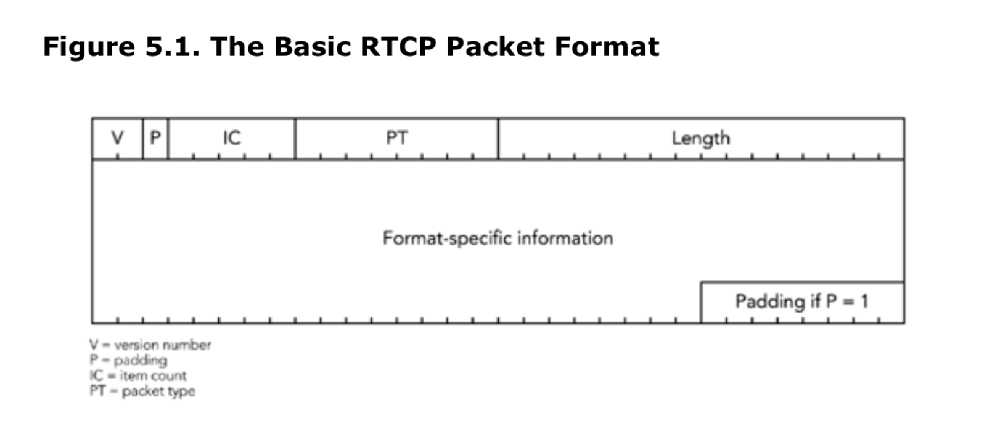

五种包类型的包头都是 4 个八位字节组成的，包含五个字段。

- 版本号（V）：对于当前版本的 RTP 协议，版本号为 2（截止到本书编纂为止），目前还没有推出新版本的计划，并且之前的版本并没有广泛的被使用
- 填充（P）：填充位表示，所要填充的数据已经超出了目前所能容纳的位数。如果此位被设置为 1，那么意味着包尾已经被一个或多个八位字节填充，最后一位八位所填充的内容表示此包的总数大小。它的用法和 RTP 数据包中的填充为非常类似，在第四章《RTP 数据传输协议》的填充位一节中有关于此位的介绍。错误的填写此位是 RTCP 协议使用过程中常见的问题，我们会在本章后面的《打包问题和包校验》中描述正确的用法。
- 条目计数（IC）：某些包类型中包含了一个 list 的条目，可能作为固定的、用于特定类型的信息的补充。这些条目字段需要标示出包中包含的条目的总数（这个字段在不同的包中有不同的命名方法，这取决于具体如何使用此字段）。每个 RTCP 包最多包含 31 个条目，同时也受到 MTU（maximum transmission unit）的限制。如果需要传输超过 31 个条目的场景，那么应用程序必须生成多个 RTCP 包。Item Count 字段为 0 的时候表示此包中的条目为空（但是并不意味着包中内容为空）。如果不需要 Item count 字段那么此字段可以用于其他的目的。
- 包类型（PT）：此字段标识了传输的包中所携带的信息的类型。在 RTP 的规范中定义了五种标准数据包类型，将来可能还会定义其他的类型（例如，报告额外统计信息或者传递其他特定源的信息）。
- 长度：此字段标识包头之后的内容总长度。因为所有的 RTCP 的数据包的长度必须为 32bit 的整数倍，所以这个字段放的是 32bit 字的个数，因为如果按照八位字节计算会出现此字段和总长度不一致的情况。0 是一个有效长度，表示这个包只包含 4 个 8bit 字节的包头（包头字段 IC 在这种情况下也是 0）。

### RTCP包中复合包的结构


RTCP 包不会单独的被传输。它需要打包在一起形成复合包（compound packets）进行传输。每一个复合包都会被一个底层的包封装（通常是 UDP/IP 包）用来传输。如果要对复合包进行加密，那么 RTCP 的包组的前缀通常是一个 32bit 的随机数。复合包的结构如图 5.2 所示。

### 5.2 RTCP 包中复合包的结构


RTCP 的复合包的组成由一组规则来控制。在对五种 RTCP 包进行更详细的描述之后，这些规则会在本章的“打包问题”中进行描述。

RTCP 中的 RR：接收报告（receiver reports）

RTCP 的主要用途之一就是接收质量报告，它通过接收数据的所有参与者发送的 RTCP 的接收报告（RR）包来完成。

### RTCP 协议中 RR 数据包格式

接收报告由类型为 201 的包来标识，起格式如图 5.3 所示。接收端报告中包含发送报告的参与者（报告者 SSRC）的 SSRC（同步源），后面跟着 0 个或者多个报告块，用 RC 字段来表示。

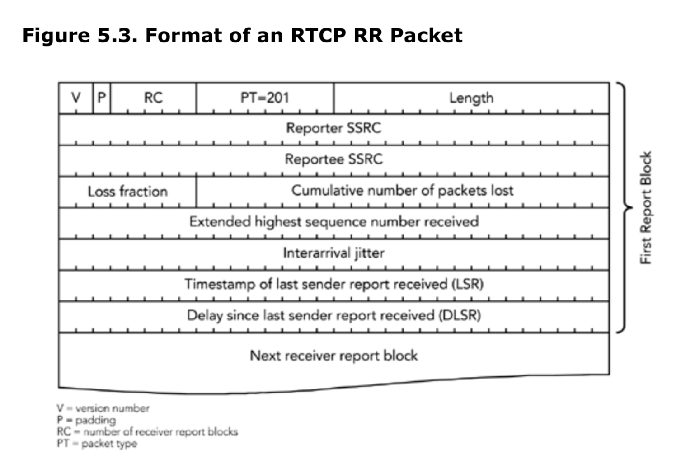

> 许多 RTCP 的包类型在固定部分的后面有一个条目列表（Item List），这个结构类似于接收端报告。所以此处需要注意，即使条目列表是空的，数据包的固定部分仍然保持不变，这也就是说，如果接收端报告中没有报告块（report block），那么要将数据包中的 RC 设置为 0，长度设置为 1，对应 4 个 8bit 字节的固定 RTCP 包头，外加 4 个 8bit 的报告者 SSRC。

每一个报告块（report block）都是描述单个同步源的接收质量，而报告者（reporter）从当前报告的间隔期间，接收从该同步源发过来的 RTP 包。每一个 RTCP 的 RR 包总共有 31 个报告块。如果有超过 31 个激活的发送端，那么接收端应该在一个复合数据包中发送多个 RR 数据包，每个报告块有 7 个字段，总共 24 个字节。

Reportee（被报告者）SSRC 标识此报告块相关的参与者。报告块中的统计数据，表示的是在生成 RR 数据包的参与者处，被报告方接收到的同步源的数据包的接收质量。

累计丢包数是一个 24 位带符号的整数，它表示预期应该到达的包的数量，减去实际接收到的包的数量。预期的包数的定义是，最后接收到的扩展序列号，减去接收到的初始序列号。接收到的包的总数包括任何延迟到达或者重传过来的包，因此可能会大于预期的数量，因此累计丢包数有可能是负值。累计丢包数的计算区间是统计的整个会话期间的，而不是在每个间隔期间。如果在会话期间丢包的总数大于 0x7FFFFF，那么此字段会在 0x7FFFFF 处于最大饱和值。

> 许多 RTCP 的统计信息是基于整个会话期间，而不是报告间隔的区间。但是，如果发生了 SSRC 冲突，或者序列号空间中存在一个非常大的间隙，使得接收端无法判断此字段是否已经被翻转，那么统计信息重置为 0.

在同步源的 RTP 数据包中接收到的扩展最高序列号（extended highest sequence number）的计算，是在第四章《RTP 数据传输协议》的序列号一节中讨论的方法。由于可能存在包重新排序的情况，所以并不一定是接收到的最后一个 RTP 包的扩展序列号。扩张序列号是基于会话计算的，而不是基于包间隔计算的。

丢包率（loss fraction）的定义是在这个报告间隔中所丢失包的数量，除以预期到达的数量。丢包率表示为一个定点数，该定点数的二进制小数点位于字段的左边缘。即丢包率乘以 256 后的整数部分（即如果传输中有 1/4 的包丢掉，那么丢包率应该是 1/4 \* 256 = 64）. 如果接收到的包的数量大于预期（由于存在重复包的情况），使得丢包数为负值，那么丢包的部分设置为 0.

到达间隔抖动（Interarrival jitter）是对被报告者（Reportee）同步源发送的数据包的网络传输时间统计方差的估计。它是以时间戳单位衡量的，因此它像 RTP 时间戳一样用 32bit 无符号整数表示。

为了测量网络传输时间的方差，有必要对传输时间进行测量。由于发送端和接收端通常都没有设置同步时钟，所以无法监测绝对的传输时间。相对传输时间是在相同的单位度量内，计算包到达时数据包的 RTP 时间戳和接收端的 RTP 时钟之间的差值。这个计算需要接收端为每一个源维护一个时钟，并与该源的媒体时钟以相同的速率运行，从该时钟获取时间戳。（这个时钟可能是接收端本地播放时钟，如果它与源的时钟运行速率相同的话）由于发送端和接收端之间的时钟缺少同步机制，相对传输时间包含一个未知的恒定偏移。但是这不是问题，因为我们仅仅对传输时间的方差感兴趣：即接收端两个数据包的时间戳与离开发送端时的时间戳间距之差。在后面的计算中，由于不同步时钟引起的恒定偏移，会被减去。

如果 Si 是来自包 i 的 RTP 时间戳，Ri 是包 i 到达的时间（以 RTP 时间戳单位），那么相对传输时间就是（Ri - Si），对于两个包 i 和 j，相对传输时间的差异可以表示为：

$$D(i,j) = (R_j - S_j) - (R_i - S_i)$$

注意，时间戳 Rx 和 Sx 是 32bit 无符号整数，而 D（i,j）是有符号的整数。使用模运算来计算（在 C 语言中，这意味时间戳类型为 unsigned int, 假设 sizeof（unsigner int) == 4））.

当每个数据包被接收后，使用该数据包与前一个数据包（不一定是按照序列号顺序的前一个数据包）的相对传输时间 D（i,j）之差来计算到达间隔抖动（interarrival jitter）。根据以下公式，抖动是以滑动平均的形式存在。

$$
J_i = J_{i-1} + \frac{(|x_{i-1},i| - J_{i - 1})}{16}
$$

无论何时生成接收报告，被报告对象 SSRC 的 Ji 的当前值就作为到到达间隔抖动（interarrival jitter）。

最后一个发送端报告（last sender report，LSR）时间戳是 64 位 NTP（网络时间协议（Network Time Protocol））格式的时间戳中间的 32bit，包含在最近从被报告者的 SSRC 接收到的 RTCP 的 SR 包中。如果 SR 没有收到，那么此字段可以设置为 0.

自上次发送端报告起的延迟（delay since last sender report，DSLR）是从被报告者 SSRC 接收到最后一个 SR 数据包到发送此接收报告块之间的延时，以 1/65,536 秒为单位。如果没从该被报告者收到 SR，则 DLSR 字段设置为 0.

### RR 数据解析

RR 包中的接收质量反馈不仅对发送端有用，对其他参与者和第三方监控工具也有用。RR 包中提供的反馈允许发送端根据反馈调整其传输。此外，其他的参与者可以确定当前产生的问题，是自己的还是多个接收端共有的，网络管理人员可以使用仅接收 RTCP 包的监控器来评估其网络的性能。

发送端可以使用 LSR 和 DLSR 字段来计算它与每个接收端之间的往返时间（rtt）。当接收到一个与之相关的 RR 包时，发送端用当前的时间减去 LSR 字段，以得到发送 SR 到接收此 RR 之间的延迟。发送端然后再减去 DLSR 字段以消除接收端延迟带来的偏移，从而获得网络往返时间。该流程如图 5.4 所示，这是取自 RTP 规范的一个示例。（注意，RFC1889 标准中有一个错误，此错误已经在 RTP 新版本中得到更正）

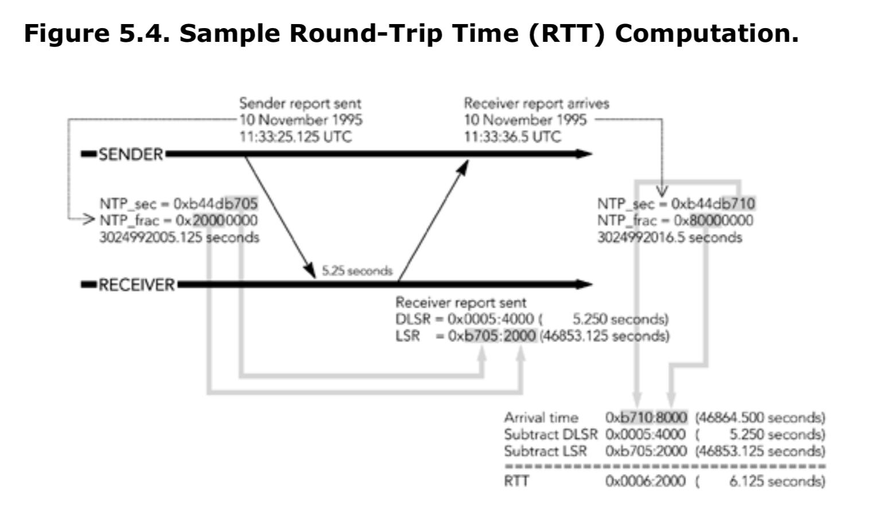

注意，计算的结果是网络往返时间（RTT），它不包括在端点上的任何处理时间。例如，接收端必须缓冲数据以用来消除抖动所带来的影响，然后才能去播放媒体（参见第六章《媒体采集、播放和时序》）。

由于延迟会阻碍交流，所以 RTT 在应用程序的交互中是相当重要的。研究表明，当 RTT 超过 300 毫秒（这个时间是大概的，这取决于通话双方以及正在做的事情）时，很难进行对话。发送端可以利用 RTT 来优化媒体编码，例如通过生成包含较少数据的包来减少打包延迟，或者推动使用纠错码的方式（参见第九章《错误恢复》）。

丢包率（loss fraction）指示的是接收端短期的丢包，通过观察报告统计中的趋势，发送端可以判断丢包是短暂的还是长期的。RR 数据包中的许多统计数据是累加值，以便进行长期均值的计算。通过对比两个 RR 数据包之间的差异，可以进行长期和短期的评估，从而让丢包报告更灵活。

例如，我们可以通过统计数据累加值得到的 RR 数据包间隔的丢包率，也可以直接上报丢包率。丢包的累加值的差值表示该时间间隔内的丢包数量，扩展后的最后序列号的差值，表示该时间间隔期望收到的包数。这两个值的比例就是丢包率。如果使用连续的 RR 包进行计算，这个数字应该等于 RR 包中的 Loss Fraction 字段，但是这个比率也给出了对一个或者多个 RR 包丢失时的丢包率的预估，当有重复的包时，它可能显示负的丢失率。使用 Loss Fraction 字段的优点是它可以用单个 RR 包提供丢包信息。这一点在大型会话中非常有用，在这些会话中，如果报告的间隔过大，可能会导致暂时没法收到两个 RR 数据包。

可以根据丢包率来设置适当的媒体格式和纠错方式（参见第九章《错误恢复》）。特别是，更高的丢包率意味着，我们应该选择更能容错的格式，并且如果可能的话，应该降低数据传输速率（因为大多数丢包是由于拥塞引起的；参见第二章《分组网络中的音视频通信》以及第十章《拥塞控制》）。

抖动（jitter）字段可以用来检测网络中拥塞的开始，抖动的突然增加常发生在丢包开始之前。抖动的影响取决于网络拓扑结构和流的数量，高程度的统计多路复用降低了增加的抖动和数据包拥塞发发生之间的相关性。

发送端应该注意，对抖动的预估应该取决于发送的数据包的间隔和他们的时间戳的匹配。如果发送端延迟发送某些数据包，则该延迟应该被视为网络抖动的一部分。这可能是视频的一个问题，在视频领域，多个包通常产生相同的时间戳，但这些包是间隔传输而不是突然一起发送。当然，这也不一定是一个问题，因为对抖动的测量还会给出关于接收端所需要的缓冲空间的估计（因为缓冲空间需要适应抖动和发送延迟）。

**RTCP SR：发送报告**

除了来自于接收端的接收报告之外，RTCP 还负责传输最近发送数据的参与者发送的发送端报告（SR）包。他们提供正在发送的媒体信息，主要是为了使接收端能够同步多个媒体流（例如，音视频同步）。

### RTCP 中 SR 包的格式

发送端报告的包类型为 200，其格式如图 5.5 所示。有效负载包含一个 24 字节的发送端信息块，后面跟着 0 个或多个接收端报告块，由 RC 字段标识，类似于接收端报告报。当发送端也是接受方的时候，接收端报告块就出现了。

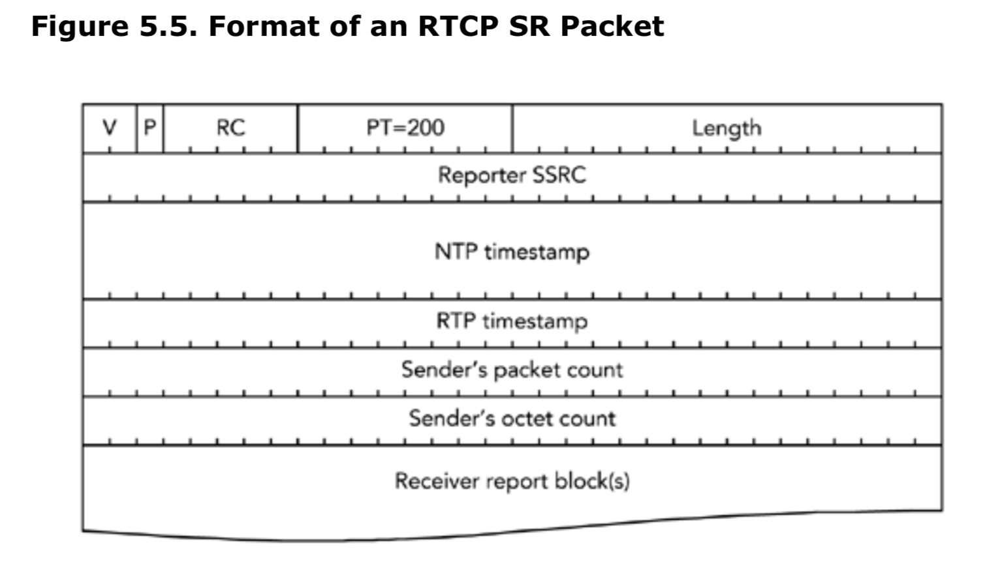

NTP 时间戳是一个 64 位的无符号值，表示发送这个 RTCP SR 包的时间。它的格式是 NTP 时间戳，时间从 1900 年 1 月 1 日开始计算秒，低 32bit 代表秒的小数部分（fractions of second）（也就是 64 位定点值，二进制小数点位于 32bit 之后）。如果要将 UNIX 的时间戳（从 1970 年 1 月 1 日开始的秒数）转化为 NTP 时间，那么需要添加 2,208,988,800 秒。

> 虽然 RTCP 的 SR 包的 NTP 字段使用了 NTP 时间戳格式，但是，时钟并不见得必须要与网络时间协议（Network Time Protocol）同步，也不必具有任何特定的精度、分辨率及稳定性。但是，对于要同步的两个媒体流的接收端，这些流必须要有相同的时钟。NTP 协议有时对同步发送时钟很有用，但是只有当要同步的媒体流由不同的系统生成时才需要它。这些问题将在第七章《音视频同步》中进一步讨论。

RTP 时间戳与 NTP 时间戳的对应的时间是相同的，但是，它是以 RTP 媒体时钟的基准单位表示的。这个值，通常与前一个数据包的 RTP 时间戳不同，因为自该数据包中的数据被采样已经经过了一段时间了。图 5.6 显示了 SR 包时间戳的一个示例。SR 包具有与发送它的时间相对应的 RTP 时间戳，这与前后的 RTP 数据包都不对应。

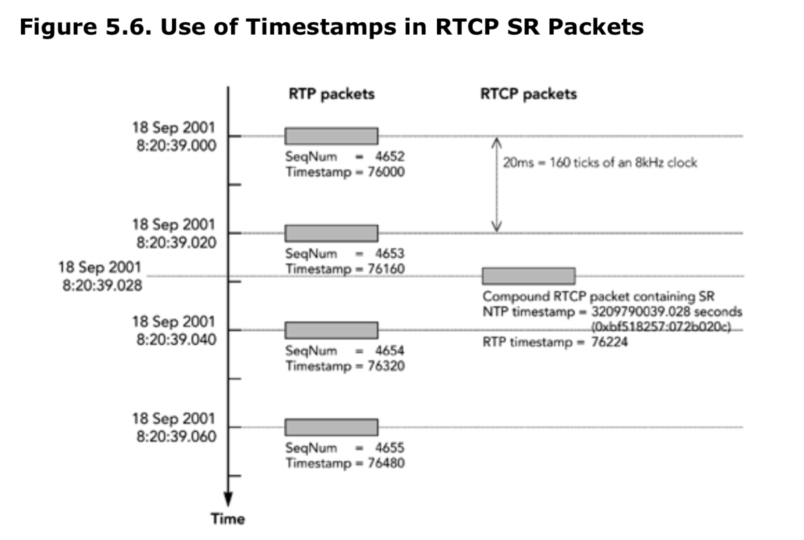

发送端的包计数，是这个同步源自会话开始以来，生成的数据包的总数。发送端的字节计数是这些数据包的有效负载（playload）中包含的字节数（不包括包头或者填充）。

如果发送端改变其 SSRC（例如，由于产生冲突），则会重置发送端的包计数以及字节计数字段。如果发送端传输很长的时间，最终会产生翻转，但是这通常不会造成问题。如果使用 32bit 模运算，且两者之间的计数不超过 2 的 32 次方，则即使有翻转，从新的值中减去老的值也将得到正确的结果（在 C 语言中，计数器的类型为无符号整型 sizeof(unsigned int) == 4）。对发送端的数据包计数和字节计数，可以使得接收端能够计算发送端的平均数据速率。

### SR 数据的解析

应用程序可以在不接收数据的情况下，通过 SR 信息，计算间隔中的平均有效负载数据速率和平均包速。两者的比值就是平均有效负载大小。可以假设数据包的丢失与数据包大小无关，特定的接收端接收的数据包数量乘以平均有效负载大小（或相应的数据包大小），就可以得出该接收端可用的表现吞吐率（apparent thoughtput）。

时间戳是用来生成一个媒体时钟和已知的外部参考（NTP 格式时钟）的对应。因此这才使得音视频同步成为可能，如第七章所述。

**RTCP SDES：源描述（Source Description）**

RTCP 也可以用来传递源描述（SDES）数据包，提供参与者认证和补充性细节，如位置、电子邮件地址和电话号码。SDES 包中的信息通常由用户输入，通常显示在应用程序的图形用户界面中，尽管这取决于应用程序的性质（例如，一个系统提供从电话系统到 RTP 的网关，它可能使用 SDES 包来传递呼叫者 ID）。

### RTCP 中 SDES 包格式

每个源描述包在 RTCP 包中类型定义为 202，具体如图 5.7 所示。SDES 包包含 0 个或者多个 SDES 项列表，具体个数由包头 SC 字段表示，每个 SDES 项包含一个源的信息。

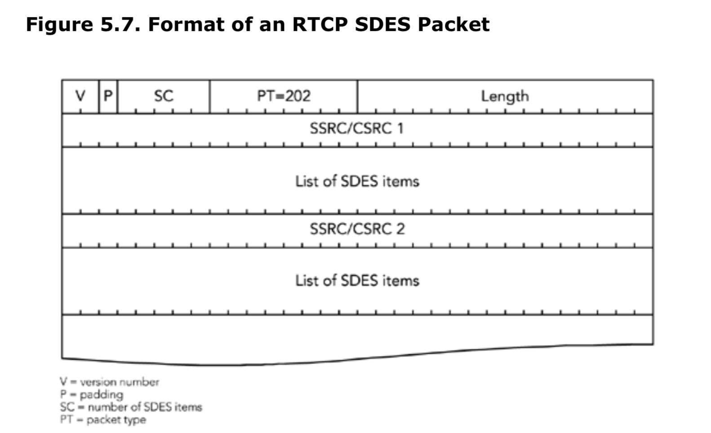

应用程序有可能生成 SDES 项为空列表的包，在这种场景下，RTCP 公共包头中的 SC 和 length 字段都为 0. 在正常情况下，SC 应该为 1（混流器（mixers）和转换器（translators）所聚集的转发信息产生的包会有较大的 SDES 项的列表）。

每个 SDES 项目列表从所描述的源的 SSRC 开始，然后是一个或者多个条目，具体格式参见图 5.8 所示。每个条目以类型和长度字段开始，然后是 UTF-8 格式的项目文本本身。length 字段标识文本中有多少字节；文本不是以 NULL 结尾的。


每个 SDES 项中的条目都是以连续的方式打包到包中，没有分隔或者填充。条目列表（list of item）以一个或者多个空的字节结束，当解析到第一个字节为 0 类型的时候，意味着这个列表结束。0 类型字节后面不会跟长度字节，但是如果需要填充，则包括其他的空字节，直到达到 32-bit 边界为止。这个填充（padding）与 RTCP 包头中的 P 位表示的填充是分开的。带有零项的列表（四个空字节）是有效的，但是没有意义。

在 RTP 规范中定义了几种类型的 SDES 条目，其他的条目可能在未来被定义。条目类型为 0 的是预留项，标识了条目列表的结束。其他标准条目类型有 CNAME、NAME、EMAIL、电话、LOC、工具、注释和 PRIV。

### SDES 的标准条目

CNAME 项（type = 1）为每个参与者提供了一个规范名称（CNAME）。它提供了一个独立于同步源的稳定且持久的标识符（因为如果应用程序重启或发生 SSRC 冲突，SSRC 将改变）。CNAME 可以用于关联来自不同 RTP 会话的参与者的多个媒体流（例如，关联需要同步的语音和视频），以及在媒体工具重启时命名参与者。这是唯一的强制性的 SDES 条目，所有实现都需要发送 SDES CNAME 项。

CNAME 是根据参与者的用户名和主机 ID 地址并通过算法进行分配的。例如，如果作者是使用基于 IPv4 的应用程序，那么 CNAME 可能是 csp@10.7.42.16。如果是 IPv6 应用，那么使用冒号分隔的数字形式的地址。如果应用程序运行在一个没有用户名概念的系统上，则只使用主机 IP 地址（无用户名或@符号）。

只要每个参与者只加入一个 RTP 会话（或一组要同步的相关会话），使用用户名和主机的 IP 地址，就可以生成一致的唯一标识符。如果要同步来自多个主机或多个用户的媒体流，则这些流的发送端必须联合起来生成一致的 CNAME（通常是由一个参与者通过算法选择的名称）。

> 使用私有地址和网络地址转换（NAT）服务意味着，IP 地址会存在全局不唯一的情况。为了使音视频同步和相关的 RTP 会话的其他用途能正确的被 NAT 操作，转换器（translator）还必须在穿过域边界（domain boundaries）时将 RTCP CNAME 转换为唯一的形式。这个转换在跨越多个 RTP 流时必须是一致的。

NAME 项（type = 2）表示参与者的名称，主要用于在参与者列表中显示，做为用户界面的一部分。这个值通常由用户输入，因此应用程序一般不假定它是任何值；特别的它不应该被认为是唯一的。

EMAIL 项（type = 3）负责传递参与者的电子邮件地址，格式符合 rfc822 - 例如，jode@example.com。应用程序在发送前，应该验证电子邮件的值是否符合电子邮件的语法，然后再将其包含在 SDES 中。因为接收端不会假定这个地址的拼写是有效的。

PHONE 项（type = 4）表示参与者的电话号码。RTP 规范建议用一个完整的国际电话号码，它带有一个加号来代替国际访问码（例如，+1 918 555 1212 是一个美国的号码），但是许多实现允许用户输入这个值而不需要去校验格式。

LOC 项（type = 5）表示参与者的位置。许多实现允许用户直接输入值，但是可以用各种格式来表示位置。例如，有一个实现方案与全球定位系统相连，并将 GPS 坐标做为位置信息。

TOOL 项（type = 6）表示参与者使用 RTP 实现 - 工具（implementation - the tool）。此字段主要用来调试和营销目的（marketing purposes）。它应该包含实现的名称和版本号。通常，用户无法编辑此字段的内容。

NOTE 项（type = 7）允许参与者对任何事做一个简短的陈述。对于“非即时回复的消息（back in five minutes）”它可以很好的工作。但是它不能作用于即时通讯的场景，因为 RTCP 包之间存在很大的延迟。

PRIV 项（type = 8）是一种私有的扩展机制，用于定义实验的或特定于应用程序的 SDES 扩展。此项的文本，从一个额外的一个字节长度的字段和前缀字符串开始，后面紧跟着值字符串来填充其余部分。其目的是初始化扩展前缀名和后面的扩展字段值。PRIV 这个项很少被使用，如果定义了新的 SDES 类型，那么可以更有效的管理扩展。

CNAME 是应用程序必须要传输的唯一的 SDES 项（其他项可选）。在实现中应该准备接收任何 SDES 项，即使忽略了它们。SDES 存在各种隐私问题（请参阅本章后面的《安全和隐私》一节），这意味着除非得到用户明确的授权，否则在实现中不应该发送除了 CNAME 之外的任何信息。

图 5.9 显示了一个包含 CNAME 和 NAME 项的完整 RTCP 源描述包的示例。请注意在 SDES 项 list 的末尾使用了填充（padding），以确保数据包是 32bits 的倍数。

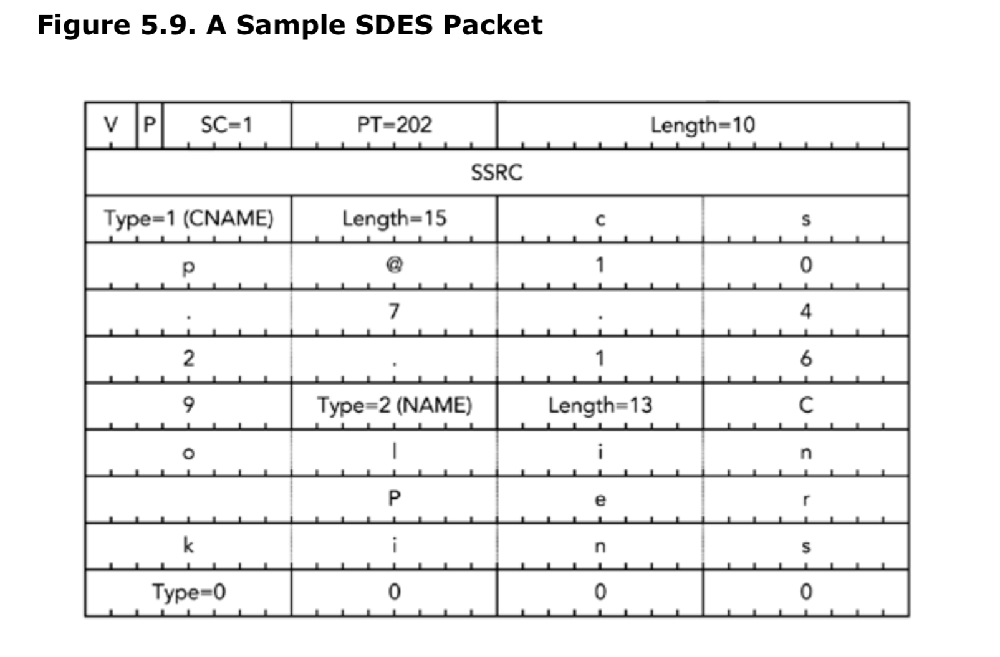

### 解析器（parser）问题

在解析 SDES 包的时候，有三点需要注意：

1. SDES 条目的文本最后不是以 null 作为结尾的，这也就是说在以 null 为结尾的字符串的语言中操作 SDES 条目需要特别小心。例如，在 C 语言中，应该使用 strcpy() 操作，因为它允许拷贝指定长度的字符串（使用 srtcpy 是危险的，因为文本不是以 null 结尾的）。如果不小心使用，非常容易造成缓冲区溢出，这是非常严重的问题

2. SDES 条目的文本使用 UTF-8 格式，本地字符集在使用前需要转换。在使用前应该先查询本地系统使用的语言环境，之后再在系统字符集和 UTF-8 之间进行转换。很多应用程序会在不经意间生成错误的字符并输入到 SDES 包中。实现中要对这种错误做容错，并使其更加健壮（例如，如果使用不正确的字符集，会导致 UTF-8 解析出无效的 Unicode 字符）。

3. SDES 项的文本由于可能被用户操作，所以不能相信其具有安全性。特别是它还可能包含一些有意向不到的副作用的通配符（metacharacters）。例如，一些用户使用脚本语言允许触发通配符并进行指令替换，这种方法可以使攻击者有办法执行任意的代码。所以，实现中应该采取措施确保其环境可以安全的处理 SDES 数据。

RTCP 释放连接 (bye) : 成员控制

RTCP 通过 RTCP 的 Bye 包为成员提供松散的控制，如果收到 Bye 表明某些参与者已经离开了会话。Bye 包是在参与者离开会话的时候，或者当其他参与者因为冲突而改变 SSRC 的时候生成的。Bye 包有可能会在传输过程中丢失，并且有些应用程序也不能生成此包。所以，即便没有收到 Bye 包，针对一段时间没有活跃的参与者，接收端应该有超时机制。

Bye 数据包的重要性在一定程度上取决于应用程序。它总是表明一个参与者正在离开 RTP 会话，但是参与者之间可能存在这另外的一种信号连接关系（例如，SIP、RTSP 或者 H.323）。RTCP BYE 包不会终止参与者之间的任何其他关联关系。

Bye 包的标识类型为 203，其格式如图 5.10 所示。公共的 RTCP 包头中的 RC 字段表示 SSRC 标识符的数量。其存在为 0 的可能性，标识为 0 时无用。在接收到 Bye 包时，实现时应该假设此源已经离开了会话，并忽略来自该源的任何后续的 RTP 和 RTCP 包。最重要的是，当收到 Bye 包之后，需要为此参与者保留一段时间的连接状态，因为要允许延迟到达的数据包被接收到。

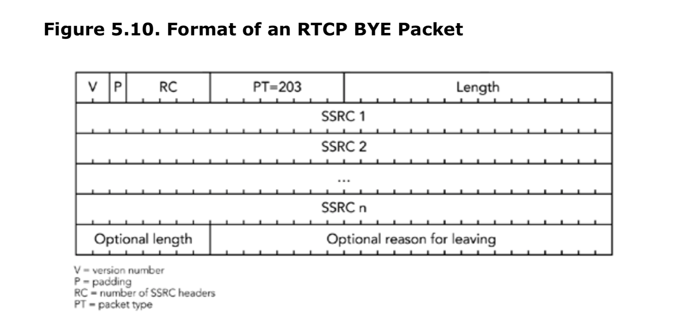

本章后面的《参与者数据库》一节，专门对参与者超时和 RTCP Bye 包相关的状态维护的问题进行了说明。

Bye 包还可能包含了表示离开会话原因的文本，适合在用户界面中显示。但是，这个文本是可以选填的，在实现过程中我们需要去接收它（即使文本可能会被忽略）。

**RTCP APP：应用程序定义的 RTCP 包**

最后一类 RTCP 包（APP）允许应用程序来自己定义扩展。它的包类型为 204，格式如图 5.11 所示。应用程序定义的包名（application-defined
packet name）由 4 个字符组成唯一的标识，每个字符都得从 ASCII 字符集中选择，并区分大小写。建议选择包名称来匹配它所代表的应用程序，并由应用程序来协调子类型值的选择。包其余部分被用于应用程序的特定需求。

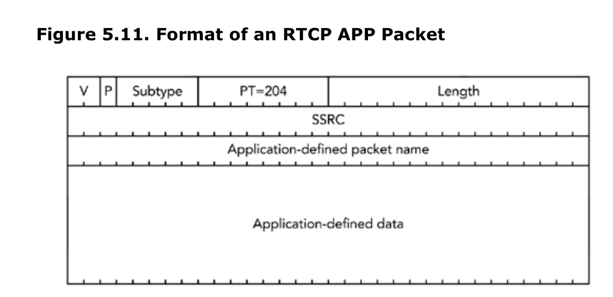

应用程序自定义的包用于 RTCP 的非标准扩展和验证新特性。目的是，验证者首先使用 APP 来验证新特性，然后如果新特性有广泛的用途，那么就注册为新的包类型。一些应用程序生成的包或实现方案，应该忽略识别不出来的应用程序包。

**组包（Packing）问题**

如前所述，RTCP 包不会单独发送，而是组包成一个复合数据包进行传输，下面详细介绍下复合包的组包规则和结构。

如果生成复合 RTCP 包的参与者是活跃的数据发送端，那么该复合包必须以 RTCP SR 包开始。否则必须从 RTCP RR 包开始。即使还没有发送或接收数据，这也是正确的，在这种情况下，SR/RR 包不会包含接收端的报告块（包头字段 RC 为 0）。另一方面，如果从多个源接收数据，并且报告太多，导致无法放入一个 SR/RR 包，则复合后的数据应以一个 SR/RR 包开始，后面在跟着多个 RR 包。

跟在 SR/RR 包后面的是一个 SDES 包。这个包必须包含一个 CNAME 条目，它可能包含其他的条目。包含其他（非 CNAME）SDES 条目的频度由使用中的 RTP 配置文件决定。例如，音视频配置文件指定在发送的每三个复合 RTCP 包中可以包含其他条目，其中 NAME 条目在八次该 slot 中发送七次，其余的 SDES 循环占用第八个 slot。 其他配置文件可以指定不同的选择。

当准备好进行传输时，Bye 包必须做为最后一个数据包发送。要发送的其他 RTCP 包可以按任何顺序。这些严格的排序规则，旨在使数据包的校验更容易，因为错误定向的数据包，大概率不会满足这些约束。

在生成复合 RTCP 包时，一个潜在的问题就是如何处理大量活跃发送端的会话。如果存在超过 31 个活跃的发送端，那么有必要在复合包中增加额外的 RR 包。这可以根据需要重复此过程，直到达到 MTU 的上限。如果发送端太多，以致于接收端报告不能被 MTU 容纳，则必须忽略某些发送端的接收报告。如果出现这种情况，那么被忽略的报告，应该在生成的下一个复合包中被包含（要求接收端跟踪每个间隔中报告的源）。

当包中包含的 SDES 条目超过最大包大小时，也会出现类似的问题。在包含额外接收报告还是包含源的描述信息之间的权衡，需要在实现中考虑。因为没有绝对正确的选择。

有时候需要将一个复合 RTCP 包填充并超出其原始大小。在这种场景下，填充只是添加到复合包中的最后一个 RTCP 包中，P 位（P bit）在最后一个包中被设置。填充（padding）是某些实现中的不正确的部分。本章会在后面的《包校验》一节讨论常见的问题。

### 安全与隐私

在使用 rtcp 过程中，有很多涉及到隐私的问题，尤其是在源描述包中。尽管这些信息包是可选的，但是他们的使用可能会暴露个人重要的信息，因此，应用程序不应该在没有通知用户其信息被使用的情况下，发送 SDES 信息。

使用 SDES CNAME 包是一个例外，因为这些包是强制性的。在 CNAME 包中包含 IP 地址会存在一个潜在的问题。不过包的 IP 头也包含相同的信息。由于 RTP 包会通过 NAT 转发，所以 IP 协议头中的地址转换，也应该在 CNAME 中的地址上进行。但在实践的过程中，许多 NAT 的实现时，并不知道 RTP，因此会存在内部 IP 地址泄露的问题。

用户名的暴露可能是一个更大的问题，在这种场景下，只要使用 CNAME 进行关联的应用程序之间可以保持一致，那么应用程序就可以重写或者忽略用户名。

一些接收端可能不希望他们的存在被其他方看到。如果这些接收端完全不发送 RTCP 那是可以的，但这样做就阻止了发送端使用质量信息来调整它们的传输以匹配接收端。

为了实现媒体流的保密性，可以对 RTCP 包进行加密，当加密时，每个复合包包含一个额外的 32bit 随机前缀，如图 5.12 所示，以帮助避免明文攻击。

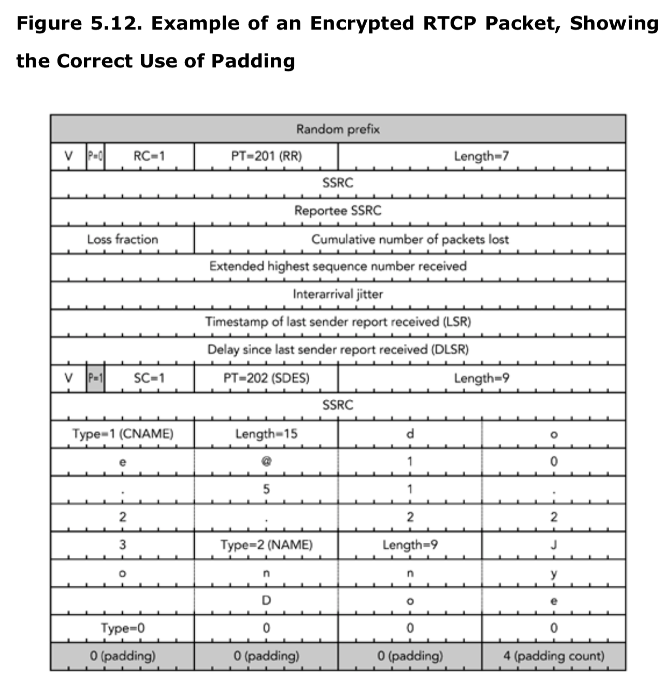

隐私和安全会在第 13 章《安全注意事项》中进行详细的讨论。

### 包校验

确认接收到的数据包是 RTP 还是 RTCP 这非常重要。前面提到的封包规则，允许严格校验 RTCP 包。RTCP 流的成功验证可以高度的保证其对应的 RTP 流也是有效的，但这并不是说 RTP 包的校验就不需要了。

List 5.1 展示了校验过程的伪代码，以下是要点：

- 所有的包必须是复合的 RTCP 包。
- 所有包的版本号必须等于 2
- 复合包中的第一个 RTCP 包的包类型必须等于 SR 或者 RR
- 如果需要填充，只添加到复合包中的最后一个包。复合 RTCP 包中所有的其他包的填充标志位必须为 0.
- 各个 RTCP 数据包的长度字段，必须总计接收到的复合 RTCP 数据包的总长度。

因为未来可能会定义新的 RTCP 包类型，所以验证过程不应该要求每个包类型必须是 RTP 规范定义中的五种包类型之一。

#### List5.1 包校验的伪代码

```c++
    validate_rtcp(rtcp_t *packet, int length)
    {
        rtcp_t *end = (rtcp_t *) (((char *) packet) + length); rtcp_t *r = packet;
        int l=0;
        int p=0;
        // All RTCP packets must be compound packets
        if ((packet->length+ 1) * 4) == length)
        {
            ... error: not a compound packet
        }
        // Check the RTCP version, packet type, and padding of the first
        // in the compound RTCP packet...
        if (packet->version != 2)
        {
            ...error: version number != 2 in the first subpacket
        }
        if (packet-> p != 0)
        {
            ...error: padding bit is set on first packet in compound
        }
        if ((packet->pt != RTCP_SR) && (packet->pt != RTCP_RR))
        {
            ...error: compound packet does not start with SR or RR
        }
        // Check all following parts of the compound RTCP packet. The RTP
        // version number must be 2, and the padding bit must be zero on
        // all except the last packet.
        do
        {
            if (p == 1)
            {
                ...error: padding before last packet in compound
            }
            if (r-> p)
            {
                p = 1;
            }
            if (r-> version != 2)
            {
                ...error: version number != 2 in subpacket
            }
            l += (r->length + 1) * 4;
            r = (rtcp_t *) (((uint32_t *) r) + r->length + 1);
        } while (r < end);
        // Check that the length of the packets matches the length of the
        // UDP packet in which they were received...
        if ((l != length) || (r != end))
        {
            ...error: length does not match UDP packet length
        }
            ...packet is valid
    }
```

一个常见的实现问题将导致包的有效性测试失败：当填充复合 RTCP 包超出其自然长度时，需要确保只将填充添加到复合包中的最后一个包。一个常见的错误是在最后一个包中添加了填充（padding），而在复合包的第一个包的头中设置了 P 位。必须只在最后一个数据包中设置 P 位。

可以通过包类型字段，检测到 RTCP 包被发送到 RTP 端口上的错误。标准的 RTCP 包会在高位封装包的类型值；如果他们被错误的发送到 RTP 端口，那么高位的包类型字段，会落在 RTP 包头的 M 位。去掉顶部位后，标准的 RTCP 包类型对应于范围在 72 到 76 的 RTP 有效负载类型。这个范围在 RTP 的规范中属于保留位，不会用来传输有效的 RTP 包，因此如果检测到这个范围内的数据包，意味着流被发错了。类似的，发送到 RTCP 端口的 RTP 包可以通过包类型来区分，其类型超出了 RTCP 包类型的有效范围。

### 参与者数据库（Participant Database）

RTCP 会话中的每个应用程序将维护一个关于参与者和会话本身信息的数据库。RTCP 时序从会话信息中获得，会话信息将被存储为一组变量：

- RTP 带宽 -- 即在应用程序启动时配置的典型会话带宽
- RTCP 带宽占比 -- 也就是 RTCP 报告在 RTP 带宽中的百分比。通常为 5%，但是可以通过修改配置文件的方法来更改这一比例（也可以配置为 0%，但是这并不意味着不传输 RTCP 数据包）。
- 该参与者发送和接收的所有 RTCP 数据包的平均大小
- 会话中成员的数量，该参与者上次发送 RTCP 数据包时的成员数量，以及在前一段报告间隔期间发送 RTP 数据包的成员比例。
- 程序最后一次发送 RTCP 包的时间，以及下一次预定的传输时间
- 一个标志位，指示了自发送最后两个 RTCP 数据包以来，程序是否发送了任何 RTP 数据包。
- 一个标志位，表名是否实现（implementation）发送了任何 RTCP 数据包。

此外，实现时还需要维护 RTCP SR 包中包含的变量：

- 发送的 RTP 数据的包和字节数
- 使用的最后一个序列号
- 正在使用的 RTP 时钟与 NTP 格式时间戳之间的对应关系

包含这些变量的会话的数据结构也适合存储：正在使用的 SSRC、程序的 SDES 信息以及 RTP 和 RTCP 套接字的文件描述符。最后，会话数据结构应该包含一个数据库，用于保存每个参与者信息。

在实现方面，可以简单的存储会话数据：C 语言的结构体，以及面向对象语言中的类。除了参与者特定的数据之外，结构体或类中的每个变量都是一个简单的类型：整型、文本字符串等。接下来描述参与者特定数据的格式。

为了正确的生成 RTCP 包，每个参与者还需要维护会话中其他成员的状态。良好的设计会使得参与者数据库成为系统运行的重要组成部分，不仅包含 RTCP 相关的信息，而且包含每个参与者的所有状态。参与者数据结构可能包含以下内容：

- SSRC 标识符
- 源描述信息：CNAME 是必须的；以及其他可能包含的信息（注意，这些值不是以 null 结尾的，在处理他们需要注意）
- 接收质量统计信息（丢包和抖动），以生成 RTCP RR 包。
- 从发送端报告收到的信息，以允许音视频同步（见第七章）。
- 最后一次接收到该参与者的信息，这样不活跃的参与者可以做超时处理
- 一个标志位，标识了该参与者是否在当前 RTCP 报告间隔内发送了数据
- 媒体播放缓冲区，以及所需要的任何编解码器的状态（参见第六章《媒体采集、播放和时序》）。
- 信道编码和错误恢复所需要的任何信息 -- 例如，在解码之前等待接收修复包的数据（参见第八章《错误隐藏》和第九章《错误恢复》）。

在 RTP 会话中，成员由其同步源标识符表示。因为可能存在许多参与者，并且他们的访问顺序很随机，所以参与者数据库的数据结构应该是一个哈希表，由 SSRC 标识符索引。在只处理单一媒体格式的应用程序中，这是足够的。然后，对音视频同步也需要具备根据它们的 CNAME 查找其源的能力。因此，参与者数据库应该是被一个双哈希表索引；一次由 SSRC 索引，一次由 CNAME 索引。

> 在一些实现中，选择 SSRC 标识符时，使用不完全随机数生成器。这意味着一个简单的哈希函数 -- 例如，使用 SSRC 的最低几位做为表的索引 -- 可能导致不平衡和低效的操作。尽管 SSRC 的值应该是随机的，但是他们应该与高效的哈希函数一起使用。有些人建议使用 SSRC 的 MD5 散列做为索引的基础，尽管这可能被认为有点过了。

在收到来自参与者验证过的包之后，应该将参与者添加到数据库中。这个验证的步骤很重要：除非确定参与者是有效的，否则程序不应为参与者创建状态。以下是一些指导方案：

- 如果接收到一个 RTCP 包并进行了校验，则应该将参与者输入到数据库中。对 RTCP 包的有效性检验很严格，伪造数据包是很难的。
- 除非是收到多个带有连续序列号的包，否则，不能只根据 RTP 包进行录入。对单个 RTP 包的有效性检验是不可靠的，而伪造的无效数据包有可能满足测试。

这意味着我们在实现过程中应该维护一个附加的轻量级的源的临时列表（仅仅接收到一个 RTP 包的源）。为了防止伪造的 RTP 和 RTCP 数据源占用太多内存，这个表应该有个主动超时机制，并应有固定的最大容量。很难防止攻击者故意生成许多不同的源来耗尽接收端的所有内存，但是这些预防措施可以防止在接收到错误定向的非 RTP 流时，意外的耗尽内存。

有效 RTP 包中的每个 CSRC（贡献源）也算一个参与者，应该添加到数据库中。你应该期望只收到 CSRC 中的参与者的源描述信息（SDES）。

当将参与者添加到数据库时，应用程序还应该更新会话级别的成员计数和发送端百分比（sender fraction）。添加一个参与者也可能导致 RTCP 前向重估（forward reconsideration），稍后将对此进行讨论。

在收到 Bye 包或在指定的非活跃期（specified period of inactivity）后，可以将参与者从数据库中删除。这听起来很简答，但是有几个微妙的地方需要注意。

由于不能保证接收到数据包的顺序，因此可能在来自源的最后一个数据包被收到前，提前接收到 Bye 数据包。为了防止状态被破坏后，又重新建立连接，参与者应该在收到 bye 数据包之后将其标志为已离开，并且其状态应该保留几秒钟（本书作者在实现中使用的是固定 2 秒的延迟）。重要的一点是，延迟要比最大的期望重排序（expected reordering）和媒体播放延迟都大，以便使延迟数据包和播放缓冲区中的任何数据都能在延迟期间到达。

如果源在报告间隔期间内，未被收到超过 5 次消息，就可以被置为超时。如果报告间隔小于 5 秒，那么这里使用 5 秒做最小值（即使在发送 RTCP 包时使用更小的间隔）。

当收到一个 Bye 数据包或某个成员超时时，将发生 RTCP 的逆向重估（reverse reconsideration takes place），本章后面的《Bye 重处理》一节，会对此进行描述。

### 时序规则

每个参与者发送 RTCP 数据包的速率都是不固定的，会根据其会话的大小和媒体流的格式而变化。它的目的是将 RTCP 流量总量限制在一个固定的比例（通常是会话带宽的 5%）。当会话大小增加时，每个参与者发送 RTCP 数据包的速率会降低，从而实现上述的目标。在双方使用 RTCP 拨打电话时，每隔几秒会发送一次 RTCP 报告；在有成千上万参与者的会议中 -- 例如，一个因特网无线电台 -- 每个听众的 RTCP 报告间隔可能是几分钟。

每个参与者根据本书后面描述的规则决定何时可以发送 RTCP 包。遵循这些规则非常的重要，特别是可能用在大型会话场景中的程序，如果实现了正确的规则，RTCP 可以扩展到具有数千个成员的会话。否则，RTCP 的流量将随着成员数的增长而线性增长，最终将导致严重的网络拥塞。

**报告时间间隔**

复合的 RTCP 包会使用随机定时器周期性发送。发送 RTCP 包之间每个参与者的平均等待时间称为报告间隔。它是根据以下几个因素计算的：

- **RTCP 带宽的分配**，这是一个固定的分配策略 -- 通常是会话带宽的 5%。会话带宽是会话期望的传输数据的速率；通常是单个音频或视频数据流的比特率，乘以同时发送端的典型数量（typical number）。会话带宽在会话期间是固定的，并在 RTP 应用程序启动时做为参数传递过去。

  分配给 RTCP 的会话带宽比例，可以根据使用中的 RTP 配置文件而变化。重要的是会话所有成员使用相同的比例（same fraction），否则某些成员的状态可能会过早的超时。

- **发送和接收的 RTCP 数据包的平均大小**。平均大小不仅包含 RTCP 数据，还包括 UDP 和 IP 包头的大小（即，实现一个典型的 IPv4，每个包需要添加 28 个字节）。

- **参与者的总数以及参与者中发送端的比例** 这需要实现一个所有参与者的数据库，标记它们是否是发送端（也就是说从他们那里收到了 RTP 包或者 RTCP SR 包）还是接收端（如果只收到了 RTCP RR、SDES 或者 APP 数据包）。前面的“参与者数据库”一节对此进行了详细的说明。

  为了防止在没有发送数据时，就发送 SR 包的错误，监听数据的参与者应该只在收到数据包后，才将另一个参与者视为发送端。只发送数据且不监听他人数据（如媒体服务器）的程序可以使用 RTCP SR 包做为发送端的标识，但是它应该验证包和字节计数字段为非零，并且是每个 SR 包的这些字段都有变化。

如果发送端的数量大于零，但不到参与者总数的四分之一，那么报告时间间隔取决于我们是否正在发送。如果参与者正在发送，报告间隔被设置为，发送端的数量乘以 RTCP 数据包的平均大小，再除以分配给 RTCP 带宽的 25%。如果参与者没有在发送，报告间隔被设置为接收端的数量乘以 RTCP 数据包的平均大小，在除以 RTCP 所需带宽的 75%：

```c++
    if ((senders > 0) and (senders < (25% of total number of participants))
    {
        if (we are sending)
        {
            Interval = average RTCP size * senders / (25% of RTCP bandwidth)
        }
        else
        {
            Interval = average RTCP size * receivers / (75% of RTCP bandwidth)
        }
    }
```

如果没有发送端，或者超过四分之一的成员是发送端，则报告间隔计算为 RTCP 数据包的平均大小乘以成员总数，再除以所需的 RTCP 带宽：

```c++
    if ((senders = 0) or (senders > (25% of total number of participants)) {
        Interval = average RTCP size * total number of members / RTCP bandwidth
    }
```

这些规则确保发送端可以占用很大一部分 RTCP 带宽，至少占到总 RTCP 带宽的四分之一。因此，对发送端进行音视频同步和识别 RTCP 所需的数据包，可以相对较快的被发送，同时还有富余的带宽允许接收来自接收端的报告。

计算出的间隔会与绝对最小间隔进行比较，该最小间隔默认设置为 5 秒。如果时间间隔小于最小间隔，那么就把它设置为最小间隔。

```c++
    If (Interval < minimum interval)
    {
        Interval = minimum interval
    }
```

在某些情况下，希望发送 RTCP 的频率超过使用默认最小间隔。例如，如果数据率很高，而应用程序需要更及时的接收质量统计数据，则需要一个较短的默认间隔。最新修订版的 RTP 协议规范，允许在这种情况下减少最小间隔。

````c++
    Minimum interval = 360 / (session bandwidth in Kbps)
``` c++

对于大于 72bps 的会话带宽，最小间隔可减小至小于 5 秒。在使用最小间隔时，重要的一点是要记住，一些参与者可能仍然在使用默认的 5 秒，在决定是否因为参与者处于不活跃状态而算其超时，要考虑到这一点。

计算出的间隔是 RTCP 数据包之间的平均时间。然后使用下面描述的传输规则，将该值转换为每个数据包实际发送的时间。每当会话中参与者的数量发生变化，或者发送端的比例发生变化时，都应该重新计算报告间隔。

**基本传输规则**

当应用程序启动时，根据对报告间隔的初始预估，安排第一个 RTCP 包进行传输。当发送第一个包时，将调度第二个包，以此类推。数据包之间的时间是随机的，在报告间隔的 1/2 到 1.5 倍之间，这是为了避免与参与者报告产生同步，以免它们每次都同时到达。最后，如果这是发送的第一个 RTCP 包，间隔减半，以提供新成员加入的更快的反馈，从而计算下一次发送时间，如下所示：

``` c++
    I = (Interval * random[0.5, 1.5])
    if (this is the first RTCP packet we are sending)
    {
        I *= 0.5
    }
    next_rtcp_send_time = current_time + I
````

例程 random[0.5,1.5] 是在 0.5 到 1.5 之间产生一个随机数。在某些平台上，它是调用系统的 rand() 来实现；在其他平台上，像 drand48() 这样的调用可能会产生更好的随机源。

以基本的传输规则为例，考虑一个使用 RTP-over-IP 多播发送 128Kbps 的 MP3 音频的 Internet 电台，其听众为 1000 人。使用最小报告间隔（5 秒）和 RTCP 带宽占比（5%）的默认值，假设 RTCP 数据包的平均大小为 90 字节（包括 UDP/IP 包头）。当一个新的听众成员启动时，它不会知道其他的听众，因为他还没有收到任何 RTCP 数据。它必须假设发送端是唯一的其他成员，并相应地计算其初始报告间隔。发送端（单一来源）已知成员（来源和这个接受者）的比例超过 25%，因此计算报告间隔如下：

```c++
    Interval = average RTCP size * total number of members / RTCP bandwidth
        = 90octets * 2 /(5%of128Kbps)
        = 180 octets / 800 octets per second
        = 0.225 seconds
```

因为 0.225 秒小于最小值，所以使用 5 秒的最小间隔做为间隔。然后将这个值随机化并减半，因为这是要发送的第一个 RTCP 包。因此，第一个 RTCP 包在应用程序启动后 1.25 到 3.75 秒之间发送。

在启动应用程序和发送第一个 RTCP 包之间的这段时间内，将从会话的其他成员接收到几个接收端报告，从而允许程序更新预估的成员数量。这个更新会用于调度第二个 RTCP 包。

我们将在后面看到，1000 个听众足以使平均间隔大于最小间隔，因此，从所有听众接收到 RTCP 数据包的总速率为 75% _ 800 字节/秒 / 90 字节/数据包 = 6.66 数据包/秒。应用程序在 2.86 秒之后发送它的第一个 RTCP 包，已知的用户大小大约是 2.86 秒 _ 6.66 秒 = 19.

因为发送端的比例现在小于已知成员的 25%，所以第二个包的报告间隔是这样计算的：

```c++
    Interval = receivers * average RTCP size / (75% of RTCP bandwidth)
        = 19 * 90 / (75% of (5% of 128 Kbps))
        = 1710 / (0.75 * (0.05 * 16000 octets/second))
        = 1710 / 600
        = 2.85 seconds
```

再次，这个值被增加到最小间隔并被随机化。第二个 RTCP 包在第一个包之后 2.5 秒到 7.5 秒之间发送。

重复此过程，从发送第一个 RTCP 数据包到第二个 RTCP 数据包之间平均要监听到 33 个新的接收端，总共已知成员数为 52。结果是平均间隔为 7.8 秒，由于大于最小间隔，因此可以直接使用。随后，在第二分组之后的 3.9 秒到 11.7 秒之间发送第三分组。数据包之间的平均间隔，随着其他接收端的发现而增加，直到收到完整的接收端为止。间隔的计算如下：

```c++
    Interval = receivers * average RTCP size / (75% of RTCP bandwidth)
        = 1000 * 90 /(75%of(5%of128Kbps))
        = 90000 / (0.75 * (0.05 * 16000 octets/second))
        = 90000 / 600
        = 150 seconds
```

150 秒的间隔，相当于每秒 1/150 = 0.0066 个包，如果有 1000 个监听器，则平均的 RTCP 接收速率为每秒 6.66 个包。

RTP 的标准版本，仅使用这些基本的传输规则，虽然这些对于许多应用程序来说已经足够了，但是它们有一些限制，这些限制会在成员迅速变化的会话中会造成问题，重估（Reconsideration）概念的提出就是为了避免这些问题。

前向重估（Forward Reconsideration）

正如上一节所建议的，当会话比较大时，新成员需要一定数量的报告间隔，才能知道会话的总大小。在这个过程中，由于获取到的信息不完整，新成员发送数据包的速度要比“正确”的速度快（“correct” rate）。当许多成员同时加入时，这个问题就会变得非常严重，这种情况叫做“步进加入（step join）”。一个“步进加入”的连接可能发生的典型场景，就是在当应用程序同时自动启动多个参与者。

在“setp join”的情况下，如果只使用基本的传输规则，每个参与者将在初始预估为 0 参与者的基础上加入，并调度它的第一个 RTCP 包。它将在最小间隔的平均一半之后，发送该数据包，并且它将根据当时观察到的参与者数量，安排下一个 RTCP 数据包，可能是几百，甚至是几千个。由于对组大小的初始预估比较低，所以当所有参与者加入会话时，RTCP 流量会激增，这可能会阻塞网络。

Rosenberg 研究了这一现象，并报告了一个案例，在这个案例中，有一万名成员同时加入了一个会话。根据他的模拟，在这样的一个步进连接（step join）中，所有 10000 个成员都试图在开始的 2.5 秒内发送一个 RTCP 包，这几乎是预期速率的 3000 倍。这一的数据包骤长的极端情况将导致网络阻塞 -- 这并不是低速率控制协议所期望的结果。

持续更新参与者的数量和发送端比例，然后使用这些数字重估每个 RTCP 包的发送时间，可以解决以上问题。在预定的传输时间到达后，根据组的大小重新预估并计算间隔时间，并使用此值计算新的发送时间，如果新的发送时间，比现在要晚，则不发送数据包，而是修改此包的新的发送时间。

这是一个听起来很复杂，但是实现起来很简单的方案。只考虑基本传输规则的情况下，可以这样写伪代码：

```c++
    if (current_time >= next_rtcp_send_time)
    {
        send RTCP packet
        next_rtcp_send_time = rtcp_interval() + current_time
    }
```

加上前向重估后，以上代码可以优化为：

```c++
    if (current_time >= next_rtcp_check_time)
    {
        new_rtcp_send_time = (rtcp_interval() / 1.21828) + last_rtcp_send_time
        if (current_time >= new_rtcp_send_time)
        {
            send RTCP packet
            next_rtcp_check_time = (rtcp_interval() /1.21828) + current_time
        }
        else
        {
            next_rtcp_check_time = new_send_time
        }
    }
```

这里，函数 rtcp_interval() 是基于当前会话的大小的预估，返回报告间隔的随机抽样。注意，rtcp_interval() 除以 1.21828（欧朗常数 e - 1）. 这是一个会受补偿因子影响的重估算法（reconsideration algorithm），它最终会收敛到一个低于期望 5%的带宽占比的值。

Rosenberg 研究了这种现象，并报告了一次有 10,000 名成员参加会议的情况。 他的模拟显示，在这样的步进连接中，所有 10,000 个成员都尝试在前 2.5 秒内发送 RTCP 数据包，这几乎是所需速率的 3,000 倍。这样的数据包突发将导致极端的网络拥塞，这对于低速率控制协议而言并不是理想的结果。

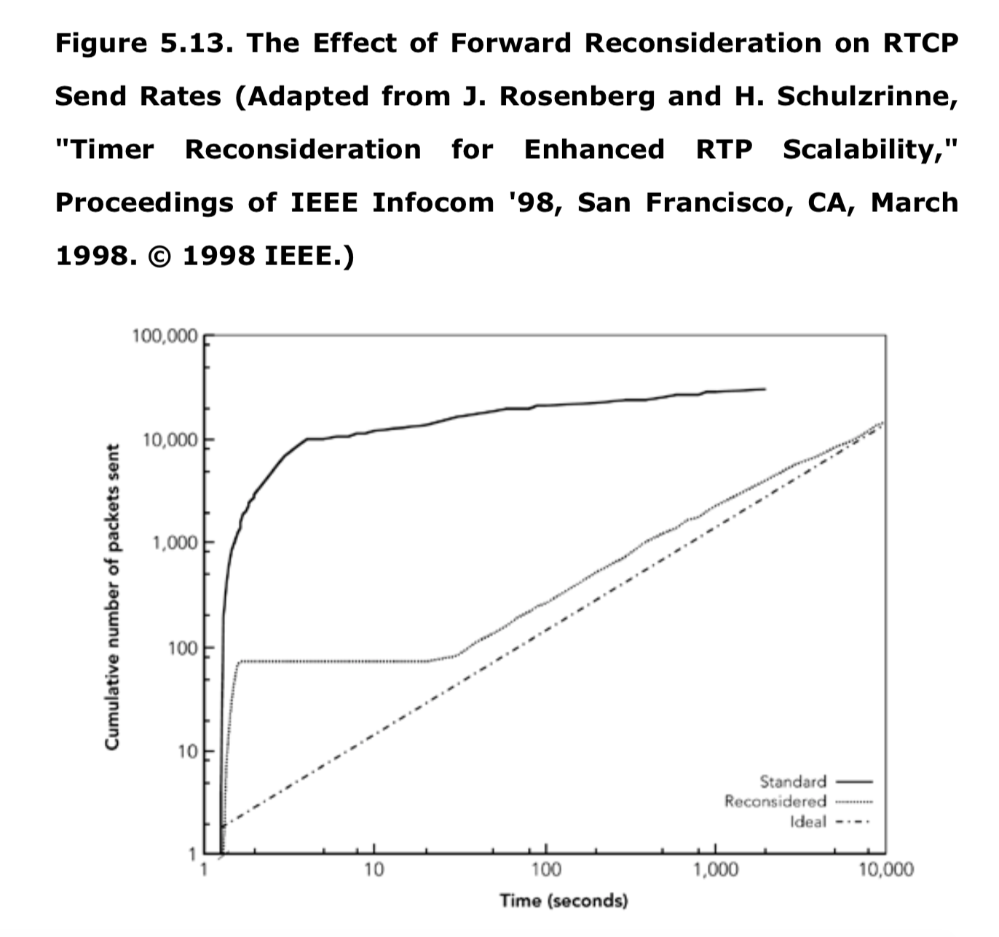

作为另一个示例，考虑上一节“基本传输规则”中讨论的场景，其中一个新的听众，使用多播 RTP 的方式加入到一个已经建立的互联网电台。当听众加入会话时，第一个 RTCP 包，像之前一样被调度，在应用程序启动的 1.25 秒到 3.75 秒之间。当预定的传输时间到达时，就会出现差异：应用程序不是发送数据包，而是根据当前成员数量重新考虑发送时间。如前所述，假设一个随机的初始时间间隔为 2.86 秒，应用程序将从其他成员接收到大约 19 个 RTCP 包，新的平均时间间隔变为 2.85 秒：

```cpp
    Interval = number of receivers * average RTCP size / (75% of RTCP bandwidth)
        = 19 * 90 / (0.75 * (0.05 * 16000 octets/second))
        = 1710 / 600
        = 2.85 seconds
```

结果小于最小值，因此使用最小值 5 秒，随机化并除以比例因子。如果结果值小于当前时间（在本例中是应用程序启动后的 2.85 秒），则发送数据包。如果不是，例如，新的随机值是 5.97 秒，则修改数据包发送时间为后者。

在新的计时器到期之后（本例中为应用程序启动后的 5.97 秒），重新开始处理。此时，接收端将从大约 5.97 秒 \* 6.66/秒 = 40 个其他成员处接收到 RTCP 数据包，重新计算的 RTCP 间隔为 6 秒（随机化和缩放之前）。此过程会重复的进行，直到重新预估的发送时间小于当前时间。此时发送第一个 RTCP 包，并调度第二个 RTCP 包。

重估（Reconsideration）是很容易实现的，建议在实现的过程中都要包括它，即使它只有在参与者达到几百人的时候才有显著效果。不管会议规模多大，或者同时有多少参与者加入，包含前向重估的实现都是安全的。只使用基本传输规则的实现可能会过于频繁的发送 RTCP 包，从而使得在大型会话场景中造成网络拥塞。

**反向重估**

如果步进接入（step join）存在问题，那么许多参与者快速离开（步进离开）时，我们可以合理地预期将会出现问题。基本的传输规则确实是这样，虽然问题不在于发送 RTCP 太频繁而导致拥塞，而在于发送不够频繁，导致参与者过早的超时。

当大多数（但不是所有）成员离开大型会话时，问题就出现了。结果是，报告间隔迅速缩短，可能从几分钟缩短到几秒。然而，使用基本的传输规则，虽然更新了超时间隔，但是在更新之后不会重新调度数据包。结果是那些没有离开的成员被标记为超时；它们的包在新的超时时间内没有到达。

这个问题的解决方法类似于步进（step join）；当收到每个 Bye 数据包，更新参与者的预估数量，重新考虑下一个 RTCP 数据包的发送时间。与前向重估的不同之处在于，预估值会变得越来越小，因此下一个数据包的发送将比原来的发送时间更早。

当收到一个 Bye 数据包时，新的传输时间是根据 Bye 之后，仍然存在的成员比例，和在原计划传输时间之前的剩余时间来计算的。例程如下：

```c++
    if (BYE packet received)
    {
        member_fraction = num_members_after_BYE / num_members_before_BYE time_remaining = next_rtcp_send_time – current_time next_rtcp_send_time = current_time + member_fraction * time_remaining
    }
```

结果就是新的传输时间比原始的早，但是比当前时间晚。因此，包会被安排的足够早，以使得其余的成员不会超时，从而防止错误地将参与者数量的预估值降为 0.

> 在实践中，反向重估可以显著减少由于过早超时而导致的问题，但不能完全解决问题。在某些情况下，在步进离开后，组成员的预估值可能会在短时间内降为零，但很快就会恢复到正确值。在重估的实现中，彻底解决这一问题的复杂性会超过其收益。

反向重估的实现是一个次要问题：它只是在有几百名参与者且成员迅速变化的会话中才会出现，而不实现它会导致错误的超时，但是不会造成全网范围的问题。

**Bye 包重估**

在 RTP 标准中，希望离开会话的成员需要立即发送一个 Bye 数据包，然后再退出。如果许多成员立即离开，这可能会导致大量的 Bye 数据包，并可能导致网络拥塞（就像如果不用前向重估 RTCP 数据包在步进加入时发生的情况一样）。

为了避免这个问题，当前的版本中的 RTP 只允许在参与者决定离开时的成员小于 50 个时，才允许立即发送 Bye 数据包。如果超过 50 人，则成员在准备离开时，如果收到其他成员的 Bye 数据包，则应延迟发送 Bye 数据包，这个过程称作 Bye 数据包重估。

Bye 重估与前向重估类似，但其是根据收到的报文数量，而不是根据其他成员的数量。一个参与者想要离开一个会话，它会暂停 RTP/RTCP 数据包的正常处理流程，并根据前向重估规则调度一个 Bye 数据包，就像没有其他成员，或者就像这是第一个要发送的 RTCP 数据包一样。在等待预估的传输时间时，参与者会忽略所有的 RTC/RTCP 包，除了 Bye 包。对接收到的 Bye 包进行计数，并且当调度的 Bye 数据包的传输时间到达时，基于该计数重估所接收到的 Bye 数据包。该过程将继续持续到发送 Bye 包，然后参与者离开会话。

正如这个描述所表明的，在发送 Bye 数据包之前的延迟依赖于离开的成员数量。如果只有一个成员决定离开，Bye 将延迟 1.026 到 3.078 秒（基于 5 秒的最小报告间隔在减半，因为 Bye 包会被当做初始的 RTCP 包对待）。如果很多参与者决定离开，在决定离开会话和能够发送 Bye 包之间可能会有相当长的延迟。如果需要快速退出，不发送 Bye 包就可以安全退出，其他参与者最终对其按超时处理。

使用 Bye 重估是一个相对次要的决定，只有当许多参与者同时离开一个会话，并且参与者关心离开通知时，Bye 重估才有用。离开大型会话而不发送 Bye 包是安全的，而不是去实现一个 Bye 的重估算法。

**对重估算法的评论（Comments on Reconsideration）**

重估算法规则的引入，使得 RTCP 能够扩展到成员迅速变化并且人数极多的会话中。作者建议所有的实现最好都包含重估算法，即使它们原本在极小规模的会议中使用。这样会避免产生一些设计者没有预见到的问题。

第一次读的时候，会感觉重估的规则复杂难以实现。实际上，只会增加少量的代码。作者的 RTP 和 RTCP 的实现中大约包含了 2500 行 C 语言代码（不包括套接字和加密部分）。正向和反向重估部分的代码只有 15 行。Bye 重估代码比较复杂，但是也只有 33 行，这显然不是最大的问题。

重估规则的正确运行，在很大程度上取决于大量参与者行为的统计均值。在大型会话中，单个错误实现的影响不会很大，但是许多错误实现的话，就可能会造成严重的拥塞问题。对于小的会话，更大程度是一个理论上的问题，但是随着会话体量的增加，糟糕的 RTCP 实现会被放大，并可能造成网络拥塞，从而影响 AV 的质量。

**实现过程中常见的问题**

RTCP 在实现的过程中最常见的问题是与基本传输规则以及带宽计算相关的：

- 没有随参与者数量同比伸缩。固定的报告间隔，将导致流量随着成员数量的增加而线性增长，最终超过发送音视频数据的量，最终造成网络拥塞
- 缺乏报告时间间隔的随机性。使用非随机报告间隔的实现方案，可能会无意间同步发送报告，从而导致 RTCP 包突增，导致接收端阻塞。
- 忘记在带宽计算的过程中的网络底层协议的开销。在计算报告间隔时，所有数据包都要包含 UDP 和 IP 包头（典型的基于 IPv4 实现，28 个字节大小）。
- 填充（padding）错误。如果需要填充，应该只添加到复合 RTCP 包中的最后一个包。

在测试一个 RTCP 的实现时，一定要使用多种场景。大型和小型会话都可能会测出问题，在这些会话中，可以设置成员快速变化，可以设置大多数的参与者是发送端，可以设置少部分参与者是发送端，还可以加入步进接入和退出机制，来测试会话。测试大型会话本就是复杂的。如果实现中可以构建一个独立于底层网络传输机制的系统，那么可以允许在单个测试机上模拟大型会话。

IETF 音视频工作组编写了一份 RTP 实现的测试策略文档，可以参考，这非常有帮助。

## 总结

本章着重描述了 RTP 的控制协议，RTCP。它由三部分组成： 1. RTCP 包格式，以及生成复合包的方法 2. 将参与者数据库作为基于 rtp 应用程序的主要数据结构，及存储 RTCP 正确操作所需要的信息。 3. 控制 RTCP 包的时序规则：定期传输、适应会话大小和重估策略。

我们还简要讨论了安全性和隐私的问题（这些问题会在第十三章《安全性考虑》中深入讨论），及 RTCP 数据包的正确性校验中深入讨论。

RTP 控制协议是 RTP 的一个组成部分，用于接收质量报告、源描述、成员控制和音视频同步。正确的实现 RTCP 可以显著的增强 RTP 会话，它允许接收端同步音视频以及识别会话的其他成员，并且允许发送端掌握足够的信息，以选择错误保护方案以实现最佳的通信质量。
