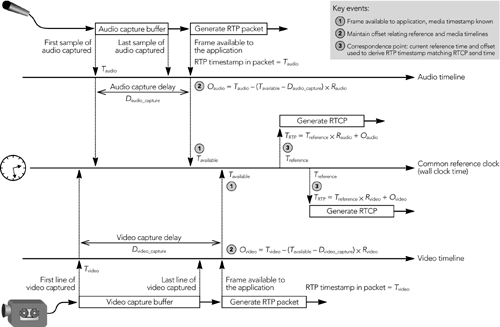
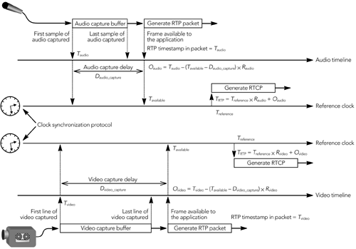
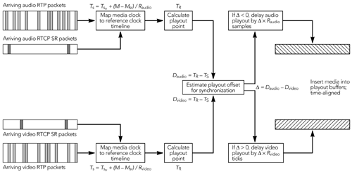
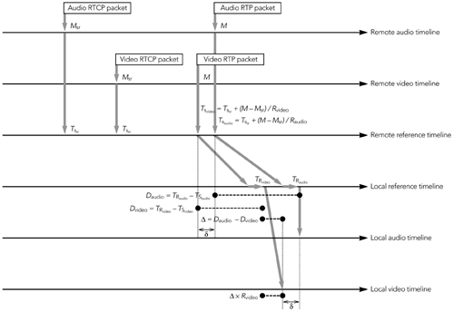

## 第七章 唇形同步

- 发送方行为
- 接收方行为
- 同步精度

一次多媒体会话包含多路媒体流，并且RTP中，每路媒体流都通过独立的RTP会话传输。因为不同编码格式之间的延迟差别非常的大，不同的流在网络中是分开来传输的，媒体往往会有不同的播放时间。为了以同步的样式呈现多路媒体流，接收方必须如图7.1中展示的那样对齐媒体流。本章讨论RTP是如何提供必要的信息来实现多路媒体流的同步。这个技术的主要应用就是对齐音频和视频来达到唇型同步，尽管本章描述的技术可以来同步任意组合的媒体流。

一个普遍的问题是，为什么媒体明明可以绑定在一起传输并预先同步，却分开来传输,迫使接收方重新同步它们。这个问题的答案包括，分开来传输音频和视频的需求,网络的异构型(the heterogeneity of networks)，编码和应用的需求等。

在传输级别上对音频和视频进行不同的处理，以反映发送方或接收方的首选项，这通常是合适的。例如，在视频会议中，与会者通常更倾向于音频而不是视频。在不稳定的网络中(best-effort network)通常表现在对不同流的错误纠正。在集成服务网络中，使用RSVP（资源保留协议),这可能对应于对音频和视频具有不同服务质量（QoS）保证的预留；在差异化服务网络中，可以将音频和视频分配不同的优先级。如果将不同的媒体类型捆绑在一起，这些选项将不复存在或变得难以实施。同样，如果使用捆绑传输，则所有接收方都必须接收所有媒体。有些参与者将无法仅接收音频，而其他参与者同时接收音频和视频。对于多方会话，尤其是使用多播分发的会话，此功能成为一个问题。

然而，即使所有媒体都使用相同的QoS，并且即使所有接收方都希望接收所有媒体，由于编解码器和播放算法的特性，通常也需要某种类型的同步过程。例如，音视频解码器花在解压，纠错，渲染的时间都不相同并且差距很大。正如我们在第六章中所知，适应播放缓冲延迟的方式也随媒体格式而变化。这些过程中的每一步都会影响播放时间，并可能导致音频和视频之间的同步丢失。

结果就是，就算把媒体捆绑在一起进行传输，也需要某种类型的同步功能。那样，我们最好还是单独分发媒体，
允许在网络中使用不同的方式处理它们，因为这样做不会给接收器增加明显的复杂性。

带着这些问题，我们转向讨论同步流程。流程分为两步：发送方需要为这些流分配一个公共参考时钟，而接收方需要重新同步媒体，从而消除由网络引起的时序中断。首先我们依次讨论发送方和接收方，然后是一些常见应用所需的同步精度的讨论。

### 发送方行为

发送方通过运行公共参考时钟并通过RTCP定时发布参考时钟时刻和媒体流时刻之间的关系以及要同步的流的标识，来使接收器处的媒体流同步。参考时钟以固定速率运行；参考时钟和媒体流之间的对应点允许接收器计算出媒体流之间的相对定时关系。 图7-2中显示了此过程。

参考时钟和媒体时钟之间的对应关系，生成每个RTCP数据包时记录下来:参考时钟的采样Treference 与计算出的RTP时间戳TRTP = Treference x Raudio + Oaudio一起包含在数据包中。必须对乘积取模，将结果限制在32位RTP时间戳的范围内。偏移量的计算方式为Taudio = Taudio –（Tavailable – Taudio_capture）x Taudio，即媒体和参考时间轴之间的转换因子。操作系统延迟可能会拖后Tavailable并导致偏移量发生变化，应由应用程序进行过滤来选择最小值。 

发送方每个RTP流的都需要访问公共参考时钟Treference，并且必须参考规范的源标识符(canonical source identifier )来标识其媒体。发送应用程序应注意媒体采集延迟（例如T~audio_capture~），因为它可能很重要，并且在计算和发布参考时钟时间与媒体时钟时间之间的关系时，应该把他考虑进去。

通用参考时钟是RTCP使用的“挂钟”时间。它采用NTP格式的时间戳的形式，计算自1900年1月1日午夜UTC（Coordinated Universal Time ）以来的秒数已经秒的小数部分（不知道"挂钟"时间的发送方可能用系统指定的时间时钟，例如“系统正常运行时间”来计算NTP格式的时间戳；参考时钟的选择不会影响同步，只要对所有媒体都保持一致即可。）发送方会定期在每个流的媒体时钟以及公共参考时钟之间建立对应关系；它通过RTCP发送方报告包（第五章《RTCP控制协议》中标题为RTCP SR：Sender Reports的部分）传递给接收方。

典型场景下，不需要将发送方或接收方的时间同步到外部时钟。有些有时候，即使RTCP发送方报告数据包中的挂钟时间使用NTP时间戳的格式，也没有同步到一个NTP时间源的必要。发送器和接收器时钟不必相互同步。接收方不关心RTCP发送方报告数据包中NTP格式时间戳的绝对值，只关心媒体之间的时钟是公共的，并且其准确性和稳定性足以保证同步。

同步时钟只有当不同的主机生成的流同步的时候使用。一个例子是多个摄像机在一个屏幕上提供了多个视角，使用独立的链接连接到独立的主机。在这种情况下，发送主机需要使用时间协议或其他某种方式来将其参考时钟与通用时基对齐。 RTP并没有强制指定定义该时间的任何方法，但是根据所需的同步程度，网络时间协议(Network Time Protocol)可能是合适的。 图7.3显示了在播放时要同步来自不同主机的媒体流时时钟同步的要求。

同步的另一个要求是标识要同步的源。 RTP通过为相关源指定一个共享名称来做到这一点，因此接收方知道它应该尝试同步的流，哪些流是独立的。每个RTP数据包都包含一个同步源（SSRC）标识符，以将该源与媒体时基相关联。 SSRC标识符是随机选择的，并且对于要同步的所有媒体流而言，SSRC标识符都不相同（如果标识符冲突，会话也会在会话期间更改，如第四章，RTP数据传输协议中所述）。 RTCP源描述（SDES）数据包提供了从SSRC标识符到永久规范名称（CNAME）的映射。发送方应确保要在播放时同步的RTP会话具有通用的CNAME，以便接收方知道对齐媒体。

规范名称是根据源主机的用户名和网络地址通过算法选择的（请参见第五章中的RTCP SDES：源描述，RTP控制协议）。如果单个主机正在生成多路媒体流，确保它们具有公共CNAME，那么同步的任务就很简单。如果目的是同步多个主机生成的媒体流（例如，一个主机正在采集和传输音频，而另一台主机正在传输视频），则CNAME的选择算法就不太明显，因为RTP标准中的默认方法要求每个主机都使用IP地址作为其CNAME的一部分。解决方案是让主机私下协商为所有要同步的流选择一个公共CNAME，即使这意味着某些主机使用的CNAME与它们的网络地址不匹配。 RTP并未指定发生这种协商的机制：一种解决方案可能是在构造CNAME时使用主机的最低编号的IP地址。另一个可能是音频使用视频主机的CNAME（反之亦然）。这种协调通常将由RTP范围之外的会话控制协议（例如SIP或H.323）提供。会话控制协议也可以指示哪些流应通过不依赖CNAME的方法进行同步。

### 接收方行为

接收方被期望根据RTCP数据包中传递给它的信息，确定哪些媒体流应该同步，并对齐展示。

这个过程的第一部分-确定要同步的流-这很简单。接收方将同步发送方的RTCP source description packets中CNAME相同的那些流，如上一节所述。由于RTCP数据包每隔几秒钟发送一次，因此在接收到第一个数据包和接收到RTCP数据包之间可能会有一个延迟，RTCP包表明指定的流将被同步。接收方可以在这段时间内播放媒体数据，但是由于没有必要的信息，因此无法同步它们。

实际的同步操作更为复杂，接收方将音频和视频时间对齐来展示。这个操作由接收RTCP发送方报告数据包触发，数据包包含媒体时钟和两个媒体共有的参考时钟之间的映射。一旦为音频和视频流都确定了这个映射关系，接收这就拥有了同步播放所需的信息。

唇形同步的第一步是为每个要同步的流确定：什么时候把特定参考时间相对应的媒体数据呈现给用户。由于网络影响或其他原因带来的差异，要是按第六章所讲的方法来独立地确定播放时间，则可能无法将在同一时刻采集的两路流同时播放。因此，必须调整一个流的播出时间来匹配另一个流。这个调整会带来一个偏移量，该偏移量将添加到一个流的播放缓冲延迟中，以便按时间对齐播放媒体。 图7.4和7.5解释了这个过程。

接收方首先检测每一路需要同步的流的媒体时钟和参考时钟之前的映射关系。这个映射关系在发送方报告包(SR)中定时的传递给接收方，因为可以从负载类型知道媒体时钟的标称速率(nominal rate),所以一旦接收到源的RTCP发送方报告(SR),接收方就能计算出任何包的参考时钟采集时间。收到带有媒体时间戳M的RTP数据包后，可以用下面公式计算相应的参考时钟采集时间（映射到参考时间轴的RTP时间戳）：

其中Msr是最后一个RTCP发送方报告数据包中的媒体（RTP）时间戳，Tsr是距发送方报告数据包的相应参考时钟（NTP）时间戳以秒为单位（和秒的小数部分），R是标称媒体时间戳时钟频率单位是Hz（需要注意的是，如果在Msr和M之间经过了超过32个单位的媒体时钟，那么公式无效，但是通常情况下，不会发生这种情况。）

接收方还根据其本地参考时钟来计算任何特定数据包的显示时间TR。 这等于数据包的RTP时间戳，如前所述，映射到接收方的参考时钟时间轴，加上播放缓冲延迟（以秒为单位）以及由于解码、混流和渲染过程引起的任何延迟。 重要的是要考虑到延迟的各个方面，直到要在显示器或扬声器上实际呈现为止，如果要实现精确的同步。 特别是，解码和渲染所花费的时间通常很长，应该按照第6章《媒体捕获，播放和定时》中所述进行考虑。

一旦根据通用参考时间线知道采集时间和播放时间，接收方可以估算出每路流的采集时间和播放时间之间的延迟关系。如果根据发送方参考时钟样本采集时间是TS，根据接收方参考时钟显示时间是TS，则它们之间的差值D = TR – TS，就是采集到播放的延迟（以秒为单位）。由于发送方和接收方的参考时钟不同步，因此这个延迟包括一个未知的偏移量，但是可以忽略不计，因为它在所有流中都是通用的，我们也仅对流之间的相对延迟感兴趣。

一旦估算出了音频和视频的采集到播放的相对延迟，就可以得出同步延迟D = Daudio – Dvideo。如果同步延迟D为零，则流同步完成。非零值表示一路流比另一路流先播放，同步延迟表示相对偏移量（以秒为单位）。

对于前面的媒体流，将同步延迟（以秒为单位）乘以标称媒体时钟速率R，以将其转换为媒体时间戳单位，然后将其作为常数偏移量应用于该媒体流的播出计算，延迟播放以匹配其他流。 结果是，一个流的数据包在接收方的播放缓冲区中驻留的时间更长，以补偿系统其他部分的更快处理或减少的网络延迟，并与另一流的数据包同时呈现。

接收方可以选择调整音频或视频的播放时间，具体的这取决于媒体流的优先级和相对延迟以及由于对每路流进行调整而导致的相对播放错乱。对于许多常见的编解码器，视频编码和解码时间是主要考量因素，但是音频对播出调整更加敏感。在这种情况下，可能需要进行适当的初始调整，方法是延迟音频以匹配附近的视频展示时间，然后对视频播放点进行细微调整。在其他情况下，相对优先级和延迟可能会有所不同，具体取决于编解码器，采集和播出设备，并且每个应用都应根据其特定的环境和延迟预算做出选择。

任何一路流的播出延迟调整了，都需要重新计算同步延迟，因为播出延迟的任何变化都会影响两路流的相对延迟。每当接收到媒体时间和参考时间之间的新映射（以RTCP发送方报告包(SR)的形式）时，也需要重新计算偏移量。健壮的接收方可能不会信任发送方，来将抖动排除在RTCP发送器报告数据包(SR)中提供的映射之外，并且它将过滤映射序列来消除任何抖动。适度的过滤器可能会跟踪媒体时间和参考时间之间的最小偏移，避免普遍的一个实现问题：发送方使用映射中前一个数据包的媒体时间，而不是生成发送方报告包的实际时间。

映射偏移量的变化会导致播放点的变化，并且可能需要从流中插入或删除媒体数据。与对播放点进行任何更改一样，应谨慎选择这类更改的时间，以降低对媒体质量的影响。在第6章《调整播放点、媒体捕获、播放和时序》一节中讨论的问题与此处相关。

### 同步精度

在实现同步时，会出现精度问题：应该同步的流之间可接受的偏移量是多少？遗憾的是，这个问题不是一句话能解答的，因为人类对同步的感知，取决于同步的内容和执行的任务。例如，音频和视频之间的唇型同步的要求相对宽松，并且随视频质量和帧率而变化，而多个相关音频流的同步的要求严格。

如果目标是将单个音频轨道同步到单个视频轨道，则通常精确到几十毫秒的同步就足够了。通过视频会议进行的实验表明，大约80毫秒到100毫秒的同步误差低于人类的感知极限（例如，参见Kouvelas等，1996，84），尽管这显然取决于所执行的任务、图像质量和帧率。更高质量的图片以及更高帧率的视频，使得同步缺失更加明显，因为它更容易看到唇部活动。同样，如果帧速率很低（每秒大约少于五帧），则几乎不需要嘴唇同步，因为虽然其他视觉提示可能会暴露出缺乏同步，但是无法将嘴唇运动感知为语音。

如果应用程序正在同步多个音轨（例如，环绕声演示中的声道），则同步的要求会更加严格。在这种情况下，播放必须对单个样本准确；由于信号之间的相位差，最小的同步误差将很明显，这会破坏信号源的视在位置。

如果有必要，RTP提供的信息足以进行精确的同步，前提是发送方已经正确计算出RTCP发送方报告(SR)数据包中包含的媒体时间和参考时间之间的映射，并且接收方具有适合的同步算法。在实践中这是否可以达到是实现质量的问题。

### 总结

像RTP的许多其他功能一样，同步是由最终系统执行的，必须尽力校正以应对分组网络中固有的可变性。本章描述了发送方如何用信号通知媒体的时间对齐，以及接收方可以重新同步媒体流的过程。本章还讨论了音频和视频之间的唇型同步以及多个音频流之间的同步所需的同步精度。