# 第九章 错误恢复

- 前向纠错
- 信道编码
- 重传
- 现实注意事项

虽然隐藏传输错误， 已经能够显著的提升质量，但如果能够避免或纠正传输错误，则是更好的。本章介绍了发送端用来帮助接收端从丢包和其他传输错误中恢复的技术。

用于纠正传输错误的技术分为两类：前向纠错和重传。前向纠错依赖于发送端向媒体流中添加的额外数据，然后接收端可以利用额外数据，以一定的概率纠正错误。另一方面，重传依赖于对特定包的显式请求。

重传和前向纠错的选用标准取决于应用和网络特性。本章详细地讨论不同方案的细节和优缺点。

## 前向纠错

前向纠错( FEC )算法变换原始码流，增加传输的鲁棒性。码流转换生成一个体积更大的比特流，在有损介质或网络传输。变换后的码流附加信息，允许接收者在存在传输错误的情况下，准确地重构原始码流。前向纠错算法主要用于数字广播系统，如移动电话和空间通信系统，以及存储系统，如光盘、计算机硬盘和存储器。由于因特网是一个有损介质，同时由于媒体应用对损耗敏感，FEC方案被提出并标准化为RTP应用。Fec方案提供的精确码流重建准确性，取决于使用的FEC的数量和类型以及损失的性质。

RTP 发送端在使用 FEC 时，必须根据网络的丢包特性来决定 FEC 的冗余数据量。一个方案是查看返回的 RTCP 接收端报告的数据包，并使用丢包比例统计信息来决定要包含在媒体流中的冗余数据量。

理论上，通过改变介质的编码，可以保证修正一定比例的丢包。在实际应用中，有几个因素表明 FEC 只能提供概率修复。其中的关键是添加 FEC 会增加流的带宽。带宽的增加限制了在可用网络容量的基础上添加 FEC 的数量，并且如果是因为拥塞而造成丢包，则 FEC 的数量也可能会产生不利影响。特别是，向流中添加带宽可能会增加拥塞，从而恶化 FEC 应该纠正的丢包。在本章后面的“实施注意事项”一节中的“发送端”小结，以及第 10 章《拥塞控制》中，将进一步讨论此问题。

请注意，尽管 FEC 的数量可以根据接收质量报告的不同而有所变化，但通常不会对单个丢包事件进行反馈，也不能保证所有丢包都得到了纠正。其目的是将剩余丢包率降低到可以接受的程度，然后让错误隐藏来处理任何剩余的丢包。

如果 FEC 要正常工作，丢包率必须是有界的，并且丢包必须发生在特定的模式下。例如：很明显，如果 10%的包丢失，设计为纠正 5%丢包的 FEC 方案将不能纠正所有丢包。不太明显的是，只有当丢包是由非连续的数据包造成时，它才有可能纠正 5%的丢包。

FEC 的主要优点是它可以扩展到非常大的组，或者是没有反馈的组。增加的冗余数据量取决于平均丢包率和丢包模式，两者都与接收端数量无关。缺点是 FEC 的添加量取决于平均丢包率。低于平均丢包的接收端将接收冗余数据，这会浪费容量，必须丢弃这些数据。丢包高于平均水平的将无法纠正所有的错误，只能依靠隐藏。如果不同接收端的丢包率非常不均匀，就不可能用单一的 FEC 流来满足所有的丢包率(分层编码可能有所帮助;参见第 10 章，拥塞控制)。

**另一个缺点是 FEC 可能会增加延迟，因为在 FEC 包到达之前无法进行修复**。如果 FEC 数据包在它们保护的数据之后很长一段时间才发送，那么接收端可能不得不在快速播放损坏数据和等待 FEC 到达之间做出选择，这可能会增加端到端延迟。交互式应用中降低延迟非常重要。

存在许多 FEC 方案，其中有几个已被作为 RTP 框架的一部分采用。我们将首先回顾一些独立于媒体格式的技术：奇偶性 FEC 和里德-所罗门（Reed-Solomon）编码，然后再研究特定的音频和视频格式。

###  奇偶校验 FEC（parity FEC）

奇偶校验是最简单的错误检测/校正码之一。奇偶运算可以数学地描述为位流异或(XOR)。XOR 操作是位逻辑操作，定义为两个输入:

0 XOR 0 = 0  
1 XOR 0 = 1  
0 XOR 1 = 1  
1 XOR 1 = 0

这个操作可以很容易地扩展到超过两个的输入，因为 XOR 满足交换律的：

A XOR B XOR C = (A XOR B) XOR C = A XOR (B XOR C)

将单个输入更改为 XOR 操作输出，从而允许奇偶校验位检测任何错误。

要使奇偶校验对使用 RTP OVER UDP/IP 的系统有用(在这种系统中，主要的威胁是包丢失，而不是位损坏)，有必要将奇偶校验位放在一个独立的包中发送给它们保护的数据。如果有足够的奇偶校验位，它们可以用来恢复丢包的全部内容。依据的性质是，对于任意值的 A 和 B 满足：

A XOR B XOR B = A

如果我们以某种方式分别传输三个信息 A、B 和 A XOR B，我们只需要接收其中的两个来恢复 A 和 B 的值

图 9.1 显示了一个示例，其中一组 7 个丢失的位通过此过程恢复，但它适用于任何长度的位流。该过程可直接应用于 RTP 分组，将整个分组视为比特流并计算奇偶校验分组，奇偶校验分组是原始数据分组的异或，可用于防丢包。

图 9.1. 使用位流之间的奇偶校验恢复丢包数据
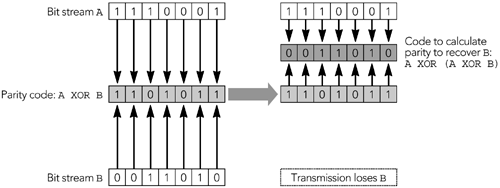

适用于 RTP 流的奇偶校验 FEC 标准由 RFC 2733 定义。本标准的目的是为 RTP 包定义一个通用的 FEC 方案，该方案可以操作任何有效负载类型，并且向后兼容不理解 FEC 的接收端。它通过计算原始 RTP 数据包中的 FEC 数据包来实现这一点;然后将这些 FEC 包作为单独的 RTP 流发送，RTP 流可能用于修复原始数据中的包，如图 9.2 所示。

图 9.2. 奇偶校验 FEC 修复
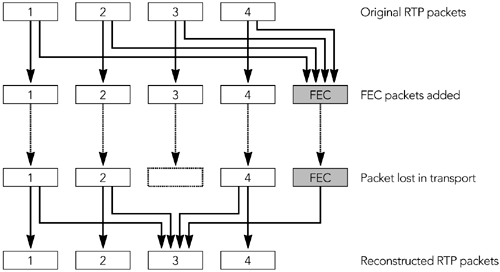

### **奇偶校验 FEC 包格式**

如图 9.3 所示，FEC 包的格式包含三个部分: 标准 RTP 包头、特定于有效负载的 FEC 包头和有效负载数据本身。除了 RTP 包头的某些字段外，FEC 包是由它所保护的数据包生成的。它是对数据包应用奇偶校验操作的结果。

图 9.3. 奇偶校验 FEC 包的格式
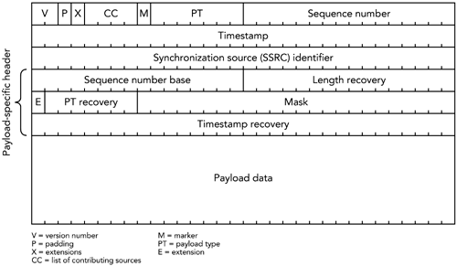

RTP 包头的字段如下:

- 版本号、有效负载类型、序列号和时间戳以通常的方式分配。根据使用的 RTP 配置文件动态分配有效负载类型;每发送一个 FEC 包，序列号增加 1;时间戳设置为在传送 FEC 包时 RTP 媒体时钟的值。(时间戳不太可能等于前后 RTP 包的时间戳。)因此，FEC 包中的时间戳是单调增加的，与 FEC 方案无关。
- SSRC 值与原始数据包的 SSRC 值相同。
- 填充、扩展、CC 和标记位被计算为原始数据包中等效位的 XOR。这允许在原始数据包丢失时对这些字段进行重覆盖。
- CSRC 列表和头扩展不存在，与 CC 字段和 X 位的值无关。如果它们存在于原始数据分组中，则它们作为 FEC 分组的有效负载部分（在 FEC 有效负载包头之后）被包括。

> 注意，在奇偶校验 FEC 包中禁止使用 CSRC 列表和包头扩展，这意味着根据标准的、与有效负载格式无关的 RTP 处理规则来处理 FEC 流并不总是可能的。特别是，FEC 流不能通过 RTP 混流器(媒体数据可以，但是混流器必须为混合数据生成一个新的 FEC 流)

在 FEC 包的 RTP 包头中未受保护的原始 RTP 包头的字段中，有效负载包头被保护了。这是有效负载头部的六个字段:

1. **序列号基数(Sequence number base)**。组成此 FEC 包的原始包的最小序列号。
2. **长度恢复(Length recovery)**。原始数据包长度的异或。长度计算为有效负载数据、CSRC 列表、头扩展和原始数据包的填充的总长度。此计算允许即使在媒体包的长度不相同时也应用 FEC 过程。
3. **扩展(Extension)**. FEC 有效负载包头中存在附加字段的指示符。它通常设置为 0，表示不存在扩展（本章后面描述的 ULP 格式使用扩展字段来指示是否存在额外的分层 FEC）
4. **有效负载类型（PT）恢复(Payload type recovery)**。原始数据包的有效负载类型字段的异或。
5. **掩码(Mask)**。一种位掩码，指示在奇偶校验 FEC 操作中包括序列号基之后的哪些包。如果掩码中的位 i 被设置为 1，则序列号为 N+i 的原始数据包与该 FEC 包相关联，其中 N 是序列号基数。最低有效位对应于 i ＝ 0，最高有效位对应于 i ＝ 23，允许在最多 24 个包上计算奇偶校验 FEC，这可能是非连续的。
6. **时间戳恢复（Timestamp recovery）**。原始数据包的时间戳的异或(XOR)。

有效负载数据导出了 CSRC 列表的 XOR（如果存在）、包头扩展（如果存在），以及要保护的包的有效负载数据。如果数据包的长度不同，则计算异或时就好像短数据包被填充以匹配最大数据包的长度一样（填充位的内容不重要，只要每次处理特定数据包时使用相同的值；可能最容易的就是填充 0）。

**奇偶校验 FEC 的使用**

FEC 包的数量及其生成方式取决于发送端采用的 FEC 方案。有效负载格式对映射过程的限制相对较少:一组至多 24 个连续的原始数据包被输入到奇偶校验操作中，每个数据包可用于生成多个 FEC 数据包。

有效负载包头中的序列号基数和掩码用于指示哪个包用于生成每个 FEC 包;不需要额外的信号。因此，FEC 操作中使用的包可以在 RTP 会话期间更改，可能是响应 RTCP RR 包中包含的接收质量信息。FEC 操作的变化能力赋予了发送端很大的灵活性:发送端可以根据网络条件调整 FEC 的使用量，并确保接收端仍然可以使用 FEC 进行恢复。

在发送原始数据包时，发送端需要实时生成适当数量的 FEC 数据包。没有一个正确的方法来选择要添加的 FEC 的数量，因为选择取决于网络的丢包特性，而标准并不要求特定的方案。以下是一些可能的选择:

- 最简单的方法是每 n - 1 个数据包发送一个 FEC 数据包，如图 9.4A 所示，允许在每 n 个包中最多有一个丢失的情况下进行恢复。这种 FEC 方案开销低，易于计算，易于适应（因为 FEC 包的比例与 RTCP-RR 包中报告的丢包比例直接对应）。

  如果数据包丢失的概率是稳定的，则该方法可以很好地工作；但是，连续突发的丢包数据是无法恢复的。如果突发丢包是常见的，如在公共互联网中，奇偶校验可以跨宽间隔数据包计算，而不是跨相邻数据包计算，从而产生更强大的保护。其结果是一个方案，可以很好地进行流式传输，但有很大的延迟，使其不适合交互式应用。

- 一个更健壮的方案是在每对数据包之间发送一个 FEC 包，但是开销要高得多，如图 9.4B 所示。这种方法允许接收端纠正每一个数据包丢失和许多连续 2 个包的丢失。这种方法的带宽开销很高，但是增加的延迟相对较小，因此更适合于交互式应用程序。

- 高阶方案允许从更多的连续丢包中恢复。例如，图 9.4C 显示了一个方案，该方案可以从多达三个连续数据包的丢失中恢复。由于需要计算多个包上的 FEC，引入的时延相对较高，因此这些方案不太适合交互使用。不过，它们在流媒体应用程序中很有用。

图 9.4. 几种可能的 FEC 方案
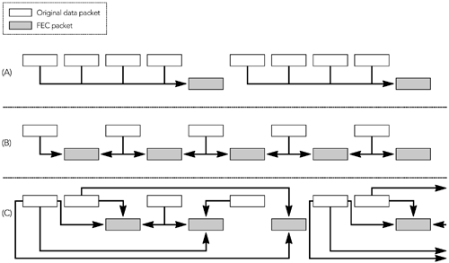

为了使奇偶校验 FEC 向后兼容，很重要的一点是，较老的接收端看不到 FEC 包。因此，数据包通常作为一个单独的 RTP 流，通过不同的 UDP 端口发送到相同的目标地址。例如，考虑一个会话，其中原始 RTP 数据包使用静态有效负载类型 0（G.711μ-law），并在端口 49170 上发送，而 RTCP 在端口 49171 上发送。FEC 数据包可以在端口 49172 上发送，相应的 RTCP 可以在端口 49173 上发送。FEC 包使用动态有效负载类型，例如 122。这种情况可以在 SDP 中描述如下：

v=0  
o=hamming 2890844526 2890842807 IN IP4 128.16.64.32  
s=FEC Seminar  
c=IN IP4 10.1.76.48/127  
t=0 0   
m=audio 49170 RTP/AVP 0 122  
a=rtpmap:122 parityfec/8000  
a=fmtp:122 49172 IN IP4 10.1.76.48/127 

本章后面一节“音频冗余编码”中描述的另一种方法，将奇偶校验 FEC 包作为媒体的冗余编码来传输。

**恢复丢包**

接收端接收 FEC 包和原始数据包。如果没有数据包丢失，则可以忽略奇偶校验 FEC。在丢包的情况下，FEC 包可以与剩余的数据包组合，从而允许接收端恢复丢失的包。

恢复过程分为两个阶段。首先，必须确定哪一个原始数据包和 FEC 数据包必须合并，以恢复丢失的数据包。完成之后，第二步是重构数据。

任何合适的算法都可以用来确定哪些包必须组合在一起。RFC 2733 给出了一个例子，如下图所示:

- 当接收到 FEC 包时，将检查序列号基数和掩码字段，以确定它保护哪些包。如果已接收到所有这些数据包，则 FEC 数据包是冗余的并被丢弃。如果其中一些数据包丢失，并且它们的序列号小于最大接收序列号，则尝试恢复；如果恢复成功，则丢弃 FEC 数据包，并将恢复的数据包存储到播放缓冲区。否则，FEC 包被存储以备将来使用.

- 当接收到数据包时，检查所有存储的 FEC 包以查看新的数据包是否使恢复成为可能。如果是，在恢复之后，FEC 包被丢弃，恢复的包进入播放缓冲区。

- 已恢复的包被视为已接收到的包，可能会触发进一步的恢复尝试。

最终，所有的 FEC 包都将作为冗余使用或丢弃，所有可恢复的丢包都将被重建。

该算法依赖于确定特定的数据包集和 FEC 包集是否能够从丢包中恢复的能力。要进行确定，需要查看由 FEC 数据包引用的一组数据包；如果只缺少一个，则可以恢复它。恢复过程与用于生成 FEC 数据的过程类似。奇偶校验（XOR）操作在数据包和 FEC 包中的等价字段上进行，得到的结果是原始数据包。详细的恢复过程如下：

1. 恢复包的 SSRC 设置为其他包的 SSRC。
2. 恢复包的填充、头扩展、CC 和标记位作为原始包和 FEC 包中相同字段的异或生成。
3. 从原始序列号的间隙中知道恢复包的序列号（即，不需要恢复它，因为它是直接已知的）。
4. 原始包中的有效负载类型字段的 XOR 异或，以及 FEC 包的有效负载类型恢复字段生成了恢复包的有效负载类型。时间戳以相同的方式恢复。
5. 有效负载的长度计算方法是原始包长度的 XOR 异或和 FEC 包的长度恢复字段
6. 贡献源（CSRC（contributing source） lists）（如果存在），扩展包头(如果存在)和恢复包的有效负载，通过原始数据包中那些字段的 XOR 异或，加上 FEC 数据包的有效负载来计算（因为 FEC 包从不包含 CSRC 列表或包头扩展本身，并且它携带原始字段的受保护版本作为其负载的一部分）

结果是对丢失的包进行了精确的重建，按位与原始包相同。RFC 2733 FEC 方案没有部分恢复。如果有足够的 FEC 包，则丢失的包可以完全恢复；如果没有，则无法恢复任何内容。

###  非均匀错误保护

尽管某些有效负载格式必须准确恢复，但也有其他格式的数据的某些部分比其他部分更重要。在这些情况下，有时可以在只恢复部分数据包的情况下获得大部分效果。

例如，一些音频编解码器需要恢复最少的比特数来提供可理解的语音，而附加比特数不是必需的，但如果可以恢复，则可以提高音频质量。一个只恢复最小数据量的恢复方案在质量上比一个恢复完整数据包的恢复方案要低，但是它的开销可能要少得多。

另外，也可以保护整个包免受某种程度的包丢失，但对包中最重要的部分提供更大程度的保护。在这种情况下，整个包有一定的概率被恢复，但是重要部分的恢复概率更高。

这样的方案称为不均匀分层保护（unequal layered protection ULP）码。在撰写本文时，还没有将 ULP 代码应用于 RTP 的标准。然而，IETF 中正在进行的工作是在 RFC 2733 中定义奇偶校验 FEC 码的扩展，它将提供这个功能。这项工作是不完整的，最终标准可能与这里描述的略有不同。

扩展提供分层编码，借助每一层保护数据包的某一部分。每一层可以具有不同的长度，直到组中最长分组的长度。层的排列使得多个层保护包的开始，而包后面的部分被更少的层保护。这种安排使得数据包的开始更有可能被恢复。

基于奇偶校验 FEC 的 ULP 的 RTP 有效负载格式如图 9.5 所示。有效负载包头的开始与 RFC 2733 的开始相同，但是设置了扩展位，并且随后附加的有效负载包头描述分层 FEC 操作。数据包的有效负载数据部分按顺序包含每个层的受保护数据。

图 9.5. 基于奇偶校验 FEC 的 ULP RTP 负载格式
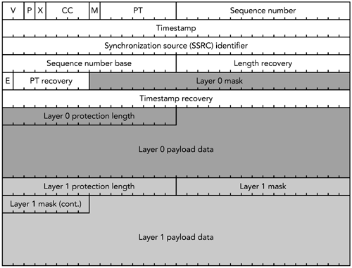

> 在撰写本文时，有一个针对这里描述的基于 ULP 的奇偶校验 FEC 的 RTP 有效负载格式的修改动作，以便除了提供分层保护之外，它还更新 RFC 2733 的奇偶校验 FEC 格式以更好地支持 RTP 混流器。这些改变预计不会改变所描述的分层编码概念，但分组格式的细节很可能会改变。

基于 ULP 的奇偶校验 FEC 格式的操作类似于标准奇偶校验 FEC 格式，只是每一层的 FEC 只对包的一部分(而不是整个包)进行计算。每一层都必须保护下层保护的包，使保护下层的 FEC 的数量与层的数量累加。每个 FEC 包可能包含所有层的数据，一个接一个地堆积在包的有效负载部分。最低层的 FEC 出现在所有 FEC 包中;根据 FEC 操作，更高的层出现在包的子集中。只有一个 FEC 流，与保护层的数量无关。

恢复以每层为基础进行，每层都可能允许恢复部分数据包。每一层的恢复算法与标准奇偶校验 FEC 格式相同。从基础层开始，依次恢复每个层，直到执行所有可能的恢复操作。

ULP 的使用不适合所有有效负载格式，因为要使其工作，解码器必须能够处理部分数据包。当这样的部分数据有用时，ULP 可以提供显著的质量增益，其开销比完全 FEC 保护所需的开销少。

**里德-所罗门码**

里德-所罗门码是奇偶校验码的一个替代方案，它以更少的带宽开销提供保护，但以增加复杂性为代价。特别是，在传统奇偶校验码效率较低的情况下，它们提供了很好的抗突发丢失保护。

里德-所罗门码将每个数据块视为一个多项式方程的系数。该方程在一定的数字基数上对所有可能的输入进行评估，从而产生要传输的 FEC 数据。通常，该过程按八位元操作，使实现更简单。完整的处理超出了本书的范围，但编码过程实际上是相对直接的，并且有优化的解码算法。

尽管里德-所罗门码与奇偶校验码相比有许多优点，但它们在 RTP 中的使用是不规范的。使用里德-所罗门码的均匀和非均匀 FEC 都引起了人们的兴趣，并有望在将来开发出一个标准。

###  音频冗余编码

到目前为止，我们所讨论的纠错方案与所使用的媒体格式无关。但是，也可以使用特定于媒体的方法来纠错，这种方法通常可以提高性能。

为 RTP 定义的第一种特定于媒体的纠错方案是 RFC 2198 中指定的音频冗余编码。这种编码方案的动机是交互式语音电话会议，在这种会议中，快速修复丢失的数据包比准确地修复它们更为重要。因此，每一包以更大的压缩格式包含音频数据的原始帧和前一帧的冗余副本。编码方案如图 9.6 所示。

图 9.6。音频冗余编码（摘自 C.Perkins、O.Hodson 和 V.Hardman，流媒体丢包恢复技术综述，&quot；IEEE 网络杂志，1998 年 9 月/10 月.版权所有 1998 IEEE.）
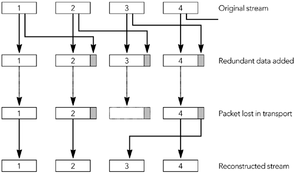

当接收到冗余音频流时，接收端可以使用冗余副本来填补原始数据流中的任何空白。由于冗余副本通常比主副本压缩得更狠，所以修复不会是精确的，但在感觉上比流中的有间隙要好。

**冗余音频包的格式**

冗余音频负载格式如图 9.7 所示。RTP 包头具有标准值，有效负载类型是表示冗余音频的动态有效负载类型。

图 9.7. 音频冗余编码的 RTP 有效负载格式
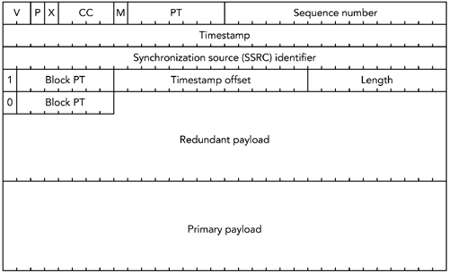

有效负载包头包含四个八位字节用于数据的每个冗余编码，外加一个表示原始媒体的有效负载类型的最后八位字节。每个冗余编码的四个八位字节有效负载头包含几个字段：

- 指示这是冗余编码还是主编码的单个位。

- 冗余编码的有效负载类型。

- 以 10 位无符号整数存储的八字节冗余编码的长度。

- 时间戳偏移量，存储为 14 位无符号整数。该值从包的时间戳中减去，以指示冗余数据的原始播放时间。

最后的有效负载包头是一个单一的八位字节，由一个位组成，表示这是最后的包头，以及主数据的 7 位有效负载类型。有效负载包头之后紧跟着数据块，数据块按与包头相同的顺序存储。数据块之间没有填充或其他分隔符，它们通常不是 32bit 对齐的(尽管它们是八位对齐的)。

例如，如果主编码是 GSM，每包发送一帧 20 毫秒，并且冗余编码是以一个包延迟发送的低速 LPC 编解码器，则完整的冗余音频包将如图 9.8 所示。请注意，时间戳偏移量为 160，因为 8kHz 时钟的 160 个刻度表示 20 毫秒偏移量（8000 个刻度/秒 x 0.020 秒=160 个刻度）。

图 9.8 冗余音频包示例

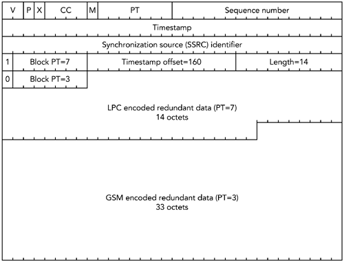

该格式允许冗余副本延迟多个包，作为一种以额外延迟为代价来抵消突发丢包的方法。例如，如果突发两个连续丢包是常见的，那么冗余副本可以在原始包之后发送两个包。

选择冗余编码应该反映这些编码的带宽要求。预期冗余编码使用的带宽将比主编码少得多——例外的情况是主编码的带宽非常低，处理要求很高，在这种情况下可以使用主编码的副本作为冗余。冗余编码的带宽不应高于主编码。

还可以在每个包中发送多个冗余数据块，允许每个包修复多个丢包事件。很少有必要使用多级冗余，因为在实践中，你通常可以通过延迟冗余以较低的开销实现类似的保护。但是，如果使用多个冗余级别，则每个级别所需的带宽预计将显著小于前一级别的带宽。

冗余音频格式在 SDP 中的信号如下例所示:

m=audio 1234 RTP/AVP 121 0 5  
a=rtpmap:121 red/8000/1  
a=fmtp:121 0/5

在这种情况下，冗余音频使用动态有效负载类型 121，主要和次要编码是有效负载类型 0（PCMμ-law）和 5（DVI）。

也可以使用动态负载类型作为主要或次要编码，例如：

m=audio 1234 RTP/AVP 121 0 122  
a=rtpmap:121 red/8000/1  
a=fmtp:121 0/122  
a=rtpmap:122 g729/8000/1

其中初级为 PCM µ-law，次级为 G.729，采用动态有效负载类型 122。

请注意，SDP 片段的 m= 和a=fmtp: 行中都出现了主编码和次编码的有效负载类型。因此，接收端必须准备好使用这些编解码器接收冗余和非冗余音频，这两种编解码器都是必需的，因为在通话突发中发送的第一个和最后一个包可能是非冗余的。

冗余音频的实现在处理一次通话中的第一个和最后一个数据包的方式上不一致。第一个包不能用次要编码发送，因为没有前面的数据：一些实现使用主有效负载格式发送它，而另一些实现使用冗余音频格式，次要编码的长度为零。同样，发送最后一个包的冗余副本也很困难，因为没有任何东西可以承载它：大多数实现无法恢复最后一个数据包，但可能只发送带有次要编码的非冗余数据包。

**冗余音频的局限性**

虽然冗余音频编码可以提供精确的修复(如果冗余副本与主副本相同)，但冗余编码更有可能具有较低的带宽，因此质量较低，并且只能提供近似的修复。

冗余音频的有效负载格式也不会为每个冗余编码保留完整的 RTP 头。特别是，RTP 标记位和 CSRC 列表不被保留。标记位的丢失不会引起不必要的问题，因为即使标记位与冗余信息一起发送，它仍然有丢失的可能，因此，在编写应用程序时仍然必须考虑到这一点。同样，由于音频流中的 CSRC 列表预期相对较少地改变，因此建议需要此信息的应用程序假设 RTP 包头中的 CSRC 数据可以应用于重构的冗余数据。

**使用冗余音频**

冗余音频有效负载格式主要用于音频电话会议。在某种程度上，它表现得非常好;然而，自从定义格式以来，编解码器技术的进步意味着现在有效负载格式的开销可能太高了。

例如，提出冗余音频的原始论文，建议使用 pcm 编码的音频-每帧 160 个字节-作为主要的，LPC 编码作为次要的。在这种情况下，有效负载包头的五个八位字节构成可接受的开销。然而，如果主节点是 G.729，每帧 10 个八位字节，则有效负载包头的开销可能被认为是不可接受的。

除了在一定程度上限制采用冗余音频的音频电话会议外，冗余音频还用于两种场景:奇偶校验 FEC 和 DTMF 音调。

前面描述的奇偶校验 FEC 格式要求 FEC 数据与原始数据包分开发送。一种常见的方法是将 FEC 作为另一个端口上的附加 RTP 流发送；然而，另一种方法是将其视为媒体的冗余编码，并使用冗余音频格式将其承载到原始媒体上。这种方法降低了 FEC 的开销，但这意味着接收端必须理解冗余的音频格式，从而降低了向后兼容性。

DTMF 音调和其他电话事件的 RTP 有效负载格式建议使用冗余编码，因为这些音调需要可靠地传送（例如，通过 DTMF 触摸音进行选择的电话语音菜单系统，如果音调不能可靠地识别，则会更加烦人）。对每个音调的多个冗余副本进行编码使得即使在包丢失的情况下也能够实现非常高的音调可靠性。

###  信道编码

前向纠错是信道编码的一种形式，它依赖于向媒体流中添加信息以防止丢包。媒体流还可以通过其他方式来匹配特定网络路径的丢包特性，下面几节将讨论其中的一些方式。

## **部分校验和**

公共互联网中的大部分丢包是由网络拥塞引起的。然而，如第 2 章所述，在分组网络上的语音和视频通信中，在某些类别的网络中，例如，无线网络中非阻塞性丢包和包损坏是常见的。尽管在许多情况下丢弃具有损坏位的数据包是适当的，但是一些 RTP 有效负载格式可以使用损坏的数据（例如，AMR 音频编解码器）。你可以通过禁用 UDP 校验和（如果使用 IPv4）或使用带有部分校验和的传输来使用部分损坏的 RTP 数据包。

当对标准的 UDP/IPv4 堆栈使用 RTP 时，可以完全禁用 UDP 校验和（例如，在支持 sysctl 的 UNIX 计算机上使用 sysctlnet.inet.UDP.checksum=0， 或者在 Winsock2 上使用UDP-NOCHECKSUM套接字选项）。禁用 UDP 校验和的好处是，具有损坏的有效负载数据的数据包将被传递到应用程序，从而可以挽救部分数据。缺点是，包头可能损坏，导致包被误用或不可用。

> 请注意，有些平台不允许禁用 UDP 校验和，而另一些平台允许将其作为全局设置，但不允许按流设置。在基于 IPv6 的实现中，UDP 校验和是必需的，不能禁用（尽管可以使用 UDP-Lite 建议）。

更好的方法是使用带有部分校验和的传输，例如 UDP-Lite。这是一个正在进行的工作，它扩展了 UDP，使校验和只覆盖数据包的一部分，而不是全部或全部。例如，校验和可以只覆盖 RTP/UDP/IP 包头，或者包头和有效负载的第一部分。使用部分校验和，传输器可以丢弃信息包，因为信息包中的头(或其他有效负载的重要部分)已损坏，只传递那些在有效负载的不重要部分中有错误的数据包。

第一个充分利用部分校验和的 RTP 有效负载格式是 AMR 音频编解码器。这是为许多第三代移动电话系统选择的编解码器，因此它的 RTP 有效负载格式的设计者高度重视对位错误的鲁棒性。编解码器比特流的每一帧都被分为 A 类比特(对解码至关重要)和 B 类和 C 类比特(如果接收到这些比特，质量就会提高，但不是至关重要)。AMR 输出的一个或多个帧被放入每个 RTP 包中，可以选择使用包含 RTP/UDP/IP 包头和 a 类位的部分校验和，而其他位则不受保护。这种缺乏保护的情况允许应用程序忽略 B 类和 C 类位中的错误，而不是丢弃数据包。例如，在图 9.9 中，阴影部分不受校验和保护。这种方法似乎没有什么优势，因为不受保护的比特相对较少，但是当使用包头压缩(见第 11 章)时，IP/UDP/RTP 包头和校验和被减少到只有四个八位元，增加了部分校验和带来的增益。

图 9.9. 在 AMR 有效负载格式中使用部分校验和的示例

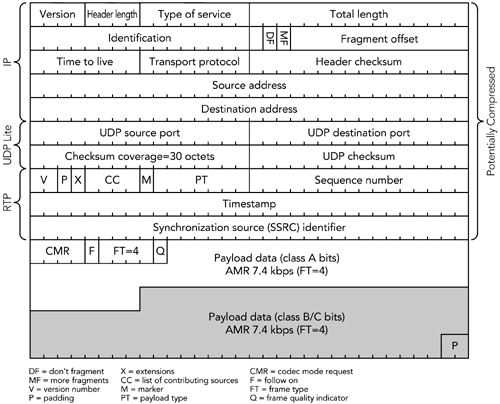

AMR 有效负载格式还支持交织和冗余传输，以增强鲁棒性。其结果是一个非常健壮的格式，可以很好地处理在蜂窝网络中常见的位损坏。

部分校验和并不是一个通用工具，因为它们不能改善由于拥塞而导致包丢失的网络的性能。然而，随着无线网络变得越来越普遍，预计未来的有效负载格式也将使用部分校验和。

### **参考帧选择**

许多有效负载格式依赖于帧间编码，如果不使用前一帧中发送的数据，就不可能解码当前帧。帧间编码最常用于视频编解码器，在这种编解码器中，运动矢量允许图像平移或图像的部分运动，而无需重新发送前一帧中已移动的部分。帧间编码对于获得良好的压缩效率至关重要，但它放大了包丢失的影响(显然，如果一个帧依赖于丢失的包，则该帧不能被解码)。

使帧间编码对丢包更健壮的一个解决方案是参考帧选择，如 H.263 和 MPEG-4 的一些变体中所使用的。这是另一种形式的信道编码，在这种编码中，如果预测其他帧的帧丢失，则根据接收到的另一帧重新编码未来帧(见图 9.10)。与不进行帧间压缩(仅进行帧内压缩)发送下一帧相比，此过程节省了大量带宽。

图 9.10. 参考帧选择  
 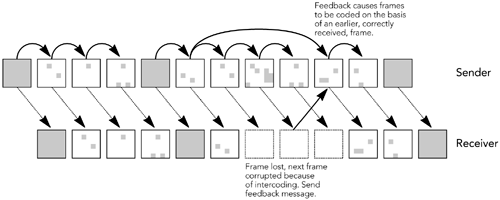

要更改参考帧，接收端必须向发送端报告单个数据包丢失。下一节将在重传的上下文中讨论反馈机制;同样的技术也可以用于参考帧的选择，只需要稍作修改。关于在 RTP 中使用参考帧选择的标准的工作正在进行中，这是下面讨论的重传配置文件的一部分。

## 重传

如果接收端向发送端发送反馈，要求其重新发送在传输过程中丢失的数据包，也可以恢复丢包。重传是一种自然的纠错方法，在某些情况下可以很好地工作。然而，它也存在一些限制其适用性的问题。重传不是标准 RTP 的一部分;然而，一个 RTP 配置文件正在开发中，它为重传请求和其他即时反馈提供了一个基于 rtcp 的框架。

### 作为重传框架的 RTCP

因为 RTP 包括一个用于接收报告和其他数据的反馈通道 RTCP，所以自然也会使用该通道来进行重传请求。需要两个步骤：需要为重传请求定义数据包格式，并且必须修改时序规则以允许立即反馈。

**包格式**

基于重传的反馈的配置文件定义了两种额外的 RTCP 包类型，表示肯定和否定的应答。最常见的类型应该是否定的确认，报告一组特定的数据包丢失。肯定的确认报告数据包已正确接收。

否定应答(NACK)的格式如图 9.11 所示。NACK 包含一个表示丢包的包标识符和一个位图，该位图显示以下 16 个包中的哪一个丢失了，值为 1 表示丢失。发送端不应该仅仅因为位掩码中相应的位置设置为零，就认为接收端已经收到了数据包;它只知道此时接收端没有报告丢失的包。在接收到一个 NACK 时，发送端需要重新发送标记为丢失的包，尽管它没有这样做的义务。

图 9.11. RTCP 反馈否定应答的格式

肯定确认（ACK）的格式如图 9.12 所示。ACK 包含表示正确接收的包的包标识符，以及位图或以下包的计数。如果 R 位设置为 1，则最后一个字段是在数据包标识符之后正确接收的数据包数的计数。如果 R 位设置为零，则最后一个字段是一个位图，显示还接收了以下 15 个数据包中的哪一个。这两个选项允许有效地发出少量丢包（R=1）的长时间 ack 和点缀着丢包（R=0）的偶发 ack 的信号。

图 9.12. RTCP 反馈肯定性确认的格式  

ACK 和 NACK 之间的选择取决于使用的修复算法和所需的语义。ACK 表示接收到了一些数据包；发送端可能认为其他数据包丢失了。另一方面，NACK 发出一些包丢失的信号，但不提供关于其余包的信息（例如，当重要包丢失时，接收端可以发送 NACK，但默默地忽略不重要数据的丢失）。

反馈包作为一个复合 RTCP 包的一部分发送，其方式与所有其他 RTCP 包相同。它们放在复合包的最后，在 SR/RR 和 SDES 项之后。(参见第 5 章，RTP 控制协议，以查看 RTCP 包格式。)

**时序规则**

RTCP 的标准定义有严格的时序规则，这些规则指定了何时可以发送数据包，并限制了 RTCP 的带宽消耗。重传配置文件修改了这些规则，以允许比正常时间更早地发送反馈包，代价是延迟后续包。其结果是短期内违反了带宽限制，尽管长期的 RTCP 传输速率保持不变。修改后的配时规则总结如下:

- 当不需要发送反馈消息时，根据标准时序规则发送 RTCP 数据包，但不强制执行 RTCP 报告之间的 5 秒最小间隔（应使用第 5 章 RTP 控制协议中标题为报告间隔一节中讨论的减小的最小间隔）。

- 如果一个接收端想在 RTCP 传输时间之前发送反馈，它应该等待一个短暂的、随机的抖动（dither）间隔，并检查它是否已经看到了来自另一个接收端的相应反馈消息。如果是，它必须避免发送，并遵循常规的 RTCP 调度。如果接收端没有看到来自任何其他接收端的类似反馈消息，并且在此报告间隔期间没有发送反馈，则可以将反馈消息作为复合 RTCP 包的一部分发送。

- 如果发送了反馈，则根据两倍标准间隔重估下一次调度的 RTCP 包传输时间。在重估的包被发送之前，接收端可能不会发送任何反馈(也就是说，对于每个常规的 RTCP 报告，它可能只发送一次反馈包)。

抖动（dither）间隔是根据组大小和 RTCP 带宽来选择的。如果会话只有两个参与者，则抖动间隔设置为 0;否则，它被设置为发送端和接收端之间往返时间的一半，乘以成员的数量(如果往返时间未知，则设置为 RTCP 报告间隔的一半)。

选择抖动间隔的算法允许每个接收端在小会话时几乎立即发送反馈。随着接收端数量的增加，每个接收端发送重传请求的速率降低了，但是另一个接收端看到相同丢包并发送相同反馈的机会增加了。

**操作模式**

RTP 重传配置文件允许以比标准 RTCP 更高的速率发送反馈，但它仍然对允许的发送时间施加了一些限制。根据组大小、可用带宽、码率、丢包率和所需的报告粒度，应用程序将在三种模式之一(即立即模式、早期模式和常规模式)中运行，如图 9.13 所示。

图 9.13. 反馈模式  
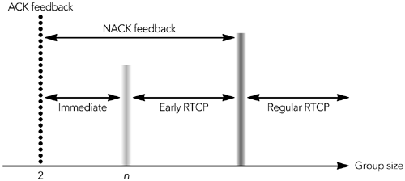

在即时反馈模式中，对于感兴趣的每个事件都有足够的带宽来发送反馈。在早期反馈模式中，没有足够的带宽提供所有事件的反馈，接收端只能报告可能事件的子集。即时模式的性能最好。当应用程序进入早期反馈模式时，它开始依赖于丢包的统计抽样，并且只向发送端提供近似的反馈。在图 9.13 中，立即模式和早期模式之间的边界由组大小 n 表示，它随码率、组大小和发送端的比例而变化。

在即时和早期模式中，只允许 NACK 包。如果会话只有两个参与者，则可以使用 ACK 模式。在 ACK 模式下，发送对每个事件的确认，向发送端提供更详细的反馈(例如，ACK 模式可能允许视频应用程序确认每个完整的帧，从而使参考图片选择能够有效地操作)。同样，必须尊重重传配置文件的带宽限制。

**适用性**

限制重传适用性的主要因素是反馈延迟。重传请求到达发送端和重传包到达接收端至少需要一个往返时间。这种延迟会影响交互式应用程序，因为重新传输所花费的时间可能超过可接受的延迟界限。对于流媒体和其他延迟界限不那么严格的应用程序，重传可能是有效的。重传允许接收端只请求修复丢失的包，并允许接受丢失部分包。在适当的情况下，结果可能是非常有效的修复。但在某些情况下，重传变得低效，例如:

- 每个重传请求使用一些带宽。当丢包率较低时，请求使用的带宽也较低，但是随着丢包变得更常见，请求消耗的带宽也会增加。

- 如果组很大，并且许多接收端看到相同的丢失，它们可能会同时请求重新传输。许多请求使用大量带宽，请求的内爆可能会压倒发送端。

- 如果组很大，并且每个接收端看到不同的丢失，则即使每个接收端只丢失一小部分数据包，发送端也必须重新传输大多数数据包。

当组数较少且丢包率相对较低时，重传效果最好。当接收端数量增加，或丢包率增加时，请求重新传输丢失的包的效率会迅速降低。最后，达到了一个边界，超过这个边界后，使用正向纠错会更有效。

例如，Handley 观察了 122 个多播组，其中大多数包被至少一个接收端丢失。结果可能是几乎每个包都需要重新传输请求，这将需要巨大的开销。如果使用前向纠错，每个 FEC 包修复多个丢失，则必须发送的修复数据量要低得多。

重新传输的包不必与原始包相同。这种灵活性允许在可能效率低下的情况下使用重传，因为发送端可以通过发送一个 FEC 包来响应请求，而不是发送原始包的另一个副本。事实上，重新传输的包和原始的包不一定是相同的，这也可能允许一次重新传输来修复多个丢包。

### 实施注意事项

如果使用纠错，RTP 实现可以显著增强对 IP 网络的不利影响的鲁棒性。但是，这些技术是有代价的:实现变得有些复杂，接收端需要更复杂的播放缓冲区算法，发送端需要逻辑来决定包含多少恢复数据以及何时丢弃这些数据。

**接收端**

使用这些纠错技术要求应用程序具有比它可能需要的更复杂的播放缓冲区和信道编码框架。特别是，它需要将 FEC 和/或重传延迟合并到其播放点计算中，并且它需要允许在播放缓冲区中存在修复数据。

在计算媒体的播放点时，接收端必须为恢复数据的到达留出足够的时间。这可能意味着将音频/视频的播放延迟到其正常时间之外，具体取决于接收恢复数据所需的时间和所需的媒体播放点。

例如，交互式语音电话应用程序可能希望在短抖动缓冲区（short jitter buffer）和只有一个或两个数据包的音频播放延迟下运行。如果发送端使用如图 9.2 所示的奇偶校验 FEC 方案，其中每四个数据包后发送一个 FEC 包，FEC 数据将是无用的，因为它将在应用程序播放完它所保护的原始数据之后到达。

应用程序如何知道恢复数据何时到达？在某些情况下，修复的配置是固定的，可以提前发出信号，从而允许接收端调整其播放缓冲区的大小。信令可以是隐式的（例如，RFC 2198 冗余，其中发送端可以将零长度冗余数据插入音频流的前几个包中，允许接收端知道实际冗余数据将跟随在后面的包中），也可以是显式的会话设置(例如,包括在 SIP 邀请中的 SDP)。

不幸的是，提前发送信号并不总是可能的，因为修复方案可能会动态变化，或者修复时间不能提前知道(例如，使用重传时，接收端必须测量发送端的往返时间)。在这种情况下，接收端有责任通过延迟媒体播放或丢弃延迟到达的修复数据，来适应并最大限度地利用接收到的修复数据。通常情况下，接收端必须在没有发送端帮助的情况下进行调整，而依靠自己对应用程序场景的了解。

接收端需要缓冲到达的修复数据，以及原始的媒体包。如何做到这一点取决于修复的形式:一些方案与原始媒体耦合较弱，可以使用通用的信道编码层;其他方案与媒体紧密耦合，必须与编解码器集成。

弱耦合的例子包括奇偶校验 FEC 和重传，在这种情况下，在不知道包的内容的情况下，可以由通用层进行修复。原因是修复操作在 RTP 包上，而不是在媒体数据本身上。

在其他情况下，修复操作与媒体编解码器紧密耦合。例如，AMR 有效负载格式包括对部分校验和和冗余传输的支持。与 RFC 2198 中定义的音频冗余不同，这种冗余传输没有单独的包头，而且是针对 AMR 的:每个包包含多个帧，在时间上与下面的包重叠。在这种情况下，AMR 分组码必须知道重叠，并且必须确保帧被正确地添加到播放缓冲区(并且重复的帧被丢弃)。另一个例子是 MPEG-4 和 H.263 的一些模式中提供的参考图片选择，在这些模式中，信道编码依赖于编码器和解码器之间的共享状态。

**发送端**

在使用纠错功能时，发送端还需要缓冲比正常情况下更长的媒体数据。缓冲量取决于所使用的纠错技术：FEC 方案要求发送端保持足够的数据以生成 FEC 分组；重传方案要求发送端保持数据直到确定接收端不再请求重传。

在缓冲方面，发送端比接收端有优势，因为它知道所使用的修复方案的细节，并且可以适当地调整其缓冲区的大小。在使用 FEC 时显然是这样，但在使用重传时也是这样（因为 RTCP 允许发送端计算到每个接收端的往返时间）。

发送端还必须知道其媒体流如何影响网络。本章中讨论的大多数技术都会向媒体流添加附加信息，然后可用于修复丢失。这种方法必然会提高流的码率。如果丢包是由于公共互联网中常见的网络拥塞造成的，那么这种码率的增加可能导致拥塞的恶化，并且实际上可能增加丢包率。为了避免这些问题，纠错必须与拥塞控制联系在一起，这是第 10 章的主题。

## 总结

在这一章中，我们讨论了各种方法来纠正由于丢包引起的错误。目前使用的方案包括各种前向纠错和信道编码，以及丢失数据包的重传。

当正确使用时，纠错为媒体流的感知质量提供了重要的好处，并且它可以使不可用的系统变得可用。然而，如果使用不当，它可能导致原本要解决的问题恶化，并可能导致严重的网络问题。拥塞控制的问题——使发送的数据量与网络容量相匹配，如在第 10 章《拥塞控制》中更详细地讨论的那样——形成了使用纠错的一个基本参考。

从这一章应该清楚的一件事是，错误纠正通常通过向媒体流中添加一些冗余来工作，这些冗余可用于修复丢失的数据。这种操作模式与媒体压缩的目标有些不一致，后者的目标是消除流中的冗余。在压缩和容错之间需要进行权衡:在某些阶段，对媒体流进行额外的压缩会适得其反，最好使用固有的冗余来进行错误恢复。当然，这条线通过的点取决于网络、编解码器和应用程序。
